# Tema 1: Estructura atómica de la materia

## **1. Modelos Atómicos**

*   Dalton
*   Thomson
*   Rutherford
*   Bohr
*   Schrödinger

¿Sabéis qué es un átomo? ¿Conocéis algún modelo atómico? ¿Os suenan estos nombres?

### **Breve introdución** {: .caja-subtitulo}

[Enlace al vídeo](https://www.youtube.com/watch?v=0UW90luAJE0)

¿Podríais decir al menos una característica de cada modelo de los que se habla en el vídeo?
¿Echáis en falta algún modelo? 

### **Evolución de los modelos atómicos** {: .caja-subtitulo}

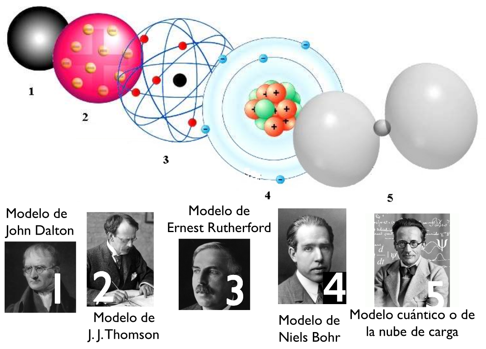{ style="display: block; margin: 0 auto; width: 75%; height: auto;" }

### **Modelo de Dalton** {: .caja-subtitulo}

**Postulados (1803-1808)**:

*   La materia está compuesta por partículas neutras, diminutas, indivisibles e indestructibles llamadas **átomos**.
*   Los átomos de un mismo elemento son idénticos entre sí.
*   Los átomos de diferentes elementos tienen masas y propiedades distintas.
*   Los átomos, al combinarse para formar compuestos guardan relaciones simples.
*   Los compuestos químicos se forman al unirse átomos de dos o más elementos distintos.

{ style="display: block; margin: 0 auto; width: 15%; height: auto;" }

> Dalton imaginaba al átomo como una pequeñísima esfera maciza indestructible.

### **Modelo de Thomson** {: .caja-subtitulo}

*   En 1897 descubrió el electrón estudiando la naturaleza de los rayos catódicos, por lo que recibió el Premio Nobel de Física en 1906.
*   En 1904 propuso un modelo atómico basado en el de Dalton en el que introducía el electrón.
*   Para Thomson el átomo es una esfera maciza con carga positiva en cuyo interior se encuentran electrones de modo que la carga total es nula.

> A este modelo también se le conoce como modelo de pastel de pasas.
> ¿Considera Thomson a los átomos como partículas indivisibles?

### **Modelo de Rutherford** {: .caja-subtitulo}

*   Su trabajo se centró en el estudio de las emisiones de sustancias radiactivas, describiendo la radiación $\alpha$, $\beta$, $\gamma$, por lo que recibió el Premio Nobel de Química en 1908.
*   En 1911 realizó un experimento con el que pudo comprobar que prácticamente toda la masa del átomo estaba concentrada en un núcleo y los electrones giraban a su alrededor como en un sistema planetario.

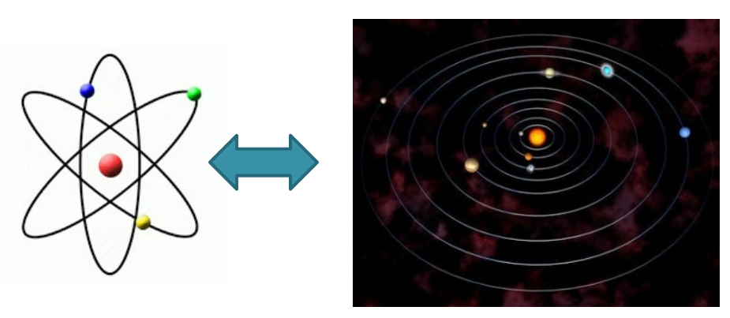

> ¡Los átomos están huecos, son como sistemas planetarios!

### **Modelo de Rutherford** (Inconsistencias) {: .caja-subtitulo}

**Principales inconsistencias**:

1.  Al igual que los anteriores modelos, no consigue explicar satisfactoriamente los espectros atómicos conocidos.
2.  Desde que Maxwell unificase los fenómenos eléctricos y magnéticos (1865), se sabía que cualquier carga acelerada produce la emisión de ondas electromagnéticas y por tanto de energía. De modo que los e- deberían caer al núcleo y los átomos desaparecer, cosa que evidentemente no ocurre.

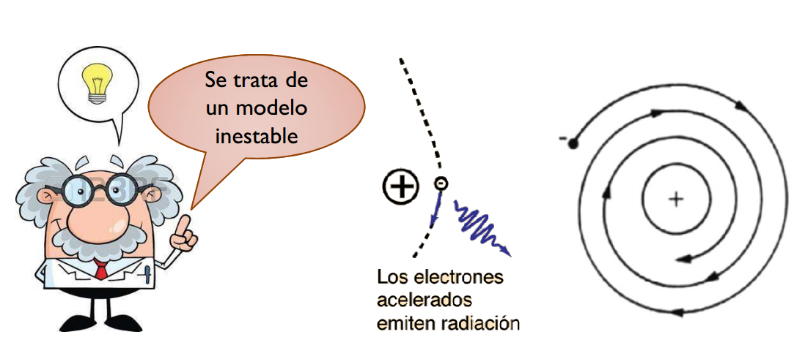

### **Hipótesis de Planck** {: .caja-subtitulo}

Durante la segunda mitad del siglo XIX se puso de manifiesto una molesta discrepancia entre la teoría y los datos experimentales relacionados con la absorción y emisión de calor (catástrofe del UV de la emisión de un cuerpo negro).

Plank puso fin a esa discrepancia al enunciar la siguiente hipótesis en 1900:

**La energía emitida o captada por un cuerpo en forma de radiación electromagnética es siempre un múltiplo de la constante h, llamada posteriormente constante de Planck por la frecuencia $\nu$ de la radiación.**

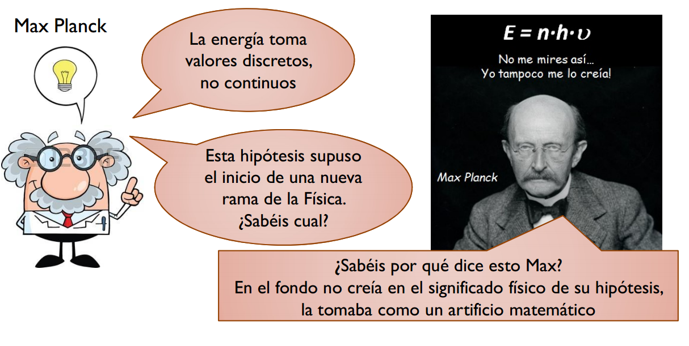

### **Espectros** {: .caja-subtitulo}

*   Un espectro es el conjunto de colores en los que se descompone un haz de luz.
*   La materia, por el hecho de tener una temperatura superior a 0 K emite radiación electromagnética, al analizar esta luz con un prisma, obtenemos su espectro.

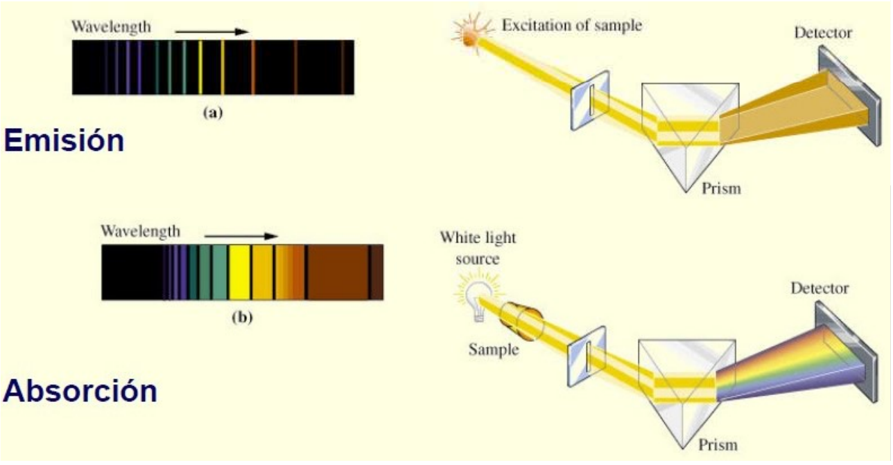{ style="display: block; margin: 0 auto; width: 75%; height: auto;" }

### **Modelo de Bohr** {: .caja-subtitulo}

*   Corrigió las inconsistencias del modelo del que fuera su profesor, Ernest Rutherford en 1913. Recibió el premio Nobel de Física en 1922.
*   Se basó en los datos experimentales de los espectros del hidrógeno y la hipótesis de Plank (1900) que demostró su utilidad ya en la explicación del efecto fotoeléctrico (Einstein, 1905).

**Postulados**:

1.   Cuando un electrón gira en su órbita no emite energía y, por tanto, esa órbita es estacionaria.
    *   De este postulado se puede deducir la velocidad de los electrones.
2.  Solo son posibles para el electrón aquellas órbitas en las que se cumple que su momento angular o cinético es múltiplo de la constante de Plank.
    *   Establece que las órbitas estacionarias solo pueden tener unos radios determinados (cuantizados).
3.  Los electrones solo pueden saltar de una órbita estacionaria a otra absorbiendo o emitiendo energía.
    *   Conduce a la cuantización de la energía del electrón en el átomo.

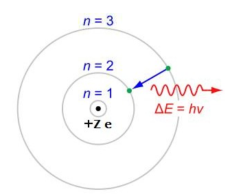{ style="display: block; margin: 0 auto; width: 25%; height: auto;" }

### **Modelo de Bohr** (Virtudes e Inconvenientes) {: .caja-subtitulo}

**Virtudes**: (justifica los principales fallos del modelo de Rutherford)

1.  Justifica la estabilidad del átomo.
2.  Introduce el concepto de niveles de energía, justificando los espectros atómicos.

**Inconvenientes**:

1.  Solo funciona bien para átomos hidrogenoides (un electrón).
2.  Avances en espectroscopía muestran espectros que este modelo no puede explicar (por ejemplo, Efecto Zeeman).

### **Modelo mecano-cuántico (Schrödinger)** {: .caja-subtitulo}

Recogiendo las aportaciones de De Broglie y Heisenberg entre otros, Schrödinger propone en 1924 una ecuación de ondas para calcular las propiedades de los electrones como ondas, la conocida como ecuación de Schrödinger y en 1926 publica unos artículos en los que propone el **modelo mecano-cuántico**.

Se denota a la función de ondas como $\psi$ y su módulo al cuadrado se interpreta físicamente como la probabilidad de encontrar el electrón.

*   Ahora por tanto, no existen órbitas fijas, sino zonas de mayor probabilidad de encontrar electrones, serán los **orbitales atómicos**.
*   Al resolver la ecuación de Schrödinger aparecen de manera natural los **números cuánticos**.

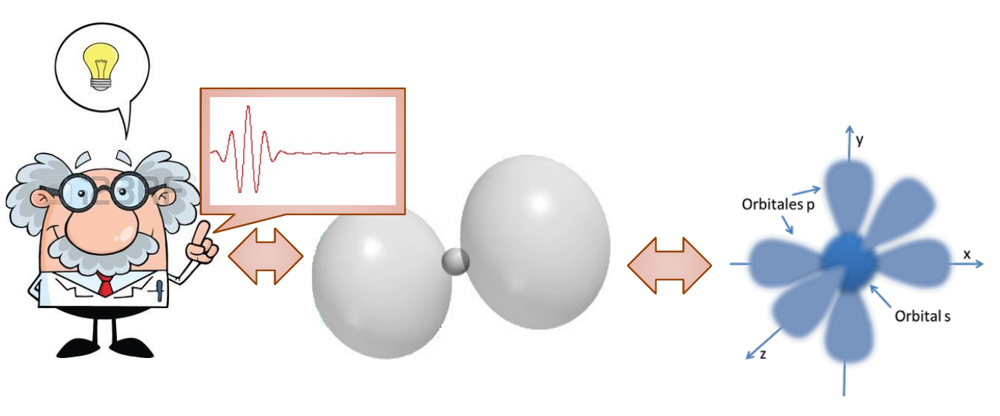{ style="display: block; margin: 0 auto; width: 75%; height: auto;" }

### **Línea temporal** {: .caja-subtitulo}

*   **1808:** Átomos como esferas sin estructura, indivisibles.
*   **1865:** Publica sus trabajos unificando la electricidad, el magnetismo y la óptica. La luz es una onda electromagnética.
*   **1900:** Hipótesis de Planck.
*   **1904:** Después de descubrir el electrón en 1897, propone el modelo de pastel de pasas.
*   **1911:** Átomo "vacío" con un núcleo y electrones alrededor, como un sistema planetario.
*   **1913:** Energía y órbitas cuantizadas.
*   **1924:** Dualidad onda-partícula.
*   **1926:** Función de onda. Nubes de probabilidad y números cuánticos.

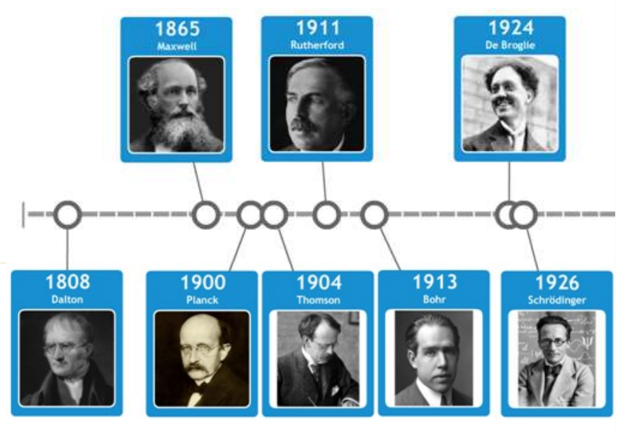{ style="display: block; margin: 0 auto; width: 50%; height: auto;" }

Se denomina **orbital** a la región del espacio donde existe una elevada probabilidad de encontrar al electrón. Estos orbitales dependen de tres números cuánticos $\psi$ (n, $l$, $m_l$): 

**Número cuántico principal, $\boldsymbol{n}$**, relacionado con el tamaño del orbital y que define los niveles de energía, similares a los de Bohr.

$$\boldsymbol{n} = 1, 2, 3,...$$

**Número cuántico secundario, $\boldsymbol{l}$**, relacionado con la forma del orbital y que define los subniveles de energía. Cada número se denomina con una letra: s, p, d, f. 

$$\boldsymbol{l} = 0, 1,... (n - 1)$$

**Número cuántico magnético, $\boldsymbol{\ce{m_l}}$**, relacionado con la orientación del orbital. Es responsable de la existencia de varios orbitales semejantes del mismo tipo.

$$\boldsymbol{\ce{m_l}} = - l ... 0 ... + l$$ 

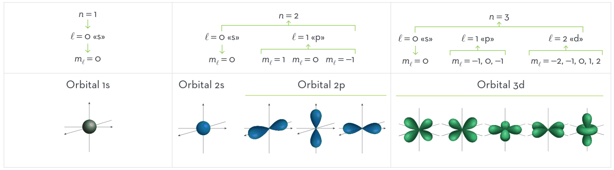{ style="display: block; margin: 0 auto; width: 100%; height: auto;" }

Existe un último número cuántico denominado **espín** (**s**), propio de los electrones. Solo puede tener dos valores (+ 1/2 y - 1/2), lo que condiciona que en un orbital solo puede hacer dos electrones. Se representa cada uno con una flecha diferente.

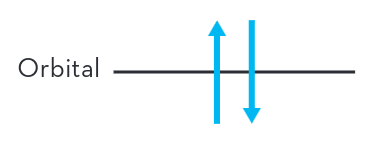{ style="display: block; margin: 0 auto; width: 30%; height: auto;" }

## **2. Corteza electrónica. Capas o niveles de energía**

Esta gráfica muestra el pozo de energía potencial del átomo de hidrógeno, con los niveles de energía permitidos según Bohr.

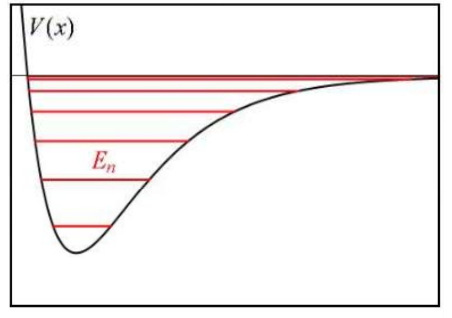{ style="display: block; margin: 0 auto; width: 50%; height: auto;" }

1.  Los electrones ocupan los niveles más próximos al núcleo, con menor energía y por tanto más estables.
2.  El número máximo de electrones que puede haber en cada capa o nivel es $\ce{2n^2}$ siendo n el **número cuántico principal**.
3.  Los electrones de la última capa se denominan **electrones de valencia** y son los responsables de las propiedades químicas de la materia.

| Nivel | Capa | Número de electrones |
| :: | :: | :: |
| 1 | K | $\ce{2 \cdot 1^2 = 2}$ |
| 2 | L | $\ce{2 \cdot 2^2 = 8}$ |
| 3 | M | $\ce{2 \cdot 3^2 = 18}$ |
| 4 | N | $\ce{2 \cdot 4^2 = 32}$ |

### **Configuración electrónica** {: .caja-subtitulo}

Es la manera en la que se distribuyen los electrones en un átomo.

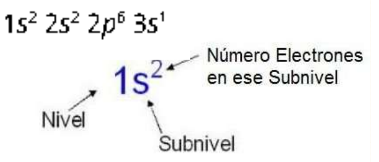{ style="display: block; margin: 0 auto; width: 25%; height: auto;" }

Se rige por tres principios: **Principio de Aufbau o de mínima energía**, **principio de exclusión de Pauli** y **principio de máxima multiplicidad de Hund**.

1. **Principio de Aufbau** (mínima energía)
Los electrones de un átomo en su estado de mínima energía (estado fundamental) empiezan a ocupar los orbitales de menor energía, de modo que la energía total de los electrones sea mínima. (Diagrama de Moeller).

1. **Principio de exclusión de Pauli**.
En 1922 se descubrió el espín, una propiedad intrínseca de las partículas elementales que tiene relación con la rotación de dichas partículas. En particular, para los electrones el espín solo puede adoptar dos valores, que se representan con flechas verticales con sentido hacia arriba y hacia abajo. El principio de exclusión de Pauli afirma que no puede haber dos electrones con el mismo espín en el mismo orbital.

1. **Principio de máxima multiplicidad de Hund**.
La configuración de mínima energía está dada por la mayor "multiplicidad", es decir, el mayor valor posible en la suma de los espines de los electrones de un nivel de energía. Eso implica que los electrones estarán desapareados en subniveles con la misma energía. A los subniveles con la misma energía se les llama "degenerados".

### **Configuración electrónica** (Ejemplos) {: .caja-subtitulo} 

*   **Ejemplo:** Configuración electrónica del Na ($\ce{Z = 11}$). El sodio en estado fundamental o de mínima energía tiene 11 electrones que se colocan de acuerdo con lo dicho anteriormente, y que cumple el siguiente diagrama (Moeller).

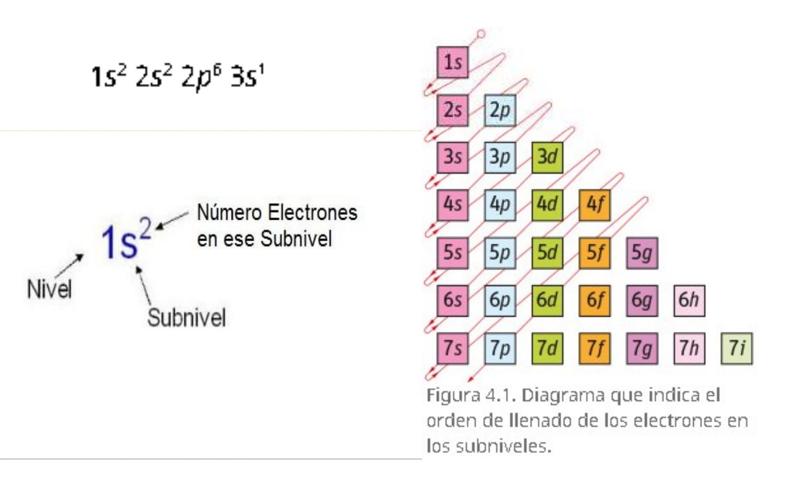{style="border: 1px solid #320d71; display: block; margin: 0 auto; width: 60%; height: auto;" }

**Configuración electrónica (Oxígeno)**

La configuración electrónica de un átomo de oxígeno en el estado fundamental (mínima energía) es:

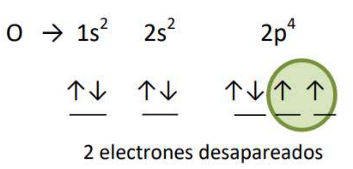{ style="display: block; margin: 0 auto; width: 50%; height: auto;" }

Los principios de exclusión de Pauli y de máxima multiplicidad de Hund, complementan al de Aufbau.

De acuerdo con el diagrama de Moeller (Aufbau) los electrones empiezan a completar el nivel 1, una vez completo se pasa al 2, pero éste tiene dos subniveles, el s y tres subniveles p. Se irán completando los distintos subniveles de acuerdo con los principios de Hund y Pauli.

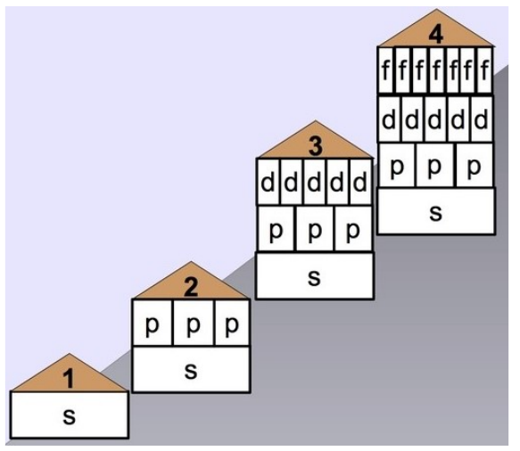{ style="display: block; margin: 0 auto; width: 35%; height: auto;" }

### **Configuración electrónica y sistema periódico** {: .caja-subtitulo}

La configuración electrónica (orden de llenado) nos permite localizar la posición de un elemento en la tabla y viceversa.

Mirando los últimos electrones de la configuración:

*   El nivel más alto de todos los términos nos da el periodo.
*   El número de electrones en el subnivel del último término de la configuración, nos da el grupo.

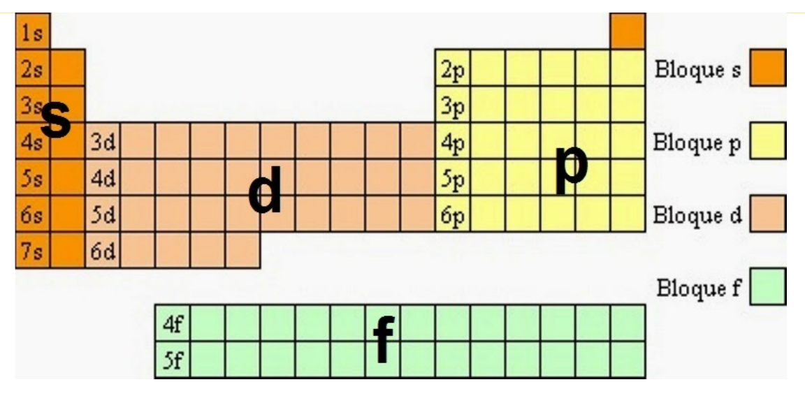{ style="display: block; margin: 0 auto; width: 75%; height: auto;" }

**Bloques de la tabla periódica:**

*   **Bloque s:** Grupos 1 y 2.
  
*   **Bloque p:** Grupos 13 al 18.

*   **Bloque d:** Grupos 3 al 12.

*   **Bloque f:** Lantánidos y actínidos.

### **Configuración electrónica Kernel** {: .caja-subtitulo}

Existe una manera compacta de escribir la configuración electrónica de un elemento, usando como referencia la configuración electrónica del gas noble inmediatamente anterior.

Se escribe entre corchetes el gas noble anterior y los electrones de valencia, es decir, de la última capa, de modo usual.

| Átomo | Configuración normal | Configuración del gas noble | Configuración kernel |
| :: | :: | :: | :: |
| $\ce{_{19}K}$ | $\ce{1s^2 2s^2 2p^6 3s^2 3p^6 4s^1}$ | $\ce{1s^2 2s^2 2p^6 3s^2 3p^6}$ | $\ce{[Ar] 4s^1}$ |

## **4. Enlace químico**

Dos átomos se enlazan para alcanzar un estado de menor energía, estable.

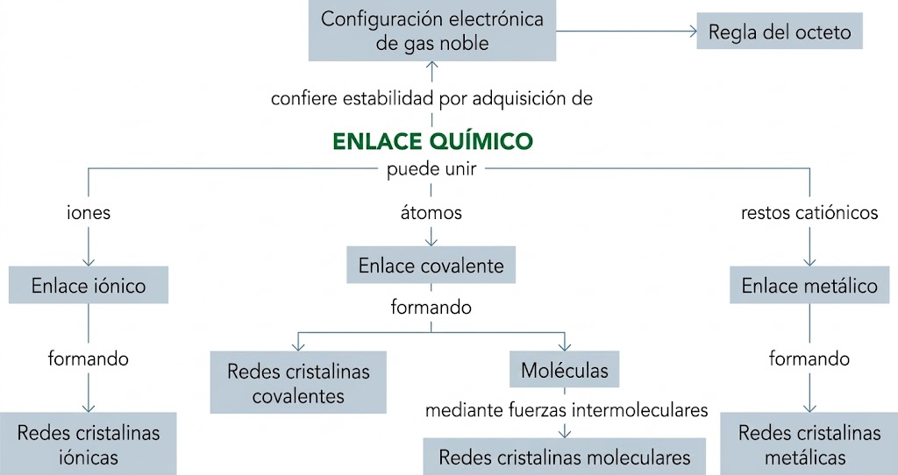{ style="display: block; margin: 0 auto; width: 75%; height: auto;" }

*   **Enlace iónico:** Se produce entre metales y no metales. Formando redes cristalinas.
*   **Enlace covalente:** Se produce entre no metales. Formando moléculas.
*   **Enlace metálico:** Se produce entre metales. Formando redes cristalinas metálicas.

### ¿**Por qué se enlazan los átomos**? {: .caja-subtitulo}

*   Sabemos que todos los sistemas tienden a un estado de mínima energía. Pues cuando se unen dos o más átomos lo hacen porque la energía del sistema unido es menor.
*   Cuando se produce la unión entre átomos, se libera energía. La energía que se libera cuando se produce la unión entre átomos se puede medir y dará cuenta de cómo de fuerte será dicho enlace. Es la llamada **energía de enlace**.

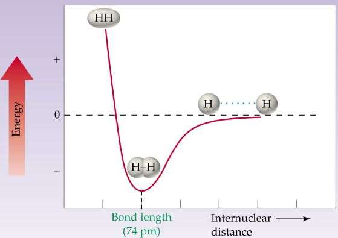{ style="display: block; margin: 0 auto; width: 30%; height: auto;" }

### ¿**Cómo se alcanza el mínimo de energía**? {: .caja-subtitulo}

La escasísima reactividad de los gases nobles indica que su configuración electrónica es la más estable (mínima energía) de entre las configuraciones de los elementos de la tabla periódica.

Los distintos átomos que interactúan en enlaces tienden a modificar su configuración electrónica para adoptar la de un gas noble. Son los electrones de la capa de valencia los responsables últimos de posibilitar el enlace.

### **Estabilidad y regla del octeto** {: .caja-subtitulo}

Kössel y Lewis proponen en 1916 que los átomos tienden a alcanzar la estructura electrónica de un gas noble cediendo o compartiendo electrones de su capa de valencia.

¿Qué tienen de especial los gases nobles? 

Tienen 8 electrones en su última capa ($\ce{ns^2 np^6}$), lo que los conforma con la configuración electrónica de un gas noble. Por eso se llama la **regla del octeto**.

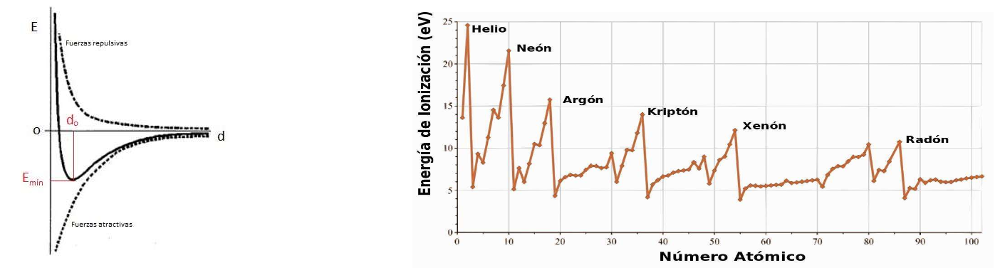{ style="display: block; margin: 0 auto; width: 90%; height: auto;" }

*   **Gráfica izquierda:** Curva de energía potencial (E) vs distancia (d). Se muestra la distancia de enlace ($\ce{d_0}$) donde las fuerzas atractivas y repulsivas se equilibran.

*   **Gráfica derecha:** Energía de ionización (eV) vs Número atómico. Se observan picos altos en los gases nobles (Helio, Neón, Argón, Kriptón, Xenón, Radón).

### **Tipos de enlace atómico** {: .caja-subtitulo}

*   **Enlace iónico:** Se forma entre un metal y un no metal. En este caso el metal cede los electrones implicados en el enlace y el no metal es el encargado de aceptar los electrones.
*   **Enlace covalente:** Se da entre dos átomos no metálicos. Ambos átomos tienden a compartir los electrones del enlace y forman **moléculas**.
*   **Enlace Metálico:** Se establece entre los átomos de un mismo elemento metálico.

En la naturaleza encontramos sustancias que tienen cierto carácter iónico y covalente a la vez. De lo mismo, en la vida real, las cosas no son blancas o negras; siempre hay características intermedias.

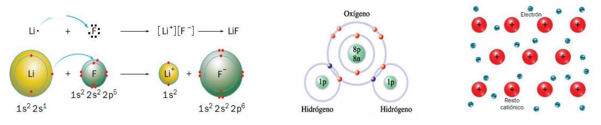{ style="display: block; margin: 0 auto; width: 95%; height: auto;" }

*   **Iónico:** $\ce{Li + F \rightarrow  [Li⁺][F⁻]}$
*   **Covalente:** Ejemplo con Oxígeno e Hidrógeno.
*   **Metálico:** Red de iones positivos rodeados por un mar de electrones.

## **6. El enlace iónico**

Cuando se aproximan un átomo de un elemento metálico, el metal pierde algún electrón de la última capa de valencia, que va a parar al elemento no metálico. Así se forman dos iones de cargas opuestas que se atraen y quedan enlazados por fuerzas electrostáticas.

Un enlace iónico se forma cuando la diferencia de electronegatividades es, al menos, de 1,7 en la escala de Pauling. Nótese que la diferencia de electronegatividades entre un metal y no metal es grande.

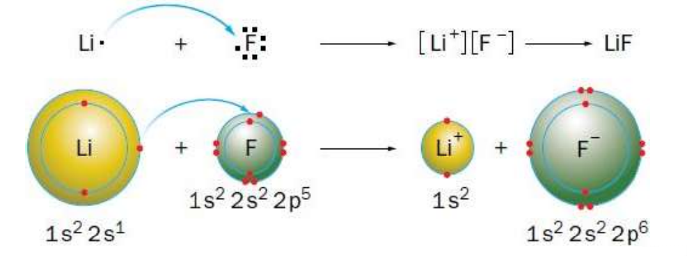{ style="display: block; margin: 0 auto; width: 90%; height: auto;" }

> Con la cesión de electrones por parte del catión y la adopción por parte del anión, los átomos consiguen una configuración electrónica más estable. (octeto)

### **Estructuras iónicas. Cristales. Introducción.** {: .caja-subtitulo}

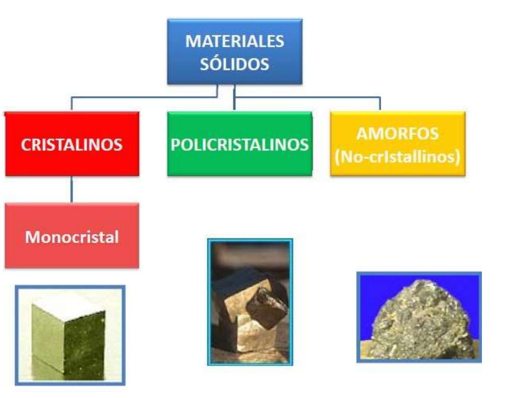{ style="display: block; margin: 0 auto; width: 50%; height: auto;" }

> Un **cristal** es una agregación de iones, átomos o moléculas que están ordenados según un patrón ordenado que se repite en las tres dimensiones del espacio.

> El **vidrio** de una ventana no es un cristal, es un material amorfo, aunque herede esta denominación por razones históricas.

> Un cristal produce un patrón de difracción no difuso y bien definido.

Un **cristal iónico** es un agregado de cationes y aniones con una ordenación espacial que en conjunto es neutra. Se cumple que:

*   Cada catión debe agrupar a su alrededor el número máximo de aniones.
*   Cada anión debe agrupar a su alrededor el número máximo de cationes.
*   La separación entre los iones debe ser la mínima posible y entre los iones del mismo signo la máxima posible.

> Por ejemplo, en la NaCl, cada $\ce{Na^+}$ (azul) está rodeado de 6 $\ce{Cl^-}$ (amarillo).

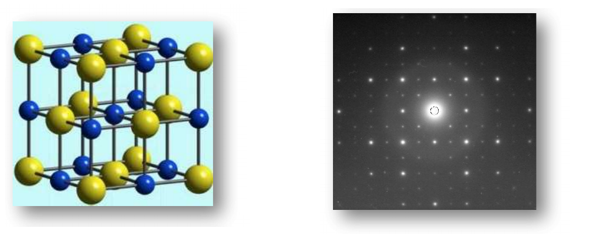{ style="display: block; margin: 0 auto; width: 50%; height: auto;" }

### **Propiedades de los compuestos iónicos** {: .caja-subtitulo}

Las propiedades más características de los compuestos iónicos son:

*   Elevados puntos de fusión y de ebullición.
*   Dureza.
*   Fragilidad.
*   **Conductividad eléctrica.** No conducen la electricidad en estado sólido, sin embargo en disolución acuosa o fundidos son buenos conductores de la electricidad (**Electrolitos**).
*   **Solubilidad.** Se disuelven bien, en general, en disolventes polares como el agua y no son solubles en disolventes apolares.

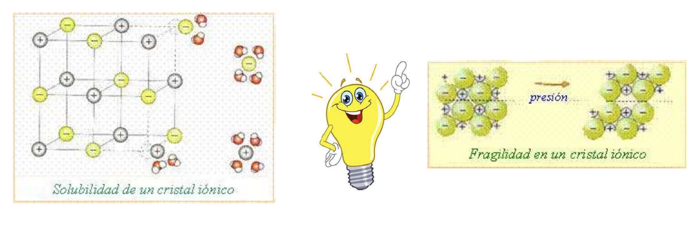{ style="display: block; margin: 0 auto; width: 75%; height: auto;" }

> **Fragilidad en un cristal iónico.**
> Al aplicar presión, las capas de iones se desplazan y los iones del mismo signo quedan enfrentados, provocando la ruptura del cristal.

## **7. Enlace metálico**

Las propiedades más representativas de los metales se pueden justificar a partir de dos modelos.

1.  **Modelo de la nube electrónica o Drude:** es un modelo clásico (no cuántico) desarrollado a finales del siglo XIX y principios del XX. Este modelo tiene fallos que corrige en gran medida el modelo cuántico del electrón libre o modelo de gas de Fermi. Tanto el modelo de Drude como el de Fermi consideran a los electrones como partículas libres dentro de los materiales.
2.  **Teoría de bandas:** Es una teoría cuántica en la que los electrones forman un gas cuántico (gas de Fermi) pero sometido a un potencial periódico producido por todos y cada uno de los núcleos positivos que forman la red cristalina.

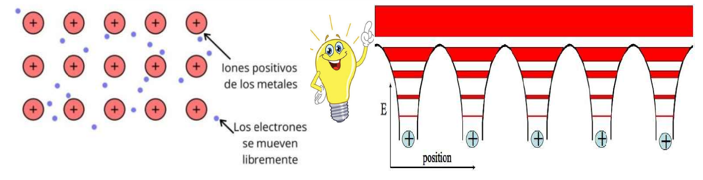{ style="display: block; margin: 0 auto; width: 90%; height: auto;" }

### **Teoría de bandas** {: .caja-subtitulo}

Consideremos dos átomos aislados de aquellos que constituyen el sólido, en estas condiciones, cada átomo por separado dispone de exactamente los mismos niveles de energía. 

Supongamos ahora que acercamos estos átomos para formar el sólido, a medida que se aproximan, sus niveles electrónicos interactúan. Debido a esto, en virtud del **principio de exclusión de Pauli**, cada nivel único de energía de los electrones en cada átomo se desdobla. 

La generalización de este razonamiento a los átomos nos lleva a ver que a cada nivel original del átomo, en un sólido le corresponde un número muy elevado de niveles discretos (tantos como átomos formen el sólido) de manera que estarán tan juntos que formarán lo que llamamos una "**banda de energía**".

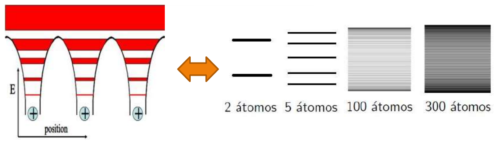{ style="display: block; margin: 0 auto; width: 90%; height: auto;" }
  
Se observa cómo los niveles discretos se ensanchan en bandas.

Consideremos dos átomos aislados que constituyen el sólido, en estas condiciones, cada átomo por separado dispone de exactamente los mismos niveles de energía.

Supongamos ahora que acercamos estos átomos para formar el sólido, a medida que se aproximan, sus nubes electrónicas interactúan. Debido a esto, en virtud del principio de exclusión de Pauli, cada nivel único de energía de los electrones en cada átomo se desdobla.

La generalización de este razonamiento al caso de muchos átomos (10²³ m⁻³) nos lleva a ver que a cada nivel original del átomo, en un sólido le corresponde un número muy elevado de niveles discretos (tantos como átomos forman el sólido) de manera que estarán tan juntos que formarán lo que llamamos una **banda de energía**.

### **Teoría de bandas (bandas y huecos)** {: .caja-subtitulo}

De la misma manera que en el átomo los niveles de energía son discretos, en el sólido, entre banda y banda habrá valores de energía no permitidos (**banda prohibida**). 

Del mismo modo que el nivel o capa de valencia determina las propiedades químicas de un elemento, en un sólido, las bandas de energía más externas serán las que principalmente determinen las propiedades del mismo. 

Las bandas de energía más externas de un sólido se denominan bandas de valencia y de conducción y su posición relativa determina la distinción entre conductores, semiconductores y aislantes.

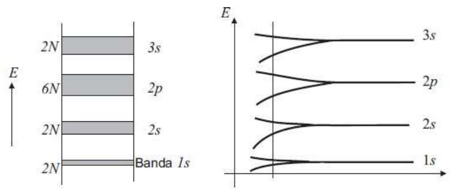{ style="display: block; margin: 0 auto; width: 75%; height: auto;" }

> Figura. Aparición de bandas de energía fruto de la pérdida de degeneración de los niveles energéticos asociados a los electrones de un sólido.

### **Teoría de bandas (Banda de valencia y de conducción)** {: .caja-subtitulo}

*   **Banda de Valencia (B.V.):** Es la banda de energía más alta ocupada por electrones.
*   **Banda de Conducción (B.C.):** Es la banda de energía vacía o parcialmente ocupada que permite la conducción eléctrica.
  
  La diferencia de energía entre ambas se llama **banda prohibida** (**BP**, gap).

• Los **conductores** tienen la BV llena parcialmente de modo que al aplicar un E, los electrones pueden acceder a esos niveles y moverse (BC). También puede ocurrir que la BC y la BV estén solapadas, sin BP entre ellas. 

• Los **aislantes** la BV está llena y la BP (gap) es tan grande que ante un E no pueden acceder electrones de la BV a la BC. 

• Los **semiconductores** tienen una BP (gap) suficientemente pequeño para que puedan saltar electrones de la BV a la BC ante la presencia de un E. 

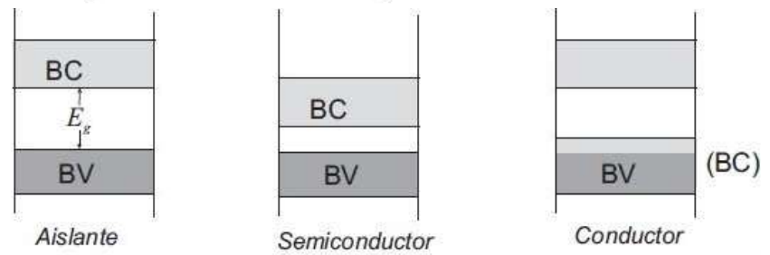{ style="display: block; margin: 0 auto; width: 75%; height: auto;" }

### **Modelo de la nube electrónica** {: .caja-subtitulo}

La estructura metálica está formada por iones positivos rodeados por un gas de electrones. Los electrones de valencia de cada uno de los átomos constituyentes son aportados al gas de electrones y dejan de pertenecer a un átomo en concreto. El gas de electrones funciona como un aglutinante de los iones de la red cristalina.

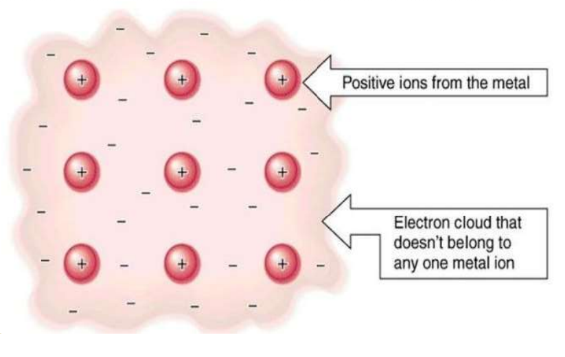{ style="display: block; margin: 0 auto; width: 50%; height: auto;" }

**Fallos:**

*   Predice una dependencia de la conductividad con la T que difiere de los átomos.
*   Predice un calor específico mucho mayor que el observado empíricamente.

### **Propiedades de los metales** {: .caja-subtitulo}

*   **Son sólidos a temperatura ambiente** (a excepción del mercurio) de **densidad elevada**. Observar que la red metálica es una estructura muy ordenada y compacta (con los iones muy bien empaquetados, muy juntos, densidad alta).
*   **Temperaturas de fusión y ebullición altas**, síntoma de que el enlace entre los átomos es fuerte.
*   **Buenos conductores del calor y la electricidad**, debido a la existencia de electrones libres que pueden moverse.
*   **Ductilidad y maleabilidad**, debido a la posibilidad de que las capas de iones se pueden deslizar unas sobre otras sin que se rompa la red metálica. La existencia de la nube electrónica hace que las capas de iones puedan deslizar unas sobre otras sin que la repulsión entre ellas rompa el sólido. Debido a ello los metales son dúctiles y maleables.

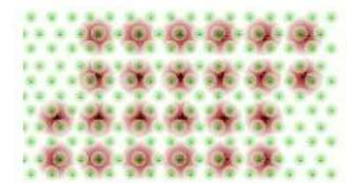{ style="display: block; margin: 0 auto; width: 30%; height: auto;" }

*   El característico **brillo metálico** es también una consecuencia de la existencia de electrones libres que pueden absorber y emitir luz de diversas frecuencias.

##  **8. Enlace covalente**

Cuando se enlazan dos **elementos no metálicos** forman sustancias mediante un enlace que se llama covalente (porque comparten electrones de valencia).

Cada hidrógeno comparte su electrón y el oxígeno comparte 2 electrones de su capa de valencia, así todos cumplen la regla del octeto.

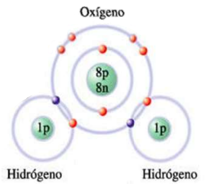{ style="display: block; margin: 0 auto; width: 30%; height: auto;" }

**Las moléculas** son agrupaciones estables de un número fijo de átomos. Si los átomos son del mismo elemento forman sustancias simples, si son de diferentes elementos forman compuestos.

**Los sólidos covalentes** tienen las siguientes características:

*   Altos puntos de fusión y ebullición.
*   Suelen ser aislantes, salvo el grafito, grafeno...
*   Insolubles en agua.

**Las sustancias moleculares** tienen las siguientes características:

*   Malos conductores del calor y la electricidad.
*   Las fuerzas de cohesión de las moléculas son débiles, por eso estas sustancias suelen ser gases o líquidos a temperatura ambiente.
*   Son solubles en agua dependiendo de su geometría.

### **Símbolos de Lewis** {: .caja-subtitulo}

Un símbolo de Lewis está formado por el símbolo del elemento y un punto por cada electrón de valencia del átomo de un elemento. Los elementos de un mismo grupo tienen configuraciones similares en su capa de valencia, por lo que tienen símbolos de Lewis parecidos. El número de puntos (electrones de valencia) desapareados, corresponden al número de enlaces que un átomo de el elemento puede formar en un compuesto.

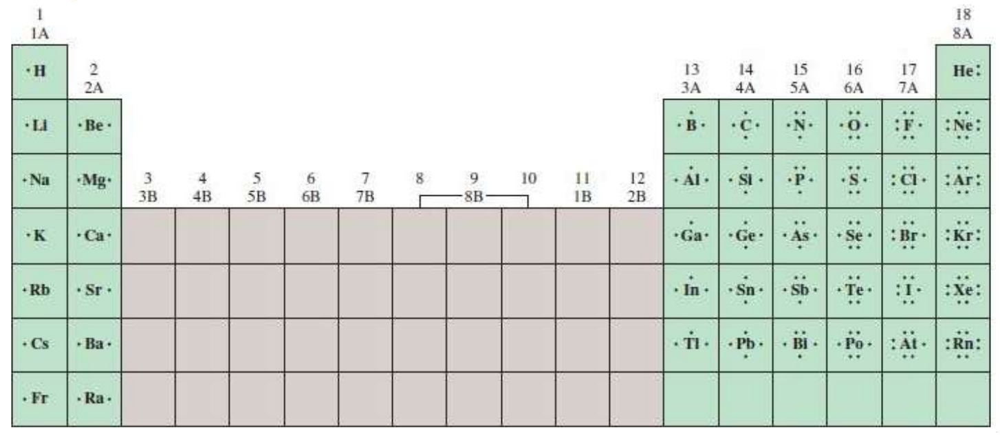{ style="display: block; margin: 0 auto; width: 90%; height: auto;" }

### **Estructuras de Lewis** (esquema) {: .caja-subtitulo}

Las estructuras de Lewis son una combinación de símbolos de Lewis que representa la transferencia (enlace iónico) o compartición (enlace covalente) de electrones en el enlace químico.

Ejemplos: 

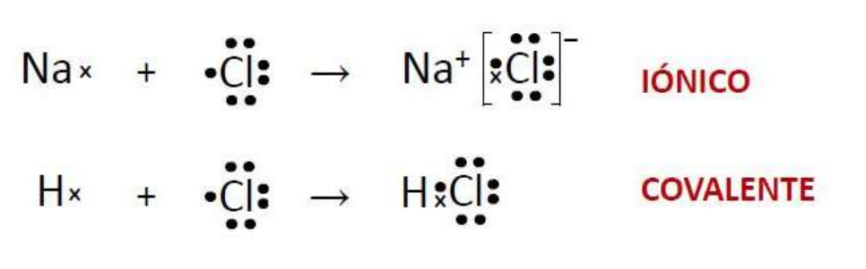{ style="display: block; margin: 0 auto; width: 60%; height: auto;" }

### **Estructuras de Lewis en enlaces covalentes** {: .caja-subtitulo}

Algunos ejemplos de estructuras de Lewis:

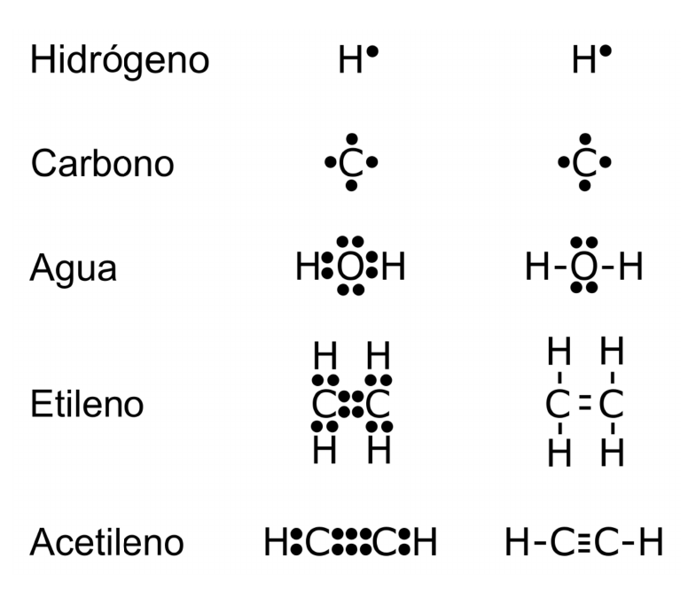{ style="display: block; margin: 0 auto; width: 40%; height: auto;" }

### **Propiedades de las sustancias covalentes** {: .caja-subtitulo}

Si forman **cristales** (diamante, silicio)

*   Son sólidos con elevados puntos de fusión.
*   Son muy duros pero frágiles.
*   No conducen la electricidad (excepto el grafito).
*   No se disuelven en prácticamente ningún disolvente.

Si forman **moléculas**

*   La mayoría son gases.
*   Los líquidos y sólidos tienen puntos de fusión y ebullición muy bajos.
*   No conducen la electricidad.
*   Son blandos y resistentes a los golpes, deformables.
*   Sólo se disuelven en disolventes de polaridad semejante.

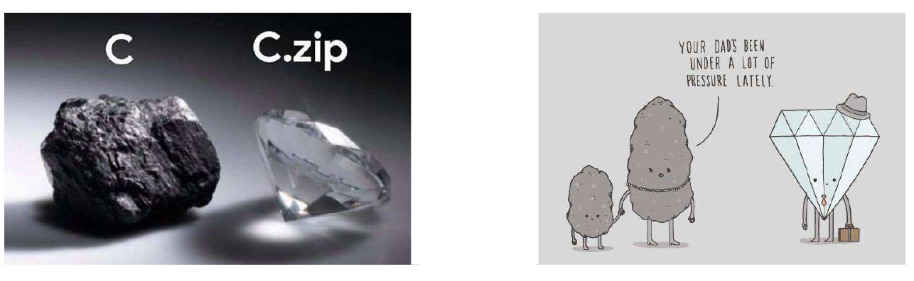{ style="display: block; margin: 0 auto; width: 75%; height: auto;" }
