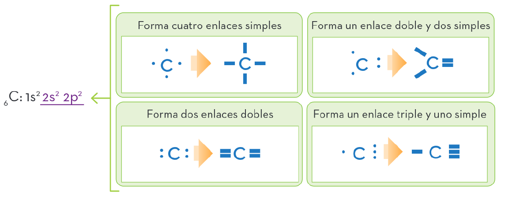

# Tema 2: Química del Carbono

## 1. Introducción

La química orgánica es la rama de la química que se ha especializado en el estudio de los compuestos complejos que forma el carbono, tanto los que utilizan los seres vivos como los que se sintetizan en el laboratorio.

Quizás te preguntes por qué merece el carbono una rama específica para su estudio. La razón es muy sencilla: porque es el elemento que mayor número de compuestos forma, siendo todos ellos muy complejos y variados.

Para entenderlo, debemos recurrir nuevamente a la configuración electrónica. El carbono pertenece a la familia de los carbonoideos con una configuración $\ce{2s^2 2p^2}$, por lo que posee cuatro electrones de valencia. Para cumplir el octeto podría formar enlaces iónicos ganando o perdiendo electrones, pero requiere demasiada energía.

Sin embargo, compartir sus electrones formando enlaces covalentes es mucho más sencillo y origina diversas posibilidades:

{ style="display: block; margin: 0 auto; width: 90%; height: auto;" }

## 1. Enlaces del Carbono

- **Enlace sencillo (C–C):** se forma por la compartición de un par de electrones.
- **Enlace doble (C=C):** se forma por la compartición de dos pares de electrones.
- **Enlace triple (C≡C):** se forma por la compartición de tres pares de electrones.

## 2. Grupos funcionales

**Grupo funcional:** Átomo o grupos de átomos que caracterizan a una serie de compuestos orgánicos con propiedades químicas parecidas.

### 2.1 Alcanos -ano

Cadena lineal o ramificados laterales; enlace sencillo.

| Fórmula semidesarrollada | Fórmula molecular | Nombre |
|---|---|---|
| CH₄ | CH₄ | Metano |
| CH₃-CH₃ | C₂H₆ | Etano |
| CH₃-CH₂-CH₃ | C₃H₈ | Propano |
| CH₃-CH₂-CH₂-CH₃ | C₄H₁₀ | Butano |
| CH₃-CH₂-CH₂-CH₂-CH₃ | C₅H₁₂ | Pentano |
| CH₃-(CH₂)₄-CH₃ | C₆H₁₄ | Hexano |
| CH₃-(CH₂)₅-CH₃ | C₇H₁₆ | Heptano |
| CH₃-(CH₂)₆-CH₃ | C₈H₁₈ | Octano |
| CH₃-(CH₂)₇-CH₃ | C₉H₂₀ | Nonano |
| CH₃-(CH₂)₈-CH₃ | C₁₀H₂₂ | Decano |

**RADICALES ALQUILO**

- Son alcanos que han perdido uno de sus hidrógenos.
- Se nombran igual que los alcanos cambiando la terminación -ano por -il o -ilo.

| Radical | Nombre |
|---|---|
| CH₃– | metil o metilo |
| CH₃-CH₂– | etil o etilo |
| CH₃-CH₂-CH₂– | propil o propilo |
| CH₃-CH– \| CH₃ | isopropil o isopropilo (1-metiletil) |
| CH₃-CH₂-CH₂-CH₂– | butil (n-butil) o butilo |
| CH₃-CH₂-CH– \| CH₃ | sec-butil o sec-butilo (1-metilpropil) |

### 2.2 Alquenos -eno

- **Doble enlace C=C**
- Los dobles enlaces se localizan con números localizadores colocados antes del sufijo -eno.

| Fórmula | Nombre | Observaciones |
|---|---|---|
| CH₂=CH₂ | Eteno (Etileno) | Alqueno se comienza con un número si es necesario para evitar ambigüedades. |
| CH₃-CH=CH₂ | Propeno | Es el caso que no hace falta indicar el localizador del doble enlace porque no existe ninguna duda de su posición (entre el carbono 1 y 2). Si fuera entre los dos átomos de carbono sería el mismo compuesto, pero se comenzaría la numeración por el otro extremo y de nuevo quedaría entre 1 y 2. |
| CH₃-CH₂-CH=CH₂ | But-1-eno (1-Buteno) | La numeración se empieza por el extremo derecho, para así que el doble enlace con el localizador más bajo, el 1. |
| CH₃-CH=CH-CH₃ | But-2-eno (2-Buteno) | En este caso es indiferente el extremo por el que se ataca la numeración, pues en ambos casos el doble enlace se sitúa entre los carbonos 2 y 3. Se nombra but-2-eno por ser el 2 el número más pequeño que se puede asignar a los carbonos que se encuentran el doble enlace. |
| CH₃-CH₂-CH₂-CH=CH₂ \| CH₃ | 4-Metilpent-1-eno (4-Metil-1-penteno) | Se numera de forma que el doble enlace queda con el localizador más bajo, ya que tiene prioridad sobre las ramificaciones. |
| CH₃-CH=CH-CH₂-CH₂-CH₃ \| CH₂ \| CH₃ | 4,5-Dimetilhept-1-eno (4,5-Dimetil-1-hepteno) | Se numera por la izquierda para que el doble enlace quede con el localizador más bajo, ya que tiene prioridad sobre las ramificaciones. |
| CH₃-CH₂-CH=CH-CH₂-CH₃ \| CH₃ | 2-Metilhex-3-eno (2-Metil-3-hexeno) | En este caso el doble enlace se encuentra compitiendo con el metilo: localizador independientemente del extremo por el que se nombre. Se numera por el extremo que es el radical el que le asigne los localizadores más bajos. |
| CH₃-CH=CH-CH₂-CH₂-CH₃ \| CH₂ \| CH₃ | Nona-1,4-dieno (1,4-Nonadieno) | Se numera por el extremo de la derecha y así que dan los localizadores más bajos para los dobles enlaces (1,4), mientras que por el otro extremo se obtendría (5,8). La terminación abre es -dieno, indicando que existen dos dobles enlaces. |
| CH₃-CH=CH-CH₂-CH=CH₂ \| CH₃ \| CH₃ | 2,4-Dimetilhexa-1,5-dieno (2,4-Dimetil-1,5-hexadieno) | Los dobles enlaces quedan con los mismos localizadores (1,5) independientemente del extremo por el que se comience, entonces se numera por la izquierda para que los radicales queden con los localizadores más bajos. |

### 2.3 Alquinos -ino

- **Hidrocarburos de triples enlaces C≡C**
- Los triples enlaces se localizan con números localizadores colocados antes del sufijo -ino.

| Fórmula | Nombre | Observaciones |
|---|---|---|
| CH≡CH | Etino (Acetileno) | El número localizador se omite ya que no hay ninguna duda de su posición (entre el carbono 1 y 2). Para la IUPAC, el nombre etino es el aceptado. |
| CH₃-C≡CH | Propino | Este caso no hace falta indicar el localizador del triple enlace porque no existe ninguna duda de su posición (entre el carbono 1 y 2). Si fuera entre los dos átomos de carbono sería el mismo compuesto, pero se comenzaría la numeración por el otro extremo y de nuevo quedaría entre 1 y 2. |
| CH₃-CH₂-C≡CH | But-1-ino (1-Butino) | La numeración se empieza por el extremo derecho, para así que el triple enlace con el localizador más bajo, el 1. |
| CH₃-C≡C-CH₃ | But-2-ino (2-Butino) | En este caso es indiferente el extremo por el que se ataca la numeración, pues en ambos casos el triple enlace se sitúa entre los carbonos 2 y 3. |
| CH₃-CH₂-C≡C-CH₃ | Pent-2-ino (2-Pentino) | Se numera por el extremo derecho para que el triple enlace quede con el localizador más bajo. |
| HC≡C-CH₂-CH₂-CH₂-CH₃ \| CH₃ \| CH₃ | 4,6-Dimetilhept-1-ino (4,6-Dimetil-1-heptino) | Se numera de forma que el triple enlace quede con el localizador más bajo, ya que tiene prioridad sobre las ramificaciones. |

### 2.4 Cicloalcanos, cicloalquenos

- Alcanos de cadena cerrada (ciclos) con un nº variable de átomos de carbono. Se nombran utilizando el prefijo ciclo- seguido del alcano.

- Si la cadena lateral es compleja, puede tomarse como cadena principal de la molécula y el ciclo como un sustituyente, nombrando con la terminación -ilo en vez de -ano.

*(Imágenes de ciclopropano, ciclobutano, ciclopentano, ciclohexano)*

1) En cicloalcanos con un solo sustituyente, se toma el ciclo como cadena principal de la molécula. Es innecesario la numeración del ciclo.

*(Imágenes: Etilciclobutano, Isopropilciclohexano, Metilciclopentano)*

2) Si el cicloalcano tiene dos sustituyentes, se nombran por orden alfabético. Se numera el ciclo comenzando por el sustituyente que va antes en el nombre.

*(Imágenes: 1-Etil-3-metilciclopentano, 1-Bromo-3-cloro-ciclohexano)*

3) Si el anillo tiene tres o más sustituyentes, se nombran por orden alfabético. La numeración del ciclo se hace de forma que se otorguen los localizadores más bajos a los sustituyentes. En caso de obtener los mismos localizadores al comenzar por diferentes posiciones, se tiene en cuenta el orden alfabético.

*(Imagen: 1-Cloro-2-metil-4-propilciclopentano)*

### 2.5 Hidrocarburos Aromáticos -benceno

- Hidrocarburos derivados del benceno (C₆H₆).

- Se nombran utilizando la palabra benceno, anteponiendo los nombres de los sustituyentes y sus localizadores.

- La numeración se hace de tal forma que se dan los localizadores más bajos posibles a los sustituyentes, teniendo en cuenta el orden de prioridades. Si hay duda decide el orden alfabético de los sustituyentes.

- El benceno como sustituyente se denomina fenilo.

1) Los anillos con un sustituyente se nombran anteponiendo el nombre del sustituyente al del benceno.

*(Imágenes: Metilbenceno, Etilbenceno, Isopropilbenceno, Vinilbenceno)*

2) En los anillos con dos sustituyentes se indican las posiciones con los números 1,2-; 1,3-; y 1,4-; o con los prefijos orto-; meta-; y para-.

*(Imágenes: o-clorometilbenceno, m-clorometilbenceno, p-clorometilbenceno)*

3) Cuando hay más de dos sustituyentes, se numera el anillo de modo que los sustituyentes tomen los localizadores más bajos. Si varias numeraciones dan los mismos localizadores se da preferencia al orden alfabético.

*(Imágenes: 1-cloro-2-etil-3-metilbenceno, 1-etil-3-isopropil-5-vinilbenceno, 1-etil-2,4-dimetilbenceno)*

- El radical del benceno se denomina fenil o fenilo.

*(Imagen: 2-fenilbut-2-eno)*

### 2.6 Derivados Halogenados

- Compuestos obtenidos de hidrocarburos por sustitución por elementos halogenados (F, Cl, Br y I).

- Se nombran citando en primer lugar el nombre del halógeno como sustituyente fluor-; cloro-; bromo-; y yodo-; seguido del nombre del hidrocarburo, e indicando su posición con el localizador.

| Fórmula | Nombre | Observaciones |
|---|---|---|
| CH₃-CH₂-CH=C=CH-CH₃ \| CH₂F \| CH₃ | 4-Etil-3-fluorhex-2-eno (4-Etil-3-fluor-2-hexeno) | La numeración de la cadena se hace por la derecha ya que viene establecida por la doble enlace. Los radicales se citan en orden alfabético. |
| CH₃-CHCl-CHCl-CH≡CH | 3,4-Dicloropent-1-ino (3,4-Dicloro-1-pentino) | El triple enlace tiene prioridad sobre los radicales en la numeración de la cadena principal. |
| (ciclopentano con Cl y Cl) | 1,1-Dicloro-3-metilciclopentano | Los carbonos del ciclo se numeran en el sentido que los localizadores de los sustituyentes sean los más bajos (1,1,3). |
| (ciclohexeno con Br) | 4-Bromociclohexeno | La prioridad para la numeración la tiene el doble enlace, al que le corresponde el carbono 1 y no hace falta indicarlo. Luego se numera en el sentido que el radical tenga el localizador más bajo. |
| CHF₃ | Trifluorometano o Fluoroformo | Cada uno de estos derivados halogenados del metano tiene un nombre común aceptado por la IUPAC. |
| CHCl₃ | Triclorometano o Cloroformo | |
| CHBr₃ | Tribromometano o Bromoformo | |
| CHI₃ | Triyodometano o Yodoformo | |
| (benceno con CH₃ y Cl) | 1,2-Dicloro-4-metilbenceno | Se elige el sentido de numeración para que los localizadores de los sustituyentes sean los más bajos (1,2,4). Se nombran en orden alfabético; en el orden alfabético no se tiene en cuenta el prefijo di-. |
| (benceno con Br y Br) | 1,2-Dibromobenceno o-Dibromobenceno | Cuando los radicales van en carbonos contiguos 1,2-, se puede usar la nomenclatura alternativa "orto", que se escribe solo -o-. |

## 2.1 Alcoholes -ol

Grupos hidroxilo (-OH)

- Se nombran como los hidrocarburos de los que proceden con la terminación -ol, indicando la posición con localizadores más bajos. Si hay más de un grupo, es necesario el prefijo multiplicador.

- Orden numérico preferencia sobre los dobles/triples enlaces.

- Cuando el grupo -OH va como sustituyente, al existir en la cadena otro grupo funcional de mayor prioridad, se nombra como "hidroxi-".

| Fórmula | Nombre | Observaciones |
|---|---|---|
| CH₃-CHOH-CH₂-CHOH-CH₂-CH₃ | Hexano-2,4-diol (2,4-Hexanediol) | Se nombra por la izquierda para que los grupos -OH tengan los localizadores más bajos. Se utiliza el sufijo -diol que indica que hay dos grupos -OH. |
| CH₃-CH₂-CH(CH₃)-CH₂-CH₂-OH | 3-Metilpentan-1-ol (3-Metil pentanol) | En la numeración el grupo funcional -OH tiene preferencia sobre los radicales. |
| CH₃-CH₂-C(CH₃)₂-CH₂-CH(OH)-CH₃ | 3,5,5-Trimetilhexan-2-ol (3,5,5-Trimetilhexan-2-ol) | En la numeración el grupo funcional -OH tiene preferencia sobre los radicales. |
| CH₂OH-CHOH-CH₂OH | Propano-1,2,3-triol (1,2,3-Propanetriol) | Se indica la presencia de tres grupos -OH con el sufijo -triol. Como el sufijo no menciona por vocal, la -ol- final del hidrocarburo se conserva. Glicerina es el término en un nombre común aceptado. |
| CH₃-CHOH-CH₂-CH₂-CH(CH₃)-CH₃ | 4-Metilhexan-2-ol (4-Metil-2-hexanol) | Se nombra por la izquierda para que los grupos -OH tengan los radicales. Se utiliza el sufijo -diol que indica que hay dos grupos -OH. |
| CH₃-CH=CH-CH=C(CH₃)-CH₃ | 4-Metilhexa-2,4-dien-2-ol (4-Metil-2,4-hexadien-2-ol) | En la numeración el grupo funcional -OH tiene preferencia sobre los radicales. |
| CH₃-CH=CH-CHOH-CH₃ | Pent-3-en-2-ol (3-Penten-2-ol) | En la numeración el grupo funcional -OH tiene preferencia sobre los radicales. |
| CH₂OH-CH=CH-CH₂-CH₂OH | Pent-2-en-1,5-diol (2-Penten-1,5-diol) | Los grupos -OH que son los que tiene la prioridad quedan con la misma numeración por ambos extremos, en este caso se le da preferencia al doble enlace. |

## 2.2 Éteres -éter

Compuestos unidos a un átomo de oxígeno.

**NOMENCLATURA FUNCIONAL**

- Se nombran en orden alfabético los radicales R y R' separados por espacios y a continuación la palabra éter, también separada por un espacio. Si los dos radicales son iguales, se usa el prefijo "di-".

Ej: CH₃-O-CH₂-CH₃ se nombra: Etil metil éter

**NOMENCLATURA SUSTITUTIVA**

- Se considera uno de los radicales unidos al oxígeno (el R+complejo, +largo) como "estructura principal", mientras que el resto R'-O se considera como sustituyente.

- El éter se nombra con la raíz del nombre del hidrocarburo más sencillo (R'-O) acabado en "-oxi" y a continuación el nombre del hidrocarburo de la estructura principal.

- Si el sustituyente (grupo alcoxi R'-O) puede ir unido en varias posiciones a la estructura principal, se indica con el localizador del carbono de la estructura principal al que se une.

Ej:

a) CH₃-O-CH₂-CH₃

- Sustituyente R'-O: **Metoxi**
- Hidrocarburo principal, R: **Etano**
- **Metoxietano**

| Fórmula | Nomenclatura funcional | Nomenclatura de sustitución |
|---|---|---|
| CH₃-O-CH₃ | Dimetil éter | Metoximetano |
| CH₃-O-CH₂-CH₃ | Etil metil éter | Metoxietano |
| CH₃-CH₂-O-CH₂-CH₃ | Dietil éter | Etoxietano |
| CH₃-CH₂-CH₂-CH₂-O-CH₃ | Butil metil éter | 1-Metoxibutano |
| CH₃-CH₂-O-C₆H₅ | Etil fenil éter | Etoxibenceno |
| CH₂=CH-O-CH₃ | Metil vinil éter | Metoxieteno |

## 2.9 Aldehídos -al

Grupo carbonilo (-CHO) en el extremo de la cadena carbonada.

- Se nombran añadiendo la terminación -al al nombre del hidrocarburo del que proceden. No se indica localizador. Si hay dos grupos -CHO, se añade la terminación -dial.

- Orden numeración: Solo pueden ser terminales, por lo que la cadena se empieza a numerar por el extremo donde se encuentra el grupo -CHO.

- Sustituyente (-CHO): Prefijo formil-. Son prioritarios frente los aldehídos: ácidos carboxílicos y ésteres.

| Fórmula | Nombre | Observaciones |
|---|---|---|
| CH₃-CH₂-CH(CH₃)-CH=CH-CHO | 3,5-Dimetilhex-4-enal (3,5-Dimetil-4-hexenal) | Se nombra por la derecha ya que el grupo -CHO tiene preferencia sobre los radicales, aunque no se indica el localizador. |
| CH₃-CH₂-CH(CH₃)-C≡CH | But-3-inal (3-Butinal) | Se nombra por el extremo de la derecha, ya que el grupo -CHO tiene preferencia sobre los radicales. |
| OHC-CH₂-CH(CH₃)-CHO | Butanodial | Cuando hay dos grupos -CHO en los extremos se añade el sufijo -dial al nombre completo del hidrocarburo. No hace falta indicar los localizadores. |
| OHC-CH(CH₃)-CH₂-CHO | Metilpropanodial | No es necesario indicar el localizador del radical metilo ya que no hay otra posibilidad de colocación. |
| CH₃-CH₂-CH(CH₃)-CH=CH-CHO | 3-Metilhex-2-en-5-inal (3-Metil-2-hexen-5-inal) | Se nombra por la derecha ya que el grupo -CHO tiene preferencia sobre los radicales, aunque no se indica el localizador. |
| CH₃-CH₂-CH(CH₃)-CH=CH-CHO | 3-Propilpent-4-enal (3-Propil-4-enal) | La cadena principal es la que contiene el grupo -CHO y el doble enlace, aunque no sea la más larga. Se nombra por el extremo que se le da el localizador. El grupo -CHO, pues tiene prioridad sobre el doble enlace y el radical. |
| (ciclopentano con CHO) | Ciclopentanocarbaldehído | En los compuestos cíclicos se añade el sufijo -carbaldehído al nombre del ciclo. |
| (benceno con CHO) | Bencenocarbaldehído (Benzaldehído) | En los compuestos cíclicos se añade el sufijo -carbaldehído al nombre del ciclo. El nombre benzaldehído deriva del ácido carboxílico (ácido benzoico). |

## 2.10 Cetonas -ona

Grupo carbonilo (CO)

**NOMENCLATURA FUNCIONAL**

- Se nombran en orden alfabético los dos radicales separados por espacios y a continuación separada la palabra cetona. Si los dos radicales son idénticos se usa el prefijo di-.

**NOMENCLATURA SUSTITUTIVA**

- Se nombran añadiendo la terminación -ona al nombre del hidrocarburo del que proceden, anteponiendo el localizador correspondiente. Si hay más de 1 grupo -CO-, se pone el prefijo multiplicador.

- Orden numérico: el grupo -CO- tiene preferencia sobre las instauraciones. Se numera la cadena de modo que al grupo -CO- le corresponda el localizador más bajo.

- Sustituyente (-CO-): Prefijo oxo-. Son prioritarios frente a las cetonas: ácidos carboxílicos, ésteres y aldehídos.

| Fórmula | Nombre de sustitución | Nombre funcional | Observaciones |
|---|---|---|---|
| CH₃-CO-CH₃ | Propanona (Acetona) | Dimetil cetona | No se indica el localizador 2 ya que el grupo carbonilo (-CO-) no puede ir en otra posición. El nombre acetona es un nombre común aceptado y muy utilizado. |
| CH₃-CO-CH₂-CH₃ | Butanona | Etil metil cetona | No se indica el localizador 2 ya que el grupo carbonilo (-CO-) no puede ir en otra posición. |
| CH₃-CH₂-CO-CH₂-CH₃ | Pentan-3-ona (3-Pentanona) | Dietil cetona | En este caso es necesario indicar la posición del grupo carbonilo -CO- con su localizador correspondiente. |
| CH₃-CH₂-CH₂-CO-CH₃ | Pentan-2-ona (2-Pentanona) | Metil propil cetona | Es necesario indicar la posición del grupo carbonilo -CO- con su localizador correspondiente. Se numera la cadena por el extremo que se asigne al grupo -CO- el localizador más bajo. |

## 2.11 Ácidos Carboxílicos -oico

Grupo carboxílico (-COOH)

- Se nombran anteponiendo la palabra ácido al nombre del hidrocarburo del que proceden con la terminación -oico. Si hay dos -COOH-, se añade -dioico.

- Orden numeración: solo pueden ser terminales. Se empieza a numerar por el extremo donde está el -COOH-. No localizador.

| Fórmula | Nombre | Observaciones |
|---|---|---|
| H-COOH | Ácido metanoico (Ácido fórmico) | En la escritura de los ácidos el grupo funcional se acostumbra a escribirlo abreviadamente como -COOH, aunque se sobreentiende que lleva un doble enlace C=O. El nombre ácido fórmico es un nombre común aceptado. |
| CH₃-CH₂-COOH | Ácido propanoico (Ácido propiónico) | El localizador 1 del grupo -COOH no se indica, pues siempre va en un extremo. El nombre de ácido propanoico es un nombre común aceptado. |
| CH₃-CH(CH₃)-COOH | Ácido metilpropanoico (Ácido isobutírico) | No es necesario indicar el localizador 2 del sustituyente (metil), ya que no ofrece duda al no poder ir en otro lugar. |
| CH₃-CH=CH-COOH | Ácido but-2-enoico (Ácido 2-butenoico) | No es necesario indicar el localizador 2 del doble enlace, pues no puede ir en otro lugar. |
| CH₃-CH≡C-COOH | Ácido but-2-inoico (Ácido 2-butinoico) | No es necesario indicar el localizador 2 del triple enlace, pues no puede ir en otro lugar. |
| HOOC-COOH | Ácido etanodioico (Ácido oxálico) | El sufijo -dioico indica que hay dos grupos carboxilo. |
| C₆H₅-COOH | Ácido benzoico | El nombre ácido benzoico es un nombre común pero es el que más se utiliza. |

## 2.12 Ésteres -oato

Grupo carboxilo (-COOH) sustituido por un radical (-COOR')

Se obtiene en la reacción de esterificación.

- Se nombran como el ácido del que proceden, eliminando la palabra ácido, cambiando la terminación -ico del ácido por -ato, seguido de la preposición de y el nombre del radical terminado por -ilo.

- Sustituyente (-COOR-): prefijo alcoxicarbonil-. Prioritarios ante: ácidos carboxílicos.

| Fórmula | Nombre | Observaciones |
|---|---|---|
| H-COO-CH₂-CH₃ | Metanoato de propilo (Formiato de propilo) | Este éster deriva del ácido metanoico (fórmico). El radical está escrito a continuación del grupo -COOR. |
| CH₃-CH(CH₃)-CH₂-COO-CH₂-CH₃ | 3-Metilbutanoato de etilo | En la numeración tiene preferencia el grupo -COOR al que le corresponde el localizador 1, pero no hace falta indicarlo. |
| HCOO-CH₂-CH₂-CH₂-COO-CH₃ | Pent-4-inoato de metilo (4-Pentinoato de metilo) | Al grupo -COOR le corresponde el localizador 1, ya que tiene preferencia sobre instauraciones. |
| C₆H₅-COO-CH₃ | Benzoato de metilo | Deriva del ácido benzoico C₆H₅-COOH. En el que se ha sustituido el hidrógeno por un grupo metilo. |
| CH₃-COO-C₆H₅ | Etanoato de fenilo (Acetato de fenilo) | El radical fenilo -C₆H₅ ha sustituido al hidrógeno del grupo -COOH del ácido etanoico (ácido acético). |

## 2.13 Aminas

Derivados del amoniaco (NH₃) por sustitución de uno, dos o tres H por radicales.

**NOMENCLATURA FUNCIONAL**

Se nombran en orden alfabético los radicales seguidos de la palabra amina sin espacio entre ellos. Si los radicales son idénticos se simplifican anteponiendo el prefijo di- o tri-.

### 2.13.1 Aminas Primarias

**NOMENCLATURA SUSTITUTIVA**

Se nombran añadiendo -amina al nombre del hidrocarburo que ha sustituido al hidrógeno del amoniaco, anteponiendo el localizador.

- Orden de numeración: grupo -NH₂ tiene preferencia sobre las instauraciones. Se numera la cadena de modo que el grupo -NH₂ le corresponda el localizador más bajo.

- Sustituyente (-NH₂): Prefijo amino-. Son prioritarios frente a las aminas: ácidos carboxílicos, ésteres, aldehídos y cetonas.

| Fórmula | Nombre de sustitución | Nombre funcional | Observaciones |
|---|---|---|---|
| CH₂=CH-NH₂ | Etenamina | Vinilamina Etenamina | El radical CH₂=CH- se puede nombrar como etenil o vinil. |
| CH₂=CH-CH₂-NH₂ | Prop-2-en-1-amina (2-Propen-1-amina) | Alilamina | Se le asigna el localizador más bajo. |
| C₆H₅-NH₂ | Bencenamina | Fenilamina (Anilina) | Anilina es nombre común. |
| NH₂-CH₂-CH(NH₂)-CH₂-CH₃ | Butano-1,2-diamina (1,2-Butanodiamina) | | En los casos que haya dos o más grupos amino -NH₂, se utiliza la nomenclatura de sustitución. |
| NH₂-CH₂-CH=CH-CH₂-CH₃ | Pent-3-en-1-amina (3-Penten-1-amina) | 3-Pentenamina | La amina tiene preferencia sobre el doble enlace. El carbono 1 es el que está unido al nitrógeno. La nomenclatura de sustitución es la más utilizada para estos casos. |

### 2.13.2 Aminas Secundarias y Terciarias

**NOMENCLATURA SUSTITUTIVA**

Se nombran como derivados N-sustituidos de una amina primaria, a la que le corresponde el radical R de mayor prioridad.

- Orden de numeración: El nitrógeno no se numera en la cadena. Los radicales se nombran independientemente desde el carbono unido al nitrógeno. Para indicar que un radical se une al nitrógeno, se utiliza como localizador la letra N escrita en cursiva.

| Fórmula | Nombre | Observaciones |
|---|---|---|
| CH₃-NH-CH₃ | Dimetilamina | Se puede escribir sin indicar los enlaces simples: (CH₃)₂NH. El radical se escribe entre paréntesis con el subíndice 2. En las aminas secundarias hay que sustituir 2 hidrógenos del amonio y por lo tanto queda -NH- unido a los dos radicales y no -NH₂. |
| CH₃-CH₂-NH-CH₂-CH₃ | Dietilamina | El nombre se escribe sin espacios. Se puede escribir sin indicar los enlaces: (CH₃CH₂)₂NH. |
| CH₃-N(CH₃)-CH₃ | Trimetilamina | También se puede escribir: (CH₃)₃N. |
| CH₃-CH₂-N(CH₂-CH₃)-CH₂-CH₃ | Trietilamina | También se puede escribir: (CH₃CH₂)₃N. |
| C₆H₅-NH-C₆H₅ | Difenilamina | El radical derivado del benceno es el fenil- y se puede escribir como C₆H₅- o bien utilizar el anillo bencénico. |

| Fórmula | Nombre | Observaciones |
|---|---|---|
| CH₃-CH₂-NH-CH₂-CH₂-CH₃ | N-Etilpropan-1-amina N-Etilpropilamina (Etil)propilamina | La cadena principal es el radical de 3 átomos de carbono. Obsérvese el uso de los paréntesis para indicar claramente cuáles son los sustituyentes de N. |
| CH₃-NH-CH₂-CH₂-CH₃ | N-Metilpropan-1-amina N-Metilpropilamina (Metil)propilamina | La cadena principal es el radical de 3 átomos de carbono. |
| CH₃-NH-CH=CH₂ | N-Metiletenamina N-Metilvinilamina Metil(vinil)amina | La cadena principal es el radical de 2 átomos de carbono. El radical es un metilo frecuentemente como un radical. |
| CH₃-CH₂-CH₂-CH₂-NH-CH(CH₃)₂ | N-Isopropilbutan-1-amina (Butil)isopropilamina | La cadena principal es el radical de 4 átomos de carbono. En la función, los radicales se nombran en orden alfabético. |
| CH₃-N(CH₃)-CH₂-CH₂-CH₃ | N,N-Dimetilpropan-1-amina N,N-Dimetilpropilamina (Dimetil)propilamina | La cadena principal es el radical de 3 átomos de carbono. Se usa el localizador N- para indicar que los dos radicales metilos van unidos al átomo de nitrógeno. |
| CH₃-CH₂-CH₂-CH₂-N(CH₃)-CH₂-CH₃ | N-Etil-N-metilbutan-1-amina N-Etil-N-metilbutilamina Butil(etil)metilamina | En la nomenclatura funcional, los radicales se nombran en orden alfabético. La cadena principal es el benceno. En la función, los radicales se nombran en orden alfabético. Anilina es el nombre común de la fenilamina. |

## 3. Orden de Preferencia de Grupos

| Orden de prioridad | Función | Grupo Funcional | Nombre como principal (sufijo) | Nombre como sustituyente (prefijo) |
|---|---|---|---|---|
| 1° | Ácido | -COOH | Ácido ... oico (-carboxílico) | carboxi- |
| 2° | Éster (o sales) | -COOR | ... oato de ... ilo -oato de ... | alcoxicarbonil- |
| 3° | Haluro de ácido | -CO-X (X = halógeno) | Haluro de ... ilo | haloformil- |
| 4° | Amida | -CONH₂ | ... amida (-carboxamida) | carbamoil- |
| 5° | Nitrilo | -C≡N | ... nitrilo (-carbonitrilo) | ciano- |
| 6° | Aldehído | -CHO | ... al (-carbaldehído) | formil- |
| 7° | Cetona | -CO- | ... ona | oxo- |
| 8° | Alcohol (Fenol) | -OH | ... ol | hidroxi- |
| 9° | Amina | -NH₂ | ... amina | amino- |
| 10° | Éter | -O-R' | ... éter (R-oxi-R) | alcoxi- |
| 11° | Insaturaciones | C=C, C≡C | ... eno, ... ino | |

## 4. Compuestos con Nombre Común

| Fórmula | Nombre común |
|---|---|
| CH₃-CH(CH₃)- | Isopropil o isopropilo (1-metiletil) |
| CH₃-CO-CH₃ | Propanona (Acetona) |
| H-COOH | Ácido metanoico (Ácido fórmico) |
| C₆H₅-COOH | Ácido benzoico |
| C₆H₅-COOH | Ácido bencenocarboxílico |
| H-COO-CH₃ | Metanoato de metilo (Formiato de metilo) |
| CH₃-COO-C₆H₅ | Etanoato de fenilo (Acetato de fenilo) |
| C₆H₅-COO-CH₃ | Benzoato de metilo |
| C₆H₅-NH₂ | Bencenamina Fenilamina (Anilina) |
