# Tema 2: Química del Carbono

## **1. Introducción**

La **química orgánica** es la rama de la química que se ha especializado en el estudio de los compuestos complejos que forma el carbono, tanto los que utilizan los seres vivos como los que se sintetizan en el laboratorio.

Quizás te preguntes por qué merece el carbono una rama específica para su estudio. La razón es muy sencilla: porque es el elemento que mayor número de compuestos forma, siendo todos ellos muy complejos y variados.

Para entenderlo, debemos recurrir nuevamente a la configuración electrónica. El carbono pertenece a la familia de los carbonoideos con una configuración $\ce{2s^2 2p^2}$, por lo que posee cuatro electrones de valencia. Para cumplir el octeto podría formar enlaces iónicos ganando o perdiendo electrones, pero requiere demasiada energía.

Sin embargo, compartir sus electrones formando enlaces covalentes es mucho más sencillo y origina diversas posibilidades:

- **Enlace sencillo ($\ce{C–C}$):** se forma por la compartición de un par de electrones.
- **Enlace doble ($\ce{C=C}$):** se forma por la compartición de dos pares de electrones.
- **Enlace triple ($\ce{C≡C}$):** se forma por la compartición de tres pares de electrones.

{ style="display: block; margin: 0 auto; width: 80%; height: auto;" }

## **2. Representaciones moleculares**

En los compuestos orgánicos encontramos una gran variedad de posibilidades de utilizar diferentes tipos de fórmulas según lo que nos interese destacar.

| Fórmula molecular | Fórmula semidesarrollada | Fórmula desarrollada | Fórmula estructural | 
|---|---|---|---|
| Informa solo acerca de qué elementos y en qué cantidad aparecen en el compuesto | Muestra únicamente los enlaces entre carbonos o algún otro elemento puente. | Muestra todos los enlaces que existen en la molécula | Indica los enlaces, los ángulos y la disposición espacial |
|  |  |  |  |

## **3. Hidrocarburos**

Los **hidrocarburos** son compuestos constituidos exclusivamente por **carbono** e **hidrógeno**. Entre los átomos de carbono pueden existir enlaces simples, dobles o triples. Constituyen el esqueleto de las moléculas orgánicas.

Podemos clasificar los hidrocarburos en dos grandes grupos:

- **Hidrocarburos alifáticos**

Los hidrocarburos alifáticos pueden ser de cadena lineal, cíclicos, saturados o no saturados:

{ style="display: block; margin: 0 auto; width: 100%; height: auto;" }

<table>
  <thead>
    <tr>
      <th style="text-align: center; vertical-align: middle;">Cadena lineal</th>
      <th style="text-align: center; vertical-align: middle;">Cíclicos</th>
      <th style="text-align: center; vertical-align: middle;">Ramificados</th>
    </tr>
  </thead>
  <tbody>
    <tr>
      <td style="text-align: center; vertical-align: middle;">
        
      </td>
      <td style="text-align: center; vertical-align: middle;">
        
      </td>
      <td style="text-align: center; vertical-align: middle;">
        
      </td>
    </tr>
  </tbody>
</table>

- **Hidrocarburos aromáticos o bencénicos**

Los hidrocarburos aromáticos son los derivados del benceno ($\ce{C6H6}$), cuya singular estructura le confiere unas propiedades características (aromaticidad).

{ style="display: block; margin: 0 auto; width: 80%; height: auto;" }

### **3.1 Hidrocarburos saturados lineales. Alcanos (-ano)** {: .caja-subtitulo}

Los hidrocarburos saturados de cadena lineal tienen de fórmula general $\ce{C_nH_{2n+2}}$. Sólo contienen enlaces simples C-C. Pueden ser de cadena lineal o presentar ramificaciones laterales.

En una cadena carbonada podemos identificar:

- carbonos **primarios**, o de final de cadena, en los que solo uno de sus enlaces se utiliza para enlazar con otro carbono;

- **secundarios**, enlazados a dos carbonos; 
  
- **terciarios**, enlazados a tres carbonos;
  
- **cuaternarios** cuando sus cuatro enlaces son uniones C-C.

{ style="display: block; margin: 0 auto; width: 70%; height: auto;" }

### **Nomenclatura** {: .caja-subtitulo2}

- **Los hidrocarburos de cadena lineal** se nombran con un prefijo que indica el número de átomos de carbono de la cadena y la terminación -**ano**, característica de los hidrocarburos saturados.

  <!-- Encabezado repetido para las 4 columnas -->
  <strong>Número de carbonos</strong><strong>Prefijo</strong>
  <strong>Número de carbonos</strong><strong>Prefijo</strong>

  <!-- Filas (de 4 en 4 celdas) -->
  
1

met-

6

hex-

  
2

et-

7

hept-

  
3

prop-

8

oct-

  
4

but-

9

non-

  
5

pent-

10

dec-

**Ejemplos**. Los primeros términos de la serie, hasta cuatro átomos de carbono, reciben nombres especiales:

| Fórmula | Nombre | 
|---|---|
| $\ce{CH4}$ | Metano |
| $\ce{CH3-CH3}$ | Etano |
| $\ce{CH3-CH2-CH3}$ | Propano |
| $\ce{CH3-CH2-CH2-CH3}$ | Butano |
| $\ce{CH3-CH2-CH2-CH2-CH3}$ | Pentano |
| $\ce{CH3-CH2-CH2-CH2-CH2-CH3}$ | Hexano |

A partir de los hidrocarburos podemos obtener los **radicales** de alquilo por pérdida de un hidrógeno (lo que deja un enlace libre). Los radicales de alquilo se nombran igual que los hidrocarburos de los que derivan cambiando la terminación -ano por -**il** o -**ilo**:

| Fórmula | Nombre | Fórmula | Nombre |
|:---|:---|:---|:---|
|  | Metil o metilo |  | Etil o etilo |
|  | Propil o propilo |  | Isopropil o isopropilo |
|  | Butil o butilo |  | Isobutil o isobutilo |
|  | Pentil o pentilo |  | Hexil o hexilo |

Para **nombrar** **hidrocarburos saturados ramificados** se aplican los criterios siguientes:

1. **Elegir la cadena principal**. Para ello aplicar, por orden, las siguientes normas:
   
      - La más larga
      - La que tenga mayor número de sustituciones

2. **Numerar la cadena principal** de tal forma que los localizadores (suma) sean los más bajos posibles.

3. **Nombrar los sustituyentes por orden alfabético** con:
    1. Un número llamado localizador que indica la posición en la cadena.
   
    2. Un prefijo en función del número de carbonos. Si hay más de uno, se añade un prefijo numérico: di-, tri-, tetra-... A la hora de clasificar alfabéticamente no se consideran los prefijos numerales (di, tri...) de los sustituyentes simples.
   
    3. Se finalizan en -**il**.
   
    4. Los números se separan entre sí con comas y de las letras con un guion. 

4. **Nombrar la cadena principal** con el prefijo adecuado terminado en -**ano**.

> Los **localizadores** son números que se asignan a los átomos de carbono de la cadena principal. Sirven para indicar la posición de las sustituciones (ramificaciones).

{ style="display: block; margin: 0 auto; width: 100%; height: auto;" }

### **Hidrocarburos saturados cíclicos** (**cicloalcanos**) {: .caja-subtitulo}
En este tipo de hidrocarburos los átomos de carbono se encuentran unidos **formando anillos**.

### **Nomenclatura** {: .caja-subtitulo2}

- Los **cicloalcanos** se nombran anteponiendo el nombre de los sustituyentes (en orden alfabético) al del hidrocarburo correspondiente con la palabra **ciclo** antepuesta.

- La numeración del ciclo se hace de tal forma que los localizadores (suma) sean los más bajos posibles. Si hay duda decide el orden alfabético de los sustituyentes.

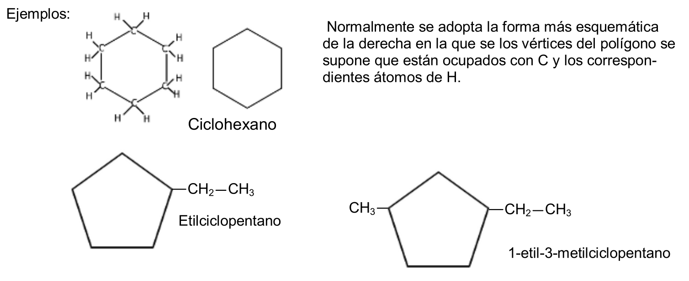{ style="display: block; margin: 0 auto; width: 100%; height: auto;" }

### **3.2 Alquenos (-eno)** {: .caja-subtitulo}

Los **alquenos** son hidrocarburos no saturados que contienen **dobles enlaces** carbono-carbono, **C=C**. 

Los dobles enlaces se localizan con números localizadores colocados antes del sufijo -eno.

### **Nomenclatura** {: .caja-subtitulo2}

- Los alquenos se nombran igual que los hidrocarburos saturados correspondientes cambiando la terminación -**ano** por -**eno**.

- En caso de que sea necesario se especifica la posición del doble enlace con un número (localizador). El localizador se coloca inmediatamente antes de la terminación característica del compuesto (eno).

- La numeración de la cadena se hace de forma que el localizador del doble enlace tenga el número más bajo posible.

Existen algunos radicales insaturados que por su importancia conviene conocer:

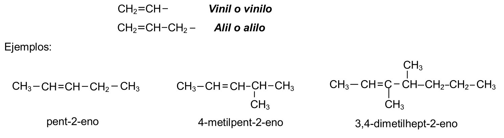{ style="display: block; margin: 0 auto; width: 100%; height: auto;" }

### **Cicloalquenos** {: .caja-subtitulo}

Los **cicloalquenos** son hidrocarburos insaturados que poseen uno o más dobles enlaces en su cadena que, además, está ciclada.

### **Nomenclatura** {: .caja-subtitulo2}

Los cicloalquenos se nombran igual que los hidrocarburos saturados cíclicos (cicloalcanos), cambiando la terminación -ano por -eno.

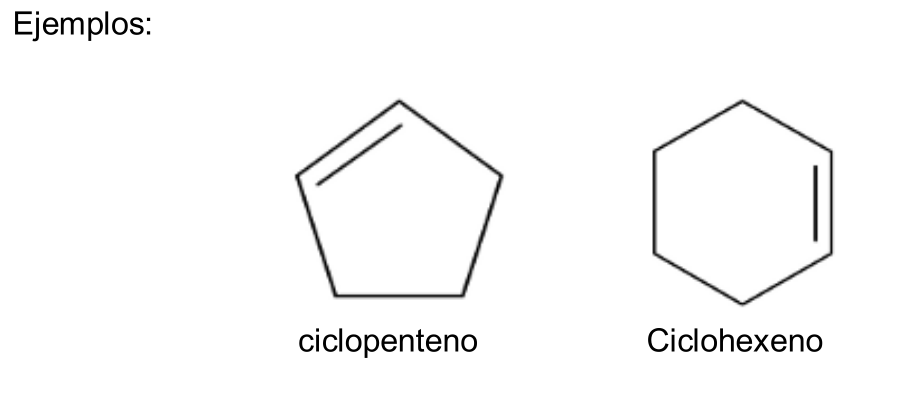{ style="display: block; margin: 0 auto; width: 50%; height: auto;" }

### **3.3 Alquinos (-ino)** {: .caja-subtitulo}

Los **alquinos** son hidrocarburos insaturados que se caracterizan por tener **triples enlaces** carbono-carbono

### **Nomenclatura** {: .caja-subtitulo2}

- Los **alquinos** se nombran igual que los hidrocarburos saturados correspondientes, cambiando la terminación -**ano** por -**ino**. Los localizadores se colocan inmediatamente antes de la terminación característica del compuesto (ino).
  
- La numeración de la cadena se hará de forma tal que el triple enlace tenga el localizador más bajo.

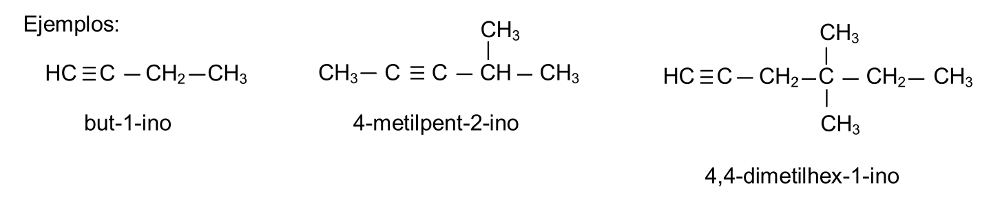{ style="display: block; margin: 0 auto; width: 100%; height: auto;" }

### **3.4 Hidrocarburos Aromáticos (-benceno)** {: .caja-subtitulo}

Se denominan **compuestos aromáticos** al benceno ($\ce{C6H6}$) y todas aquellas sustancias derivadas que por tener núcleos bencénicos en su molécula poseen propiedades químicas similares.
  
{ style="display: block; margin: 0 auto; width: 70%; height: auto;" }

### **Nomenclatura** {: .caja-subtitulo2}

1) Los anillos con **un sustituyente** se nombran anteponiendo el nombre del sustituyente al del benceno.

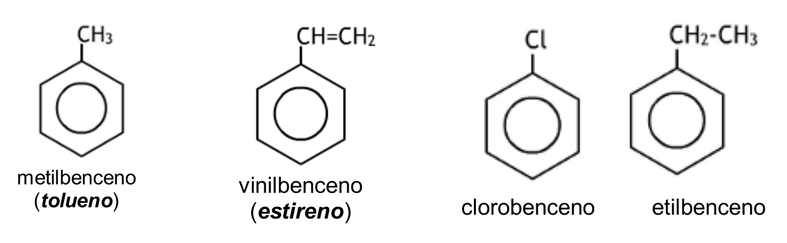{ style="display: block; margin: 0 auto; width: 65%; height: auto;" }

2) En los anillos con **dos sustituyentes** se indican las posiciones con los números 1,2-; 1,3-; y 1,4-; o con los prefijos orto-; meta-; y para-.

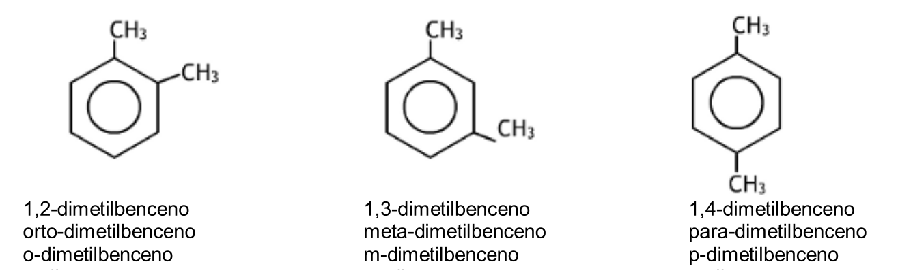{ style="display: block; margin: 0 auto; width: 65%; height: auto;" }

3) Cuando hay **más de dos sustituyentes**, se numera el anillo de modo que los sustituyentes tomen los localizadores más bajos. Si varias numeraciones dan los mismos localizadores se da preferencia al orden alfabético.

{ style="display: block; margin: 0 auto; width: 65%; height: auto;" }

<!--- El radical del benceno se denomina **fenil** o **fenilo**.

*(Imagen: 2-fenilbut-2-eno)*
{ style="display: block; margin: 0 auto; width: 70%; height: auto;" } 

-->

<!---
### **3.5 Derivados Halogenados** {: .caja-subtitulo}

Compuestos obtenidos de hidrocarburos por sustitución por elementos **halogenados** (F, Cl, Br y I).

Se nombran citando en primer lugar el nombre del halógeno como sustituyente fluor-; cloro-; bromo-; y yodo-; seguido del nombre del hidrocarburo, e indicando su posición con el localizador.

Ejemplos: 

$\ce{CH3-CH2-Cl \hspace{1cm}}$  cloroetano

$\ce{CH3-CH=CH2-Br \hspace{1cm}}$  1-bromopropeno   $\ce{\hspace{1cm} CH3-CBr=CH3 \hspace{1cm}}$  2-bromopropeno

-->

## **4. Grupos funcionales**

Cuando el carbono se une a elementos diferentes del hidrógeno origina una estructura que son los grupos **funcionales**. Un **grupo funcional** sería un átomo o grupos de átomos que caracterizan a una serie de compuestos orgánicos con propiedades químicas parecidas.

### **4.1 Alcoholes (-ol)** {: .caja-subtitulo}

Los **alcoholes** resultan de la sustitución de uno o más átomos de hidrógeno de un hidrocarburo por grupos hidroxilo (-**OH**). Si la sustitución tiene lugar en un hidrocarburo alifático se obtienen los alcoholes propiamente dichos y si es aromático se obtienen los **fenoles**.

Los alcoholes se pueden clasificar en primarios, secundarios o terciarios en función de que el grupo -OH se encuentre unido a un carbono primario, secundario o terciario:

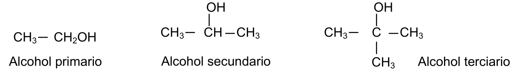{ style="display: block; margin: 0 auto; width: 65%; height: auto;" }

### **Nomenclatura** {: .caja-subtitulo2}

Para nombrarlos observamos las siguientes normas: 

a) Identifica la cadena más larga que contenga al grupo hidroxilo -OH. 

b) Empieza a contar de manera que los hidroxilos queden en las posiciones más bajas posibles. Se incorpora un indicador numérico por cada grupo hidroxilo.

c) Se cambia la terminación -**o** del hidrocarburo por el grupo -**ol**. 

d) Se añade un prefijo numérico delante del sufijo indicando el número de -OH. Si hay más de un hidroxilo, tras la terminación del enlace simple o múltiple se añade una o. 

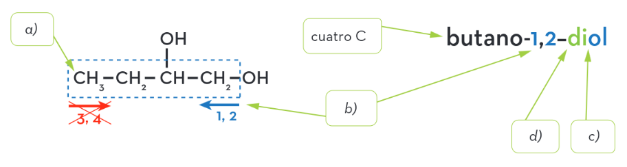{ style="display: block; margin: 0 auto; width: 65%; height: auto;" }

Otros ejemplos:

| Fórmula | Nombre | Fórmula | Nombre |
|:---|:---|:---|:---|
|  | metanol |  | propan-2-ol | 
|  | etanol |  | butano-1,3-diol |

### **4.2 Éter** {: .caja-subtitulo}

En los éteres un átomo de oxígeno enlaza dos radicales de alquilo: **R-O-R'**

Los éteres se pueden considerar derivados de los hidrocarburos por sustitución de un hidrógeno por el radical -O-R (alcoxi), o bien derivados de los alcoholes si consideramos que el hidrógeno del grupo hidroxilo se ha sustituido por un radical de alquilo.

Si los dos radicales de alquilo son iguales se dice que el éter es simétrico y si son diferentes, asimétrico.

### **Nomenclatura** {: .caja-subtitulo2}
 
Se nombran los radicales (por orden alfabético) unidos al átomo de oxígeno seguidos de la palabra éter.

Ejemplos:

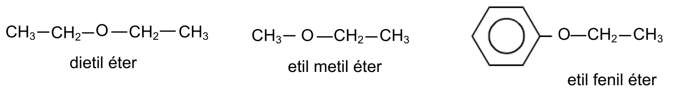{ style="display: block; margin: 0 auto; width: 85%; height: auto;" }

### **Grupo funcional: - CO - (carbonilo)**

El grupo carbonilo consta de un oxígeno unido mediante un doble enlace al carbono. Puede estar situado en un carbono primario o en uno secundario

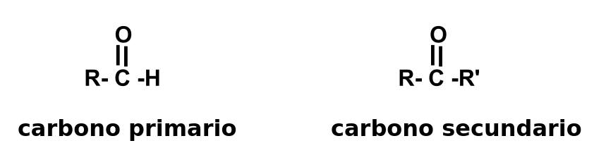{ style="display: block; margin: 0 auto; width: 50%; height: auto;" }

### **4.3 Aldehídos (-al)** {: .caja-subtitulo}

En los aldehídos el grupo carbonilo se encuentra en un carbono primario: { style="display: inline-block; vertical-align: bottom; width: 10%; height: auto;" }

### **Nomenclatura** {: .caja-subtitulo2}

Se nombran cambiando la terminación del hidrocarburo por -**al**.

Ejemplos:

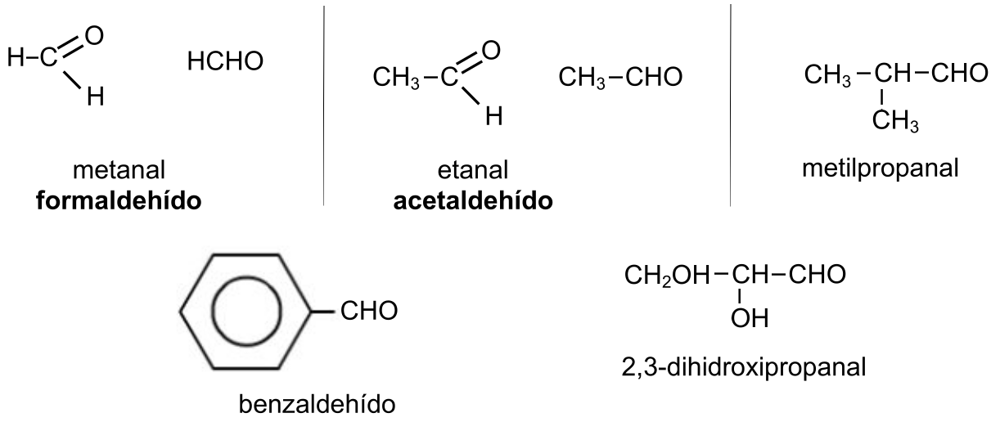{ style="display: block; margin: 0 auto; width: 85%; height: auto;" }

### **4.4 Cetonas (-ona)** {: .caja-subtitulo}

En las cetonas el grupo carbonilo se encuentra en un carbono secundario:
R- C -R'

### **Nomenclatura** {: .caja-subtitulo2}

La cadena se numera de tal forma que el grupo carbonilo tenga el número más bajo posible.

Se nombran cambiando la terminación del hidrocarburo por -**ona**.

Ejemplos:

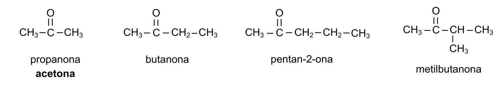{ style="display: block; margin: 0 auto; width: 85%; height: auto;" }

### **4.5 Ácidos Carboxílicos (-oico)** {: .caja-subtitulo}

Grupo carboxílico (-COOH)

- Se nombran anteponiendo la palabra ácido al nombre del hidrocarburo del que proceden con la terminación -oico. Si hay dos -COOH-, se añade -dioico.

- Orden numeración: solo pueden ser terminales. Se empieza a numerar por el extremo donde está el -COOH-. No localizador.

| Fórmula | Nombre | Observaciones |
|---|---|---|
| H-COOH | Ácido metanoico (Ácido fórmico) | En la escritura de los ácidos el grupo funcional se acostumbra a escribirlo abreviadamente como -COOH, aunque se sobreentiende que lleva un doble enlace C=O. El nombre ácido fórmico es un nombre común aceptado. |
| CH3-CH2-COOH | Ácido propanoico (Ácido propiónico) | El localizador 1 del grupo -COOH no se indica, pues siempre va en un extremo. El nombre de ácido propanoico es un nombre común aceptado. |
| CH3-CH(CH3)-COOH | Ácido metilpropanoico (Ácido isobutírico) | No es necesario indicar el localizador 2 del sustituyente (metil), ya que no ofrece duda al no poder ir en otro lugar. |
| CH3-CH=CH-COOH | Ácido but-2-enoico (Ácido 2-butenoico) | No es necesario indicar el localizador 2 del doble enlace, pues no puede ir en otro lugar. |
| CH3-CH≡C-COOH | Ácido but-2-inoico (Ácido 2-butinoico) | No es necesario indicar el localizador 2 del triple enlace, pues no puede ir en otro lugar. |
| HOOC-COOH | Ácido etanodioico (Ácido oxálico) | El sufijo -dioico indica que hay dos grupos carboxilo. |
| C₆H₅-COOH | Ácido benzoico | El nombre ácido benzoico es un nombre común pero es el que más se utiliza. |

### **4.6 Ésteres -oato** {: .caja-subtitulo}

Grupo carboxilo (-COOH) sustituido por un radical (-COOR')

Se obtiene en la reacción de esterificación.

- Se nombran como el ácido del que proceden, eliminando la palabra ácido, cambiando la terminación -ico del ácido por -ato, seguido de la preposición de y el nombre del radical terminado por -ilo.

- Sustituyente (-COOR-): prefijo alcoxicarbonil-. Prioritarios ante: ácidos carboxílicos.

| Fórmula | Nombre | Observaciones |
|---|---|---|
| H-COO-CH2-CH3 | Metanoato de propilo (Formiato de propilo) | Este éster deriva del ácido metanoico (fórmico). El radical está escrito a continuación del grupo -COOR. |
| CH3-CH(CH3)-CH2-COO-CH2-CH3 | 3-Metilbutanoato de etilo | En la numeración tiene preferencia el grupo -COOR al que le corresponde el localizador 1, pero no hace falta indicarlo. |
| HCOO-CH2-CH2-CH2-COO-CH3 | Pent-4-inoato de metilo (4-Pentinoato de metilo) | Al grupo -COOR le corresponde el localizador 1, ya que tiene preferencia sobre instauraciones. |
| C₆H₅-COO-CH3 | Benzoato de metilo | Deriva del ácido benzoico C₆H₅-COOH. En el que se ha sustituido el hidrógeno por un grupo metilo. |
| CH3-COO-C₆H₅ | Etanoato de fenilo (Acetato de fenilo) | El radical fenilo -C₆H₅ ha sustituido al hidrógeno del grupo -COOH del ácido etanoico (ácido acético). |

### **4.7 Aminas** {: .caja-subtitulo}

Derivados del amoniaco (NH₃) por sustitución de uno, dos o tres H por radicales.

**NOMENCLATURA FUNCIONAL**

Se nombran en orden alfabético los radicales seguidos de la palabra amina sin espacio entre ellos. Si los radicales son idénticos se simplifican anteponiendo el prefijo di- o tri-.

### 4.7.1 Aminas Primarias

**NOMENCLATURA SUSTITUTIVA**

Se nombran añadiendo -amina al nombre del hidrocarburo que ha sustituido al hidrógeno del amoniaco, anteponiendo el localizador.

- Orden de numeración: grupo -NH₂ tiene preferencia sobre las instauraciones. Se numera la cadena de modo que el grupo -NH₂ le corresponda el localizador más bajo.

- Sustituyente (-NH₂): Prefijo amino-. Son prioritarios frente a las aminas: ácidos carboxílicos, ésteres, aldehídos y cetonas.

| Fórmula | Nombre de sustitución | Nombre funcional | Observaciones |
|---|---|---|---|
| CH2=CH-NH₂ | Etenamina | Vinilamina Etenamina | El radical CH2=CH- se puede nombrar como etenil o vinil. |
| CH2=CH-CH2-NH₂ | Prop-2-en-1-amina (2-Propen-1-amina) | Alilamina | Se le asigna el localizador más bajo. |
| C₆H₅-NH₂ | Bencenamina | Fenilamina (Anilina) | Anilina es nombre común. |
| NH₂-CH2-CH(NH₂)-CH2-CH3 | Butano-1,2-diamina (1,2-Butanodiamina) | | En los casos que haya dos o más grupos amino -NH₂, se utiliza la nomenclatura de sustitución. |
| NH₂-CH2-CH=CH-CH2-CH3 | Pent-3-en-1-amina (3-Penten-1-amina) | 3-Pentenamina | La amina tiene preferencia sobre el doble enlace. El carbono 1 es el que está unido al nitrógeno. La nomenclatura de sustitución es la más utilizada para estos casos. |

### 4.7.2 Aminas Secundarias y Terciarias

**NOMENCLATURA SUSTITUTIVA**

Se nombran como derivados N-sustituidos de una amina primaria, a la que le corresponde el radical R de mayor prioridad.

- Orden de numeración: El nitrógeno no se numera en la cadena. Los radicales se nombran independientemente desde el carbono unido al nitrógeno. Para indicar que un radical se une al nitrógeno, se utiliza como localizador la letra N escrita en cursiva.

| Fórmula | Nombre | Observaciones |
|---|---|---|
| CH3-NH-CH3 | Dimetilamina | Se puede escribir sin indicar los enlaces simples: (CH3)₂NH. El radical se escribe entre paréntesis con el subíndice 2. En las aminas secundarias hay que sustituir 2 hidrógenos del amonio y por lo tanto queda -NH- unido a los dos radicales y no -NH₂. |
| CH3-CH2-NH-CH2-CH3 | Dietilamina | El nombre se escribe sin espacios. Se puede escribir sin indicar los enlaces: (CH3CH2)₂NH. |
| CH3-N(CH3)-CH3 | Trimetilamina | También se puede escribir: (CH3)₃N. |
| CH3-CH2-N(CH2-CH3)-CH2-CH3 | Trietilamina | También se puede escribir: (CH3CH2)₃N. |
| C₆H₅-NH-C₆H₅ | Difenilamina | El radical derivado del benceno es el fenil- y se puede escribir como C₆H₅- o bien utilizar el anillo bencénico. |

| Fórmula | Nombre | Observaciones |
|---|---|---|
| CH3-CH2-NH-CH2-CH2-CH3 | N-Etilpropan-1-amina N-Etilpropilamina (Etil)propilamina | La cadena principal es el radical de 3 átomos de carbono. Obsérvese el uso de los paréntesis para indicar claramente cuáles son los sustituyentes de N. |
| CH3-NH-CH2-CH2-CH3 | N-Metilpropan-1-amina N-Metilpropilamina (Metil)propilamina | La cadena principal es el radical de 3 átomos de carbono. |
| CH3-NH-CH=CH2 | N-Metiletenamina N-Metilvinilamina Metil(vinil)amina | La cadena principal es el radical de 2 átomos de carbono. El radical es un metilo frecuentemente como un radical. |
| CH3-CH2-CH2-CH2-NH-CH(CH3)₂ | N-Isopropilbutan-1-amina (Butil)isopropilamina | La cadena principal es el radical de 4 átomos de carbono. En la función, los radicales se nombran en orden alfabético. |
| CH3-N(CH3)-CH2-CH2-CH3 | N,N-Dimetilpropan-1-amina N,N-Dimetilpropilamina (Dimetil)propilamina | La cadena principal es el radical de 3 átomos de carbono. Se usa el localizador N- para indicar que los dos radicales metilos van unidos al átomo de nitrógeno. |
| CH3-CH2-CH2-CH2-N(CH3)-CH2-CH3 | N-Etil-N-metilbutan-1-amina N-Etil-N-metilbutilamina Butil(etil)metilamina | En la nomenclatura funcional, los radicales se nombran en orden alfabético. La cadena principal es el benceno. En la función, los radicales se nombran en orden alfabético. Anilina es el nombre común de la fenilamina. |

