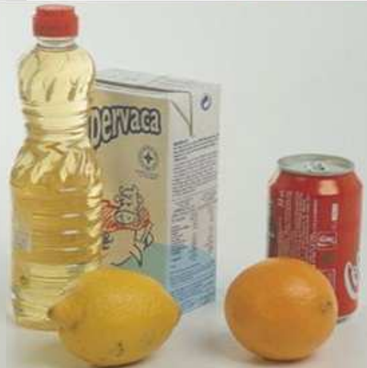
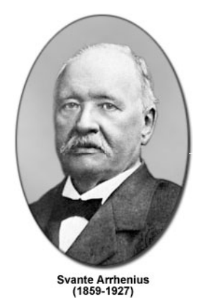
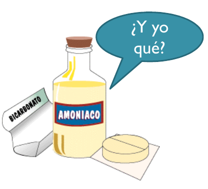
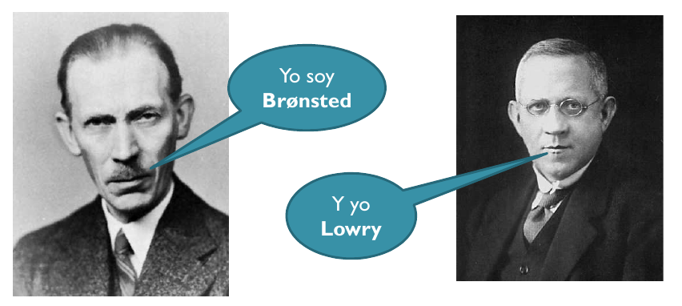
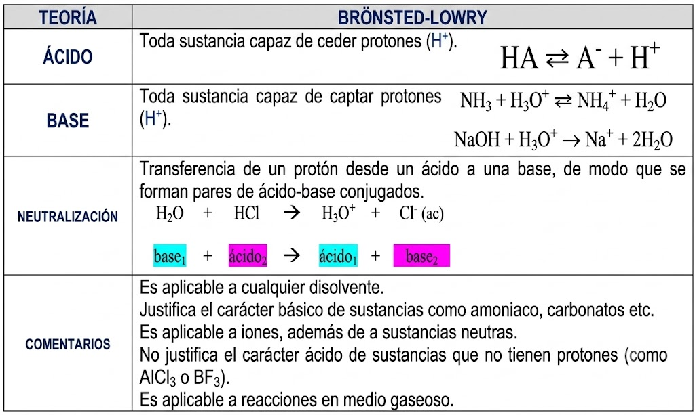
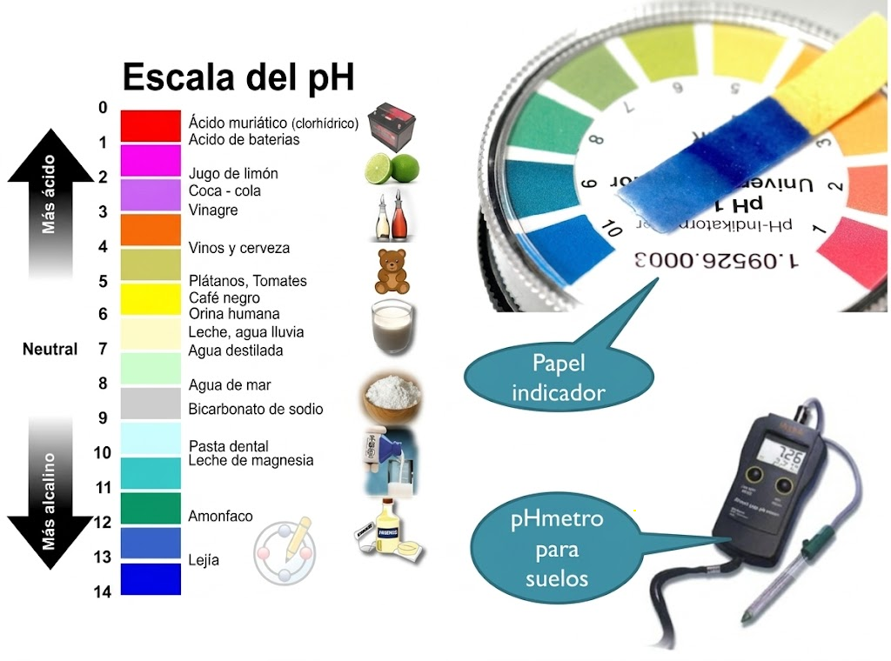
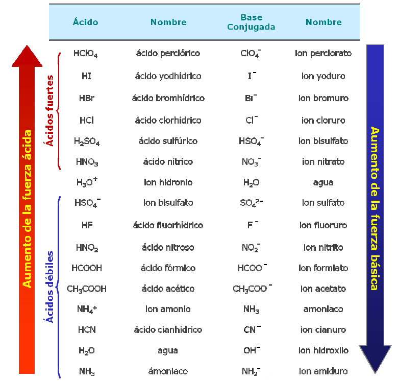
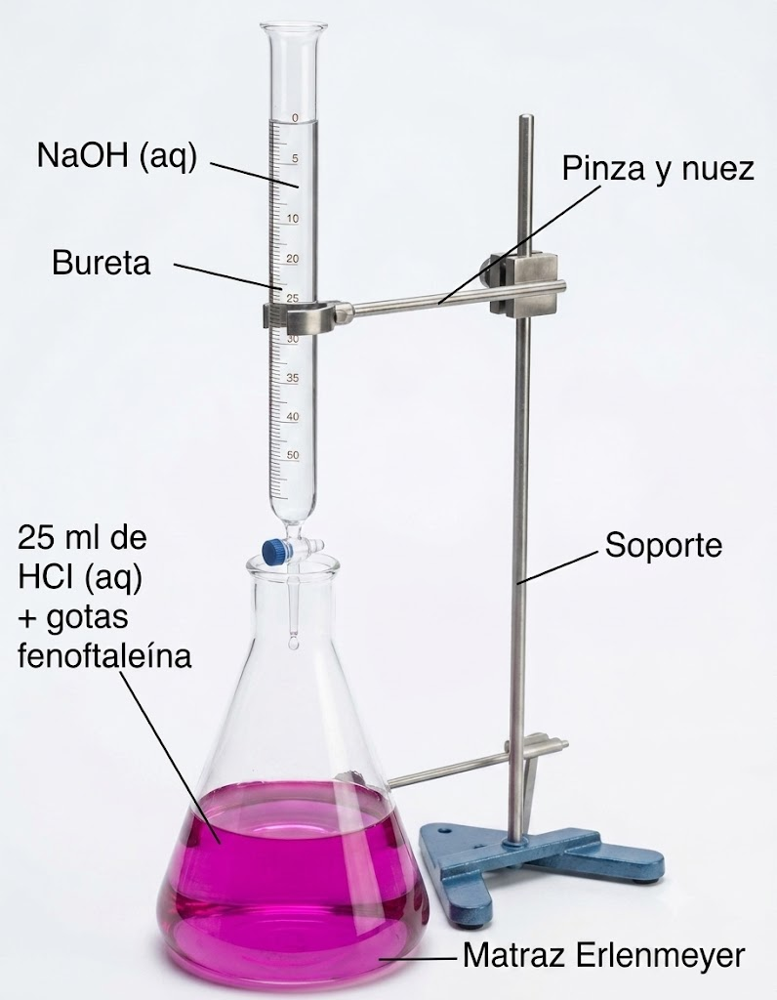
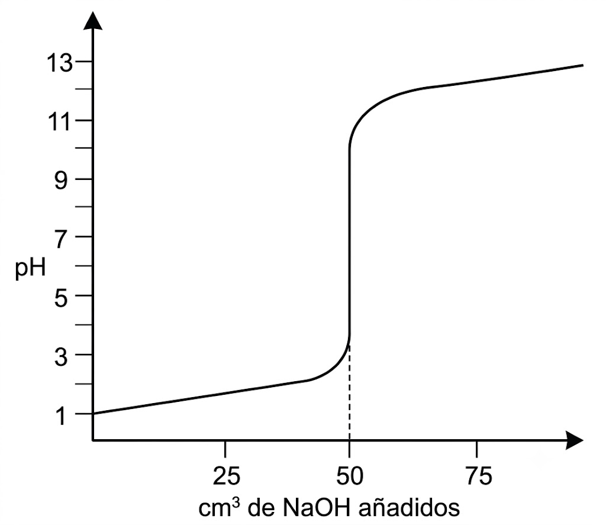
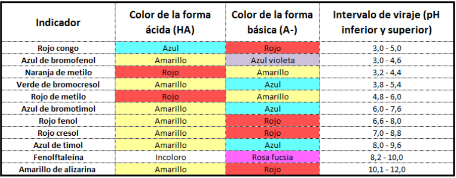

# Tema 6: Reacciones de transferencia de protones

## **1. Introducción**

El título del tema, **"Reacciones de transferencia de protones"**, hace referencia a las definiciones de ácido y base que vamos a manejar:

* **Ácido:** Es una sustancia capaz de ceder protones ($\ce{H^+}$).
* **Base:** Es una sustancia capaz de aceptar protones ($\ce{H^+}$).

De ahí que cualquier reacción ácido-base será una reacción de transferencia de protones, en la que el ácido los cede y la base los acepta.

### **Propiedades Generales de Ácidos y Bases (Definición Histórica)** {: .caja-subtitulo}

| Propiedad | Ácidos | Bases |
| :--- | :--- | :--- |
| **Sabor** | Agrio (como el vinagre o el limón). | Amargo. |
| **Tacto / Contacto** | Corrosivos para la piel. | Suaves (jabonosas) al tacto, pero corrosivas con la piel. |
| **Indicadores (Tornasol)** | Enrojecen el papel de tornasol. | Dan color azul al papel de tornasol. |
| **Materia orgánica** | Las disoluciones concentradas la destruyen. | Las disoluciones concentradas la destruyen. |
| **Reacción con metales** | Atacan metales activos desprendiendo hidrógeno ($\ce{H2}$). | Reaccionan generando precipitados insolubles (hidróxidos). |
| **Neutralización** | Neutralizan los efectos de las bases. | Neutralizan los efectos de los ácidos. |
| **Conductividad eléctrica** | Conducen la corriente en disolución acuosa (electrolitos). | Conducen la corriente en disolución acuosa (electrolitos). |
| | {style="display: inline-block; width: 48%; vertical-align: middle;"} | {style="display: inline-block; width: 48%; vertical-align: middle;"} |

## **2. Definición de Arrhenius de Ácido y Base**

### **Los Ácidos y Bases como Electrolitos** {: .caja-subtitulo}

Arrhenius, químico sueco, llamó **electrolito** a cualquier sustancia que al disolverse en agua condujese la electricidad. 

Propuso que estas sustancias, al disolverse, se disociaban en dos partes cargadas eléctricamente con signos opuestos:

* A la partícula con carga positiva la llamó **catión**.

* A la partícula con carga negativa la llamó **anión**.

Dado que los ácidos y las bases conducen la electricidad al disolverse en agua, estableció que dichas sustancias eran electrolitos. Esto posibilitó el desarrollo del primer modelo teórico para explicar la naturaleza de los ácidos y las bases.

{style="display: block; margin: 0 auto; width: 20%"}

Arrhenius propuso que el catión que se producía cuando se disolvía un ácido en agua era siempre el mismo: el **ión hidrógeno** ($\ce{H^+}$) [o ión hidronio, $\ce{H3O^+}$], y que las propiedades de los ácidos se debían precisamente a la presencia de dichos iones.

Asimismo, propuso que cuando se disolvía una base en agua, se producía siempre el **ión hidróxido** ($\ce{OH^-}$), lo que daba a las bases sus propiedades características. De ahí sus definiciones:

<strong>Ácido:</strong> Toda sustancia que, en disolución acuosa, se disocia produciendo iones hidrógeno (protones, $\ce{H^+}$):

  
$$\ce{HA \xrightarrow{\ce{H2O}} H^+ + A^-}$$

<strong>Base:</strong> Toda sustancia que, en disolución acuosa, se disocia produciendo aniones hidróxido ($\ce{OH^-}$):

  
$$\ce{BOH \xrightarrow{\ce{H2O}} B^+ + OH^-}$$

Esta teoría interpretaba correctamente el comportamiento de la mayoría de ácidos y bases en disolución acuosa, pero presentaba algunas limitaciones importantes.

**Limitaciones de la Teoría de Arrhenius**

Son básicamente dos:

1.  **Restricción al disolvente:** Su teoría estaba restringida exclusivamente a disoluciones acuosas, dejando fuera a otro tipo de procesos que transcurren en otros disolventes o que no transcurren en disolución.
2.  **Sustancias sin grupo hidróxido:** Existen sustancias que son claramente básicas, como el amoníaco ($\ce{NH3}$) o los carbonatos (ión carbonato, $\ce{CO3^{2-}}$), que no contienen el grupo $\ce{OH^-}$ en su estructura y que, por lo tanto, no encajaban en su definición clásica de base.

{style="display: block; margin: 0 auto; width: 20%"}

## **3. Teoría Ácido-Base de Brønsted-Lowry**

Las limitaciones de la teoría de Arrhenius fueron superadas por la propuesta del químico danés Johannes Nicolaus Brønsted y el inglés Thomas Martin Lowry, quienes en 1923, de forma independiente, propusieron una nueva definición:

<strong>Ácido:</strong> Toda sustancia capaz de ceder protones ($\ce{H^+}$)

<strong>Base:</strong> Toda sustancia capaz de aceptar protones ($\ce{H^+}$)

Esta teoría es válida para cualquier disolvente, aunque en este curso se sobreentenderá que el disolvente empleado siempre es el agua ($\ce{H2O}$).

La gran ventaja de este modelo es que elimina la necesidad de la presencia obligatoria del ión $\ce{OH^-}$ en la estructura de la molécula para justificar la basicidad. Por ejemplo, el comportamiento básico del amoníaco ($\ce{NH3}$) en agua se explica de la siguiente manera:

$$\ce{NH3 + H2O \rightleftharpoons NH4^+ + OH^-}$$

Aquí, el $\ce{NH3}$ actúa como base (acepta un protón) y el $\ce{H2O}$ actúa como ácido (cede un protón).

{style="display: block; margin: 0 auto; width: 50%; border: 1px solid #333;"}

### **Resumen de la Teoría de Brønsted-Lowry** {: .caja-subtitulo }

{style="display: block; margin: 0 auto; width: 75%"}

*(Nota: Aunque la teoría de Brønsted y Lowry fue ampliada posteriormente por la teoría de Lewis, durante el resto del tema utilizaremos preferentemente el modelo de Brønsted-Lowry).*

### **Ácidos y Bases de Lewis** {: .caja-subtitulo }

El químico estadounidense Gilbert N. Lewis, en 1938, amplió la definición de ácido y base de la siguiente manera:

<strong>Ácido:</strong> Toda sustancia que puede aceptar un par de electrones solitarios para formar un enlace

<strong>Base:</strong> Toda sustancia que puede donar un par de electrones solitarios para formar un enlace

La diferencia clave radica en la estructura electrónica: el ácido debe tener su octeto de electrones incompleto (un orbital vacío), mientras que la base debe poseer al menos un par de electrones no compartidos.

La reacción de un ácido con una base de Lewis da como resultado un compuesto de adición mediante la formación de un **enlace covalente coordinado o dativo**.

* **Ejemplos de ácidos de Lewis:** $\ce{BF_3}$, $\ce{AlCl_3}$, $\ce{Fe^{3+}}$, $\ce{Ag^+}$.
* Estos ácidos son catalizadores sumamente importantes en muchas reacciones de química orgánica (como la halogenación de benceno o la alquilación de Friedel-Crafts).

## **4. Pares Ácido-Base Conjugados**

Cuando un ácido ($\ce{HA}$) cede un protón, produce un anión ($\ce{A^-}$):

$$\ce{HA \rightleftharpoons H^+ + A^-}$$

El anión $\ce{A^-}$, por su parte, posee la capacidad de capturar un protón para regenerar el ácido de partida:

$$\ce{A^- + H^+ \rightleftharpoons HA}$$

Dado que el anión $\ce{A^-}$ puede captar un protón, se comporta como una base. Por ello, decimos que **$\ce{A^-}$ es la base conjugada del ácido $\ce{HA}$**. Ambos constituyen un **par ácido-base conjugado** ($\ce{HA / A^-}$).

El mismo razonamiento se puede hacer a partir de una base ($\ce{B}$) que captura un protón para dar su ácido conjugado ($\ce{BH^+}$):

$$\ce{B + H^+ \rightleftharpoons BH^+}$$

Donde **$\ce{BH^+}$ es el ácido conjugado de la base $\ce{B}$**.

### **Reacciones Ácido-Base (Brønsted y Lowry)** {: .caja-subtitulo }

Bajo esta teoría, es evidente que si un ácido (I) cede un protón es porque hay una base (II) presente que lo acepta. Por ello, las reacciones ácido-base son reacciones de transferencia de protones, y el proceso global se representa así:

$$\ce{\text{Ácido}_1 + \text{Base}_2 \rightleftharpoons \text{Base conjugada}_1 + \text{Ácido conjugado}_2}$$

$$\ce{HA + B \rightleftharpoons A^- + BH^+}$$

La doble flecha indica que se trata de un equilibrio químico que puede estar desplazado hacia un lado o hacia el otro según la fuerza relativa de las especies.

Es muy frecuente que la sustancia que complete la reacción ácido-base actúe como disolvente (el agua):

$$\ce{HA + H2O \rightleftharpoons A^- + H3O^+}$$

Por **ejemplo**, considera la reacción que involucra el ácido acético ($\ce{CH3-COOH}$) y el agua ($\ce{H2O}$):

$$\ce{CH3-COOH + H2O \rightleftharpoons CH3-COO^- + H3O^+}$$

- El ácido acético dona un protón para convertirse en acetato ($\ce{CH3-COO^-}$), su base conjugada.
  
- El agua acepta un protón para convertirse en ión hidronio ($\ce{H3O+}$), su ácido conjugado.

Así, $\ce{CH3-COOH}$ y $\ce{CH3-COO^-}$ son un par ácido-base conjugado, $\ce{H2O}$ y $\ce{H3O+}$ y son otro par ácido-base conjugado.

Otro **ejemplo** tendriamos si consideramos la reacción que involucra el amoniaco ($\ce{NH3}$) y el agua ($\ce{H2O}$):

$$\ce{NH3 + H2O \rightleftharpoons NH4^+ + OH^-}$$

- El amoniaco capta un protón para convertirse en ion amonio ($\ce{NH4^+}$), su ácido conjugado.
  
- El agua cede un protón para convertirse en ión hidróxido ($\ce{OH-}$), su ácido conjugado.

Así, $\ce{NH3}$ y $\ce{NH4^+}$ son un par base-ácido conjugado, $\ce{H2O}$ y $\ce{OH-}$ y son otro par ácido-base conjugado.

### **Concepto de Anfótero o Anfolito** {: .caja-subtitulo }

Las sustancias **anfóteras** (o anfolitos) son aquellas moléculas o iones que pueden actuar tanto como donantes o como aceptores de protones. Es decir, según el medio en el que se encuentren, mostrarán un comportamiento ácido o básico.

* **Ejemplos:** El agua ($\ce{H2O}$), el ión bicarbonato ($\ce{HCO3^-}$) y los aminoácidos (que poseen un grupo ácido carboxílico y un grupo amino en su estructura).

 Comportamiento del agua:

* **Frente a un ácido (como el $\ce{HCl}$):** El agua se comporta como una **base**. $\ce{\quad \quad HCl + H2O \rightarrow Cl^- + H3O^+}$

* **Frente a una base (como el $\ce{NH3}$):** El agua se comporta como un **ácido**. $\ce{\quad \quad NH3 + H2O \rightleftharpoons NH4^+ + OH^-}$

**Ejercicios de Autoevaluación**

1. Indica la base conjugada de las siguientes especies cuando actúan como ácidos. Nómbralas:
    - $\ce{H2O \rightarrow}$
    - $\ce{NH4^+ \rightarrow}$
    - $\ce{HCO3^- \rightarrow}$
    - $\ce{HSO4^- \rightarrow}$

2. Indica el ácido conjugado de las siguientes especies cuando actúan como bases:
    - $\ce{NH3 \rightarrow}$ 
    - $\ce{H2O \rightarrow}$ 
    - $\ce{OH^- \rightarrow}$ 
    - $\ce{CO3^{2-} \rightarrow}$ 
    - $\ce{HCO3^- \rightarrow}$ 

3. Completa las siguientes reacciones ácido-base e identifica los pares conjugados (Ácido I / Base I y Ácido II / Base II):
    - $\ce{HF + H2O \rightleftharpoons F^- + H3O^+}$
    - $\ce{NH3 + H2O \rightleftharpoons NH4^+ + OH^-}$
    - $\ce{HCO3^- + OH^- \rightleftharpoons CO3^{2-} + H2O}$
    - $\ce{CH_3COOH + NH3 \rightleftharpoons CH_3COO^- + NH4^+}$

## **5. Fuerza de Ácidos y Bases**

* Un **ácido es fuerte** si tiene una elevada tendencia a ceder protones (disociación prácticamente completa).
* Un **ácido es débil** si tiene poca tendencia a ceder protones (disociación parcial, se establece un equilibrio).
* Una **base es fuerte** si tiene una gran tendencia a aceptar protones (o disociarse liberando $\ce{OH^-}$ totalmente).
* Una **base es débil** si muestra poca tendencia a captar protones.

La fuerza de un ácido o una base es una medida cuantitativa que depende de su constante de equilibrio al reaccionar con el disolvente de referencia (habitualmente el agua).

### **Ácidos Fuertes** {: .caja-subtitulo }

Los **ácidos fuertes más habituales** en el laboratorio son el ácido clorhídrico ($\ce{HCl}$), el ácido sulfúrico ($\ce{H_2SO4}$) y el ácido nítrico ($\ce{HNO_3}$). En un segundo término encontramos el ácido perclórico ($\ce{HClO_4}$) o el ácido yodhídrico ($\ce{HI}$).

En **disolución acuosa diluida**, consideramos que **están totalmente ionizados** (disociados al 100 %):

$$\ce{HCl + H2O \rightarrow Cl^- + H3O^+}$$

$$\ce{HNO_3 + H2O \rightarrow NO_3^- + H3O^+}$$

Se utiliza una **única flecha** para indicar que la reacción es irreversible (disociación completa). En estos casos se cumple que:

$$\ce{[H3O^+] = C_{\text{ácido inicial}}}$$

* **Ejemplo:** Si disolvemos 0,15 mol de $\ce{HCl}$ en agua hasta completar 1 L de disolución, se cumple que:
  
    $$\ce{[H3O^+] = [Cl^-] = \dfrac {\ce{n}}{\ce{V}} = \dfrac {\ce{0,15 mol}}{\ce{1 L}} = 0,15 \text{ M}}$$

    $$\ce{\text{pH} = - \log \ (0,15) \approx 0,82}$$

### **Bases Fuertes** {: .caja-subtitulo }

Los hidróxidos de los metales alcalinos (Grupo 1: $\ce{LiOH}$, $\ce{NaOH}$, $\ce{KOH}$...) y alcalinotérreos (Grupo 2: $\ce{Ca(OH)2}$, $\ce{Ba(OH)2}$...) son bases fuertes debido a que son compuestos iónicos que se disocian completamente en sus iones al disolverse en agua.

* **Ejemplo de disociación del $\textbf{NaOH}$:**
  
    $$\ce{NaOH \xrightarrow{\ce{H2O}} Na^+ + OH^-}$$

En disolución, la especie química que actúa realmente como base de Brønsted-Lowry es el **ión hidróxido** ($\ce{OH^-}$), ya que capta con gran avidez un protón del medio para dar una molécula de agua:

$$\ce{OH^- + H3O^+ \rightarrow 2 H2O}$$

Por convención, decimos que el $\ce{NaOH}$, $\ce{KOH}$ o el $\ce{Ca(OH)2}$ son bases fuertes, aunque en sentido estricto son los proveedores del ión hidróxido libre ($\ce{OH^-}$).

### **Ácidos y Bases Débiles** {: .caja-subtitulo }

La inmensa mayoría de los ácidos y bases de la naturaleza son débiles. Al disolverse en agua no se disocian de forma completa, por lo que en el estado de equilibrio coexisten las moléculas neutras sin disociar junto a los iones producidos.

* El ácido débil más representativo en los problemas es el **ácido acético** o **etanoico** ($\ce{CH3-COOH}$).
* La base débil más común es el **amoníaco** ($\ce{NH3}$).

**Constante de Disociación de un Ácido Débil ($\ce{Ka}$)**

Para un ácido débil genérico ($\ce{HA}$) en disolución acuosa, se establece el siguiente equilibrio:

$$\ce{HA + H2O \rightleftharpoons A^- + H3O^+}$$

Según la ley de acción de masas, la constante de equilibrio ($\ce{Kc}$) se define como:

$$\ce{Kc = \frac{[A^-][H3O^+]}{[HA][H2O]}}$$

Dado que el agua actúa como disolvente y su concentración permanece prácticamente constante ($[\ce{H2O}] \approx 55,5 \text{ M}$), se incluye dentro de la constante de equilibrio en el primer miembro de la ecuación, dando lugar a la **constante de acidez ($\ce{Ka}$)**:

$$\ce{Ka = Kc \cdot [H2O] = \frac{[A^-][H3O^+]}{[HA]} \quad \rightarrow \quad Ka = \frac{[A^-][H3O^+]}{[HA]} }$$

**Constante de Disociación de una Base Débil ($\ce{Kb}$)**

Para una base débil genérica ($\ce{B}$) en disolución acuosa, el equilibrio correspondiente es:

$$\ce{B + H2O \rightleftharpoons BH^+ + OH^-}$$

La constante de equilibrio correspondiente es:

$$\ce{Kc = \frac{[BH^+][OH^-]}{[B][H2O]}}$$

Integrando la concentración constante del agua en la constante de equilibrio, definimos la **constante de basicidad ($\ce{Kb}$)**:

$$\ce{Kb = Kc \cdot [H2O] = \frac{[BH^+][OH^-]}{[B]} \quad \rightarrow \quad  Kb = \frac{[BH^+][OH^-]}{[B]} }$$

### **$\ce{\textbf{Ka}}$, $\ce{\textbf{Kb}}$ y la fortaleza de ácidos y bases** {: .caja-subtitulo }

Los valores numéricos de las constantes de acidez ($\ce{Ka}$) o basicidad ($\ce{Kb}$) indican de forma directa la fuerza relativa de las especies:

* Un valor **muy pequeño** de la constante ($\ce{Ka \ll 1}$) indica que el equilibrio está muy desplazado hacia los reactivos (ácido muy poco disociado, es decir, ácido muy débil).
* Un valor **grande** indica un mayor grado de disociación en el equilibrio.
* En el caso de los **ácidos fuertes** (disociados prácticamente al 100 %), la concentración de reactivo sin disociar en el denominador es casi nula ($\ce{[HA] \rightarrow 0}$), por lo que sus constantes de acidez teóricas tienden a infinito ($\ce{Ka \rightarrow \infty}$).

En los ácidos y bases débiles se define el **grado de disociación**, $\alpha$, como la fracción de moléculas disociadas inicialmente del ácido o de la base que se puede expresar en tanto por uno o en tanto por cien.

$$\ce{\alpha \ = \dfrac {\ce{x}}{\ce{c_0}} }$$

Cuanto más pequeño sea el grado de disociación, más débil será el ácido o la base, teniendo en cuenta que $\alpha \ = 100 \%$ o $\alpha \ = 1$ en los ácidos y bases fuertes. Los valores de Ka pueden establecer una clasificación aproximada de los ácidos según:

| Valores de Ka | $\textbf{Ka > 55}$ | $\textbf{55 > Ka > 10}^{-4}$ | $\textbf{10}^{-4} \textbf{> Ka > 10}^{-14}$ | $\textbf{Ka < 10}^{-14}$ |
| | | | | |
| Fuerza del ácido | Fuerte | Intermedio | Débil | Muy débil |

**Ejemplo de cálculo en ácidos débiles**

**Problema:** Calcula la concentración de ión hipoclorito ($\ce{ClO^-}$) e ión hidronio ($\ce{H3O^+}$) de una disolución de ácido hipocloroso ($\ce{HClO}$) de concentración $0,05 \text{ M}$.  
Dato: $\ce{Ka (HClO) = 3,0 \cdot 10^{-8}}$

**Solución**:
Planteamos la tabla del equilibrio de disociación:

<table class="arithmatex" style="border-collapse: collapse; margin: auto; border:0.5px solid #f6f8fa;">
  <tr style="background:#eee">
    <td style="border:none; padding:4px;"></td>
    <td style="border:none; padding:4px;">$\ce{HClO}$</td>
    <td style="border:none; padding:4px;">$ + \quad $</td>
    <td style="border:none; padding:4px;">$\ce{H2O}$</td>
    <td style="border:none; padding:4px;">$\leftrightarrows \quad $</td>
    <td style="border:none; padding:4px;">$\ce{ClO^-}$</td>
    <td style="border:none; padding:4px;">$+ \quad $</td>
    <td style="border:none; padding:4px;">$\ce{H3O^+}$</td>
  </tr>
  <tr style="border-bottom: 1px solid #eee;">
    <td style="border:none; padding:4px;">$\small{\textbf{Concentraciones iniciales}:}$</td>
    <td style="border:none; padding:4px;">$\ce{0,05}$</td>
    <td style="border:none; padding:4px;"></td>
    <td style="border:none; padding:4px;">$\ce{Exceso}$</td>
    <td style="border:none; padding:4px;"></td>
    <td style="border:none; padding:4px;">$\ce{-}$</td>
    <td style="border:none; padding:4px;"></td>
    <td style="border:none; padding:4px;">$\ce{-}$</td>
  </tr>
  <tr style="border-bottom: 1px solid #eee;">
    <td style="border:none; padding:4px;">$\small{\textbf{Cambio}:}$</td>
    <td style="border:none; padding:4px;">$\ce{-x}$</td>
    <td style="border:none; padding:4px;"></td>
    <td style="border:none; padding:4px;">$\ce{-}$</td>
    <td style="border:none; padding:4px;"></td>
    <td style="border:none; padding:4px;">$\ce{+x}$</td>
    <td style="border:none; padding:4px;"></td>
    <td style="border:none; padding:4px;">$\ce{+x}$</td>
  </tr>
  <tr style="border-bottom: 1px solid #eee;">
    <td style="border:none; padding:4px;">$\small{\textbf{Concentraciones equilibrio}:}$</td>
    <td style="border:none; padding:4px;">$\ce{0,05 - x}$</td>
    <td style="border:none; padding:4px;"></td>
    <td style="border:none; padding:4px;">$\ce{Exceso}$</td>
    <td style="border:none; padding:4px;"></td>
    <td style="border:none; padding:4px;">$\ce{x}$</td>
    <td style="border:none; padding:4px;"></td>
    <td style="border:none; padding:4px;">$\ce{x}$</td>
  </tr>
</table>

La expresión de la constante de acidez $\ce{Ka}$ es:

$$\ce{Ka = \frac{[ClO^-][H3O^+]}{[HClO]} = \frac{x^2}{0,05 - x} = 3,0 \cdot 10^{-8}}$$

Como la constante de acidez es extremadamente pequeña ($\ce{Ka \ll 10^{-4}}$), podemos realizar la aproximación de que la cantidad disociada es despreciable frente a la inicial ($\ce{0,05 - x \approx 0,05}$):

$$\ce{3,0 \cdot 10^{-8} \approx \frac{x^2}{0,05}}$$

$$\ce{x^2 = 3,0 \cdot 10^{-8} \cdot 0,05 = 1,5 \cdot 10^{-9}}$$

$$\ce{x = \sqrt{1,5 \cdot 10^{-9}} \approx 3,87 \cdot 10^{-5} \text{ M}}$$

Por tanto, en el equilibrio:

* $\ce{[H3O^+] = [ClO^-] \approx 3,87 \cdot 10^{-5} \text{ M}}$

* $\ce{[HClO] = 0,05 - 3,87 \cdot 10^{-5} = 0,04996 M \approx 0,05 \text{ M}}$ (se confirma que la aproximación es correcta).

## **6. Producto Iónico del Agua (Kw)**

El agua pura no es un aislante eléctrico absoluto; conduce débilmente la electricidad. Esto se debe a que experimenta un proceso de autoionización, comportándose simultáneamente como ácido y base débil:

$$\ce{2 H2O \rightleftharpoons H3O^+ + OH^-}$$

Como cualquier equilibrio este proceso vendrá gobernado por una constante

$$\ce{K = \dfrac {\ce{[H3O^+] \cdot [OH^-]}}{\ce{[H2O]^2}} }$$

y puesto que la concentración del agua sin disociar puede considerarse prácticamente constante, se puede englobar en la constante de equilibrio y la nueva constante de este equilibrio de autoionización se conoce como **producto iónico del agua ($\ce{Kw}$)**:

$$\ce{Kw = [H3O^+][OH^-]}$$

* A una temperatura estándar de $25 \ ^\circ \text{C}$ ($298 \text{ K}$), el valor experimental de esta constante es:
    $\ce{\quad Kw = 1,0 \cdot 10^{-14}}$

Este producto es una constante termodinámica. Por tanto, se cumple en **cualquier** disolución acuosa diluida, permitiendo calcular la concentración de un ión [$\ce{H3O^+}$] si se conoce la del otro $\ce{[OH^-]}$ y viceversa.

## **7. Disoluciones Ácidas, Básicas y Neutras**

En el agua pura la concentración de iones hidronio y de iones hidróxido es la misma: $\ce{\quad [H3O^+] = [OH^-] = 10^{-7} mol/L}$

Cualquier disolución que cumpla que $\ce{[H3O^+] = 10^{-7} mol/L}$ se dice que es una **disolución neutra**.

A partir de la relación de autoionización, podemos clasificar las disoluciones acuosas a $25 \ ^\circ\text{C}$:

| Tipo de Disolución | Relación de Concentraciones | Concentraciones a $25 \ ^\circ\text{C}$ |
| : | : | : |
| **Neutra** | $\ce{[H3O^+] = [OH^-]}$ | $\ce{[H3O^+] = [OH^-] = 1,0 \cdot 10^{-7} \text{ M}}$ |
| **Ácida** | $\ce{[H3O^+] > [OH^-]}$ | $\ce{[H3O^+] > 1,0 \cdot 10^{-7} \text{ M} > [OH^-]}$ |
| **Básica** | $\ce{[H3O^+] < [OH^-]}$ | $\ce{[H3O^+] < 1,0 \cdot 10^{-7} \text{ M} < [OH^-]}$ |

## **8. Concepto de pH**

Trabajar habitualmente con potencias de base 10 de exponentes negativos tan pequeños resulta incómodo. Para simplificar estos cálculos, Sørensen introdujo en 1909 el concepto de **pH** (potencial de hidrógeno):

$$\ce{pH = - \ log \ [H3O^+] }$$

De esta manera, la escala de pH a $25 \ ^\circ\text{C}$ clasifica las disoluciones en:

* **Disolución Ácida:** $\quad \ce{pH < 7}$
* **Disolución Neutra:** $\quad \ce{pH = 7}$
* **Disolución Básica:** $\quad \ce{pH > 7}$

### **Concepto de pOH** {: .caja-subtitulo }

De forma análoga al pH, se define el **pOH** como el logaritmo cambiado de signo de la concentración de iones hidróxido ($\ce{OH^-}$):

$$\ce{pOH = -\ log \ [OH^-] }$$

En química, el operador matemático **"p"** representa la operación $\ce{- \ log(x)}$ aplicada a cualquier variable.

Si aplicamos logaritmos a la expresión del producto iónico del agua ($\ce{Kw}$):

$$\ce{Kw = [H3O^+] \cdot [OH^-] = 10^{-14}}$$

$$\ce{- \ log (Kw) = - \ log [H3O^+] - \ log [OH^-] = - \ log (10^{-14})}$$

Llegamos a la útil e importantísima relación:

$$\ce{ pH + pOH = 14 }$$

### **Medida del pH** {: .caja-subtitulo }

El pH de una disolución se puede medir experimentalmente en el laboratorio mediante dos métodos principales:

1.  **Indicadores visuales (método cualitativo/semicuantitativo):** Papel indicador universal o disoluciones indicadoras que cambian de color de forma reversible al variar el pH del medio.
2.  **pH-metro (método cuantitativo):** Un sensor potenciométrico calibrado que mide de forma precisa la diferencia de potencial eléctrico entre un electrodo de vidrio de referencia y la disolución, traduciéndola directamente a unidades de pH.

{style="display: block; margin: 0 auto; width: 70%"}

### **Relación entre las constantes $\textbf{Ka}$ y $\textbf{Kb}$ de un par conjugado** {: .caja-subtitulo }

La constante de acidez de un ácido ($\ce{HA}$) y la de su base conjugada ($\ce{A^-}$) están ligadas de manera matemática por medio del producto iónico del agua ($\ce{Kw}$):

$$\ce{Ka \cdot Kb = Kw}$$

**Demostración matemática:**

Escribimos las reacciones de equilibrio para el ácido $\ce{HA}$ y su base conjugada $\ce{A^-}$ en agua:

1.  $$\ce{HA + H2O \rightleftharpoons A^- + H3O^+ \implies Ka = \frac{[A^-][H3O^+]}{[HA]}}$$
2.  $$\ce{A^- + H2O \rightleftharpoons HA + OH^- \implies Kb = \frac{[HA][OH^-]}{[A^-]}}$$

Multiplicando ambas expresiones de las constantes:

$$\ce{Ka \cdot Kb = \left(\frac{[A^-][H3O^+]}{[HA]}\right) \cdot \left(\frac{[HA][OH^-]}{[A^-]}\right)}$$

Simplificando los términos $\ce{[A^-]}$ y $\ce{[HA]}$ en el numerador y denominador:

$$\ce{Ka \cdot Kb = [H3O^+][OH^-] = Kw}$$

Esto demuestra que **cuanto más fuerte es un ácido (mayor $\ce{Ka}$), más débil es su base conjugada (menor $\ce{Kb}$), y viceversa**.

{style="display: block; margin: 0 auto; width: 50%"}

**Relación entre $\textbf{pKa}$ y $\textbf{pKb}$**

Si tomamos el logaritmo negativo ($\ce{- \ log}$) a ambos lados de la ecuación $\ce{Ka \cdot Kb = Kw}$, obtenemos:

$$\ce{- log (Ka \cdot Kb) = - log Kw \quad \rightarrow \quad - log Ka - log  Kb = - log Kw}$$

$$\ce{ \text{p}Ka + \text{p}Kb = \text{p}Kw }$$

A una temperatura de $25^\circ\text{C}$ ($298 \text{ K}$), esta relación se resume en: $\ce{\quad \text{p}Ka + \text{p}Kb = 14 }$

**Algunas Constantes de Acidez comunes ($25^\circ\text{C}$)**

| Ácido | Fórmula | Constante de Acidez ($\ce{Ka}$) | $\ce{\text{p}Ka}$ |
| : | :: | :: | :: |
| Ácido Fluorhídrico | $\ce{HF}$ | $\ce{6,6 \cdot 10^{-4}}$ | $\ce{3,18}$ |
| Ácido Nitroso | $\ce{HNO2}$ | $\ce{4,5 \cdot 10^{-4}}$ | $\ce{3,35}$ |
| Ácido Acético | $\ce{CH3COOH}$ | $\ce{1,8 \cdot 10^{-5}}$ | $\ce{4,74}$ |
| Ácido Hipocloroso | $\ce{HClO}$ | $\ce{3,0 \cdot 10^{-8}}$ | $\ce{7,52}$ |
| Ácido Cianhídrico | $\ce{HCN}$ | $\ce{4,9 \cdot 10^{-10}}$ | $\ce{9,31}$ |

**Ejercicios de Autoevaluación**

**ATENCIÓN:** En la resolución de problemas de ácidos y bases débiles con concentraciones de uso habitual en el laboratorio, se pueden realizar con seguridad las aproximaciones $\ce{[HA]_{\text{equi}} \approx C_0}$ si el grado de disociación es muy bajo. Como regla práctica general, esto se cumple cuando la constante de acidez/basicidad es menor que $\ce{10^{-4}}$ ($\ce{K < 10^{-4}}$). Si no se cumple esta condición, se debe resolver rigurosamente la ecuación completa de segundo grado.

**Ejercicio propuesto**:

Calcula el pH de una disolución acuosa $0,1 \text{ M}$ de ácido nitroso ($\ce{HNO2}$).  Dato: $\ce{Ka (HNO2) = 4,5 \cdot 10^{-4}}$

**Solución:**

Planteamos la tabla del equilibrio de disociación:

<table class="arithmatex" style="border-collapse: collapse; margin: auto; border:0.5px solid #f6f8fa;">
    <tr style="background:#eee">
        <td style="border:none; padding:4px;"></td>
        <td style="border:none; padding:4px;">$\ce{HNO2}$</td>
        <td style="border:none; padding:4px;">$ + \quad $</td>
        <td style="border:none; padding:4px;">$\ce{H2O}$</td>
        <td style="border:none; padding:4px;">$\leftrightarrows \quad $</td>
        <td style="border:none; padding:4px;">$\ce{NO2^-}$</td>
        <td style="border:none; padding:4px;">$+ \quad $</td>
        <td style="border:none; padding:4px;">$\ce{H3O^+}$</td>
    </tr>
    <tr style="border-bottom: 1px solid #eee;">
        <td style="border:none; padding:4px;">$\small{\textbf{Concentraciones iniciales}:}$</td>
        <td style="border:none; padding:4px;">$\ce{0,1}$</td>
        <td style="border:none; padding:4px;"></td>
        <td style="border:none; padding:4px;">$\ce{Exceso}$</td>
        <td style="border:none; padding:4px;"></td>
        <td style="border:none; padding:4px;">$\ce{-}$</td>
        <td style="border:none; padding:4px;"></td>
        <td style="border:none; padding:4px;">$\ce{-}$</td>
    </tr>
    <tr style="border-bottom: 1px solid #eee;">
        <td style="border:none; padding:4px;">$\small{\textbf{Concentraciones equilibrio}:}$</td>
        <td style="border:none; padding:4px;">$\ce{0,1 - x}$</td>
        <td style="border:none; padding:4px;"></td>
        <td style="border:none; padding:4px;">$\ce{Exceso}$</td>
        <td style="border:none; padding:4px;"></td>
        <td style="border:none; padding:4px;">$\ce{x}$</td>
        <td style="border:none; padding:4px;"></td>
        <td style="border:none; padding:4px;">$\ce{x}$</td>
    </tr>
</table>

Como $\ce{Ka}$ está en el límite ($\ce{4,5 \cdot 10^{-4}}$), planteamos y resolvemos la ecuación de segundo grado:

$$\ce{Ka = \frac{[NO2^-] \cdot [H3O^+]}{[HNO2]}  = \frac{x^2}{0,1 - x} = 4,5 \cdot 10^{-4}}$$

$$\ce{x^2 + 4,5 \cdot 10^{-4} \cdot x - 4,5 \cdot 10^{-5} = 0}$$

Resolviendo la ecuación de segundo grado (tomando la raíz positiva):

$$\ce{x = [H3O^+] \approx 6,49 \cdot 10^{-3} \text{ M}}$$

$$\ce{\text{pH} = - log \ [H3O^+] =  - \log \ (6,49 \cdot 10^{-3}) \approx 2,19}$$

**Otros ejercicios**:

1. Si en una disolución $\ce{[H3O+] = 6,5 \cdot 10^{-5} mol/L}$, calcula el pH, el pOH y la concentración de iones hidróxido.

2. ¿Cuál será el pH de una disolución 0,05 M de ácido benzoico? $\ce{Ka = 6,5 \cdot 10^{-5}}$

3. Calcula el pH y el grado de disociación de una disolución de ácido acético 0,015 M. $\ce{Ka = 1,8 \cdot 10^{-4}}$

## **9. Reacciones de Neutralización**

Tradicionalmente, se denomina **reacción de neutralización** a aquella en la que un ácido reacciona cuantitativamente con una base para producir una sal neutra y agua:

  

  $$\text{Ácido} + \text{Base} \rightarrow \text{Sal} + \text{Agua}$$

  

Dependiendo de las proporciones estequiométricas añadidas de reactivos, se pueden dar tres escenarios diferenciados en el medio final:

1.  **Exceso de ácido:** No reacciona toda la cantidad de ácido añadida. La disolución final resultará ácida ($\ce{[H3O^+] > [OH^-]}$).
2.  **Exceso de base:** Queda base libre sin neutralizar. La disolución resultante será básica ($\ce{[H3O^+] < [OH^-]}$).
3.  **Cantidades estequiométricas exactas:** Todo el ácido reacciona con toda la base de forma completa. Se alcanza el **punto de equivalencia**.  
    *(¡Atención! Esto no significa que el pH final tenga que ser estrictamente 7, ya que dependerá del fenómeno de hidrólisis de los iones de la sal formada).*

**Ejemplos de Reacciones de Neutralización**

1.  **Ácido fuerte + Base fuerte:**

    $$\ce{HCl + NaOH \rightarrow NaCl + H2O}$$

    *Sal formada: $\ce{NaCl}$. No sufre hidrólisis, pH en punto de equivalencia = 7.*

2.  **Ácido débil + Base fuerte:**
   
    $$\ce{CH3-COOH + NaOH \rightarrow CH3-COONa + H2O}$$

    *Sal formada: $\ce{CH3COONa}$. Sufre hidrólisis básica, pH en punto de equivalencia > 7.*

3.  **Ácido fuerte + Base débil:**
   
    $$\ce{HCl + NH3 \rightarrow NH4Cl}$$

    *Sal formada: $\ce{NH4Cl}$. Sufre hidrólisis ácida, pH en punto de equivalencia < 7.*

4.  **Ácido débil + Base débil:**
   
    $$\ce{CH3-COOH + NH3 \rightarrow CH3-COO-NH4}$$

    *Sal formada: $\ce{CH3-COO-NH4}$. Sufren hidrólisis ambos iones, pH dependerá de la fortaleza de cada ion.*

## **10. Hidrólisis de Sales**

Cuando una sal se disuelve en agua, se disocia por completo en sus cationes y aniones constituyentes. No obstante, el pH de la disolución resultante no siempre es neutro (pH = 7).

Este comportamiento se conoce como **hidrólisis** (rotura por el agua). Se interpreta de forma sencilla bajo la teoría de Brønsted-Lowry como una reacción de transferencia de protones entre los iones procedentes de la sal disociada y las moléculas de agua.

Para predecir el comportamiento, se debe disociar correctamente la sal y analizar de forma individual la fuerza conjugada de sus cationes y aniones:

* Un ión procedente de un electrolito **fuerte** será un conjugado **débil** y no reaccionará con el agua (no sufre hidrólisis).
* Un ión procedente de un electrolito **débil** será un conjugado **fuerte** y sí reaccionará con el agua (sufre hidrólisis).

### **Hidrólisis Básica** {: .caja-subtitulo }

Se produce cuando los aniones procedentes de la disociación de una sal que deriva de un **ácido débil** actúan como bases de Brønsted-Lowry, captando protones del agua y liberando iones hidróxido ($\ce{OH^-}$) al medio.

 **Ejemplo**: Acetato de sodio ($\ce{CH3-COONa}$)

La sal se disocia completamente en agua:

$$\ce{CH3-COONa \xrightarrow{\ce{H2O}} CH3-COO^- + Na^+}$$

Analizamos cada ión individualmente:

* El catión $\ce{Na^+}$ procede de una base fuerte ($\ce{NaOH}$). Es un ácido conjugado extremadamente débil, por lo que **no reacciona con el agua**.
* El anión acetato ($\ce{CH3-COO^-}$) procede de un ácido débil ($\ce{CH3-COOH}$). Es una base conjugada fuerte y reacciona con el agua en un equilibrio de hidrólisis:

$$\ce{CH3-COO^- + H2O \rightleftharpoons CH3-COOH + OH^-}$$

Como resultado de este equilibrio, se genera un exceso de iones hidróxido ($\ce{OH^-}$) en la disolución. Por consiguiente, el **pH de la disolución de acetato de sodio será mayor que 7 (básico)**.

 **Ejemplo**: Cianuro de Potasio ($\ce{KCN}$)

La sal se disocia por completo en agua:

$$\ce{KCN \xrightarrow{\ce{H2O}} K^+ + CN^-}$$

* El catión $\ce{K^+}$ proviene de una base muy fuerte ($\ce{KOH}$), por lo que no reacciona con el agua.
* El anión cianuro ($\ce{CN^-}$) proviene de un ácido muy débil ($\ce{HCN}$). Reacciona con el agua produciendo ácido cianhídrico y liberando iones hidróxido:
  
$$\ce{CN^- + H2O \rightleftharpoons HCN + OH^-}$$

La liberación de $\ce{OH^-}$ desplaza el pH por encima de 7.

**Relación de fortaleza**:

* Cuanto más débil sea el ácido de procedencia, más fuerte será su base conjugada y mayor será el pH de la disolución de la sal a igualdad de concentración.
* Comparativa: $\ce{Ka (CH3-COOH) = 1,8 \cdot 10^{-5}}$ frente a $\ce{Ka (HCN) = 4,9 \cdot 10^{-10}}$. Como el ácido cianhídrico es mucho más débil que el acético, el ión cianuro es una base conjugada mucho más fuerte. Por tanto, el pH de una disolución de $\ce{KCN}$ será sensiblemente mayor que el de una de $\ce{CH3-COONa}$ de la **misma concentración**.

### **Hidrólisis Ácida** {: .caja-subtitulo }

Se produce cuando los cationes procedentes de la disociación de una sal que deriva de una **base débil** actúan como ácidos de Brønsted-Lowry, cediendo protones al agua, lo que aumenta la concentración de iones hidronio ($\ce{H3O^+}$) y reduce el pH.

 **Ejemplo**: Cloruro de amonio ($\ce{NH4Cl}$)
La sal se disocia completamente al disolverse:

$$\ce{NH4Cl \xrightarrow{\ce{H2O}} NH4^+ + Cl^-}$$

* El anión $\ce{Cl^-}$ procede de un ácido fuerte ($\ce{HCl}$). Es una base conjugada extremadamente débil y **no reacciona con el agua**.
* El catión amonio ($\ce{NH4^+}$) procede de una base débil ($\ce{NH3}$). Actúa como un ácido conjugado fuerte y experimenta hidrólisis cediendo un protón al agua:

$$\ce{NH4^+ + H2O \rightleftharpoons NH3 + H3O^+}$$

Al generarse un exceso de iones hidronio ($\ce{H3O^+}$), **el pH de la disolución resultante será menor que 7 (ácido)**.

### **Sales que no sufren Hidrólisis** {: .caja-subtitulo }

Las sales neutras que proceden simultáneamente de un **ácido fuerte** y una **base fuerte** (cloruros, nitratos, sulfatos o percloratos de metales alcalinos como el sodio o el potasio) no sufren ningún fenómeno de hidrólisis en agua.

**Ejemplo**: Cloruro de sodio ($\ce{NaCl}$)

$$\ce{NaCl \xrightarrow{\ce{H2O}} Na^+ + Cl^-}$$

* $\ce{Na^+}$ (procedente del $\ce{NaOH}$, base fuerte) no reacciona con el agua.
* $\ce{Cl^-}$ (procedente del $\ce{HCl}$, ácido fuerte) no reacciona con el agua.

Ninguno de los dos iones altera el equilibrio de autoionización del agua, por lo que **la disolución se mantiene neutra (pH = 7)**.

### **Sales de Ácido Débil y Base Débil** {: .caja-subtitulo }

En este tipo de sales, tanto el catión como el anión sufren hidrólisis en agua de forma simultánea. El pH final de la disolución dependerá de la fuerza relativa de los electrolitos débiles precursores de la sal:

* Si $\ce{Ka(\text{ácido}) > Kb(\text{base})}$: El catión se hidroliza en mayor grado que el anión, por lo que la disolución será ligeramente **ácida** ($\text{pH} < 7$). Ejemplo: Nitrito de amonio ($\ce{NH4-NO2}$).
* Si $\ce{Kb(\text{base}) > Ka(\text{ácido})}$: El anión se hidroliza más, dando lugar a una disolución ligeramente **básica** ($\text{pH} > 7$). Ejemplo: Cianuro de amonio ($\ce{NH4CN}$).
* Si $\ce{Ka(\text{ácido}) = Kb(\text{base})}$: Los dos procesos de hidrólisis se compensan exactamente, resultando una disolución neutra ($\text{pH} = 7$). Ejemplo: Acetato de amonio ($\ce{CH3-COO-NH4}$).

**Ejemplo**:

$$\ce{NH4NO2 \; (aq) \longrightarrow \; NH4^+ \; (aq) + NO2^- \; (aq) }$$

$$\ce{NH4CN \; (aq) \longrightarrow \; NH4^+ \; (aq) + CN^- \; (aq) }$$

$$\ce{CH3-COONH4 \; (aq) \longrightarrow \; NH4^+ \; (aq) + CH3-COO^- \; (aq) }$$

$$\begin{array}{|l|p{2.5cm}|p{2.5cm}|}  
\hline  
\rowcolor[rgb]{1,0.8,0.8}
\ce{Sustancia} & \ce{Ka} & \ce{Kb} \\ 
\hline
\ce{HNO2} & \ce{7,2*10^{-4}} & \ce{-} \\
\ce{HCN} & \ce{4,9*10^{-9}} & \ce{-} \\
\ce{CH3-COOH} & \ce{1,8*10^{-5}} & \ce{-} \\
\ce{NH3} & \ce{-} & \ce{1,8*10^{-5}} \\
\hline 
\end{array}$$

**Ejercicios de Autoevaluación**

**Ejercicio propuesto**:

1. Clasifica de forma cualitativa (ácido, básico o neutro) el comportamiento en disolución acuosa de las siguientes sales, escribiendo las ecuaciones químicas correspondientes:
   
    a) Nitrato de potasio ($\ce{KNO3}$):

    b) Fluoruro de sodio ($\ce{NaF}$):

    c) Cloruro de amonio ($\ce{NH4Cl}$):

2. Indica el pH de las disoluciones acuosas de las siguientes sales. Justifica la respuesta:
   
    a) Nitrato de amonio

    b) Perclorato potásico

    c) Hidrogenocarbonato de sodio (bicarbonato sódico)

3. Considera las disoluciones acuosas de idéntica concentración de los siguientes compuestos: ácido nítrico, cloruro de amonio, cloruro de sodio y ácido fluorhídrico.
   
    a) Deduce si las disoluciones serán ácidas, básicas o neutras.

    b) Ordénalas por orden creciente de pH.

    Datos: $\ce{Ka (HF) = 1,4 \cdot 10^{-4}; Kb (NH3) = 1,8 \cdot 10^{-5} }$.

4. Se preparan disoluciones acuosas de igual concentración de ácido clorhídrico, cloruro de sodio, cloruro amónico e hidróxido de sodio.
    
    a) ¿Cuál de ellas tendrá mayor pH?

    b) ¿Qué disolución es neutra?

    c) ¿Qué disolución tendrá menor pH?
    
    d) ¿Qué disolución no cambia su pH al diluirla?

## **11. Volumetrías de Neutralización**

La **volumetría** (o valoración ácido-base) es una técnica cuantitativa de análisis químico que permite determinar la concentración desconocida de un analito en disolución midiendo de manera precisa el volumen consumido de un reactivo valorante de concentración conocida.

* El **analito** (disolución de concentración desconocida) se coloca habitualmente en un matraz Erlenmeyer.
* El **agente valorante** (disolución estándar de concentración conocida) se coloca en una bureta graduada.

{style="display: block; margin: 0 auto; width: 30%; border: 1px solid #0056b3;"}

### **Proceso Práctico de Valoración de un Ácido** {: .caja-subtitulo }

1.  **Preparación:** Se toma un volumen medido con precisión del ácido problema (por ejemplo, $\ce{25,0 mL}$) mediante una pipeta y se vierte en un matraz Erlenmeyer. Se añaden unas gotas de un indicador visual adecuado (como la fenolftaleína).
2.  **Adición:** Se llena la bureta con la disolución estándar de la base (agente valorante) y se va vertiendo lentamente sobre el matraz Erlenmeyer bajo agitación continua.
3.  **Finalización:** Se detiene la adición en el instante preciso en el que el indicador experimenta un cambio permanente de color. Este punto práctico se denomina **punto final** de la valoración.

### **Punto de Equivalencia en la Neutralización** {: .caja-subtitulo }

El **punto de equivalencia** es el instante teórico de la valoración en el que se han mezclado las cantidades estequiométricas exactas de reactivos (ácido y base), completándose la reacción química de neutralización.

{style="display: block; margin: 0 auto; width: 30%; border: 1px solid #0056b3;"}

Se puede determinar de forma instrumental midiendo de forma continua la variación del pH con un electrodo de pH (pH-metro). En las proximidades del punto de equivalencia, se observa un cambio extremadamente brusco y vertical de la curva de valoración (salto de pH).

* *Importante:* El punto de equivalencia **no siempre coincide con pH = 7**. El pH de equivalencia dependerá exclusivamente de la hidrólisis de la sal formada en la neutralización.

**Ejercicio**: 

Calcular los valores del pH de la mezcla cuando se han añadido a los 50 mL de HCl 0,1 M las siguientes cantidades de NaOH 0,1 M (en
mL): 0; 25; 45; 49; 49,5; 50; 50,5; 51; 55; 75.

### **Cálculos en el Punto de Equivalencia** {: .caja-subtitulo }

En el punto de equivalencia de cualquier reacción de neutralización, se cumple de manera rigurosa la ley de equivalencia química:

$$\ce{moles H^+ del \text{á}cido} = \ce{moles OH^- de la base}$$

Que podemos expresar en términos de molaridades y volúmenes como:

$$\ce{a \cdot M_{\text{ácido}} \cdot V_{\text{ácido}} = b \cdot M_{\text{base}} \cdot V_{\text{base}}}$$

Donde:

* **$\textbf{a}$** es el número de protones ($\ce{H^+}$) que puede transferir una molécula del ácido (ej. 1 para $\ce{HCl}$, 2 para $\ce{H2SO4}$, 3 para $\ce{H3PO4}$).
* **$\textbf{b}$** es el número de iones hidróxido ($\ce{OH^-}$) que puede liberar o aceptar una molécula de la base (ej. 1 para $\ce{NaOH}$, 2 para $\ce{Ca(OH)2}$).

En cualquier caso todos los problemas de reacciones de neutralización pueden resolverse siguiendo las pautas típicas de cualquier problema de estequiometría.

## **12. Indicadores Ácido-Base**

Un **indicador ácido-base** es un ácido o base orgánica débil cuya forma molecular protonada ($\ce{HIn}$) y su forma ionizada conjugada ($\ce{In^-}$) presentan coloraciones intensas y marcadamente diferentes bajo la luz visible:

$$\begin{array}{ccccccc}
\ce{HIn} & + & \ce{H2O} & \rightleftharpoons & \ce{In^-} & + & \ce{H3O^+} \\[1pt]
\scriptstyle \text{color 1} & & & & \scriptstyle \text{color 2} & &
\end{array}$$

El cambio de color (viraje) se produce en un intervalo estrecho de pH, centrado en el valor de su constante de acidez ($\ce{\text{pH} \approx \text{p}K_{In} \pm 1}$).

Para una valoración, se debe seleccionar un indicador cuyo rango de viraje coincida con la zona del salto vertical de la curva de valoración (punto de equivalencia).

{style="display: block; margin: 0 auto; width: 80%; border: 1px solid #0056b3;"}

**Ejercicio Resuelto de Valoración**

**Problema:** Se valoran $\ce{25,0 mL}$ de una disolución de ácido sulfúrico ($\ce{H2SO4}$) de concentración desconocida empleando una disolución patrón de hidróxido de sodio ($\ce{NaOH}$) de concentración $\ce{0,12 M}$. Si se requieren exactamente $\ce{30,0 mL}$ de la base para alcanzar el viraje del indicador, calcula la molaridad del ácido.

**Solución**:

La reacción química ajustada es: $\ce{\quad H2SO4 + 2NaOH \rightarrow Na2SO4 + 2H2O}$

Aplicamos la fórmula de equivalencia: $\ce{\quad a \cdot M_a \cdot V_a = b \cdot M_b \cdot V_b}$

Para el ácido sulfúrico $\ce{H_2SO4}$ se tiene $\ce{a = 2}$.  
Para el hidróxido de sodio $\ce{NaOH}$ se tiene $\ce{b = 1}$.

$$\ce{2 \cdot M_a \cdot 25,0 \text{ mL} = 1 \cdot 0,12 \text{ M} \cdot 30,0 \text{ mL}}$$

$$\ce{50,0 \cdot M_a = 3,6}$$

$$\ce{M_a = \frac{3,6}{50,0} = 0,072 \text{ M}}$$

La concentración de la disolución de ácido sulfúrico es de **$\ce{0,072 \text{ M}}$**.

**Ejercicios de Autoevaluación**

**Ejercicios propuestos:**

1.  Calcula el volumen de disolución de hidróxido de potasio ($\ce{KOH}$) $\ce{0,15 M}$ necesario para neutralizar por completo $\ce{50,0 mL}$ de una disolución de ácido clorhídrico ($\ce{HCl}$) $\ce{0,20 M}$. (**Solución**: $\textbf{66,7 mL}$)

2.  Determina la concentración de una disolución de $\ce{Ca(OH)2}$ si para valorar $\ce{20,0 mL}$ de la misma se consumen exactamente $\ce{15,0 mL}$ de ácido nítrico ($\ce{HNO3}$) $\ce{0,10 M}$. (**Solución**: $\textbf{0,0375 M}$)
   
3.  El pH de un zumo de limón es 3,4. Suponiendo que el ácido del limón se comporta como un ácido monoprótico (HA) con constante de acidez, $\ce{Ka = 7,4 \cdot 10^{-4}}$, calcule:
   
    a) La concentración de HA en ese zumo de limón. (**Solución**: $\boldsymbol{6,12 \cdot 10^{-4}}$)

    b) El volumen de una disolución de hidróxido sódico 0,005 M necesaria para neutralizar 100 mL del zumo de limón. (**Solución**: $\boldsymbol{12,24} \ \textbf{mL}$)

4. El pH de una disolución de un ácido monoprótico HA es 3,4. Si el grado de disociación del ácido es 0,02. Calcule:
   
    a) La concentración inicial de ácido. (**Solución**: $\boldsymbol{0,0199}$)

    b) Las concentraciones del ácido y de su base conjugada en el equilibrio. (**Solución**: $\boldsymbol{0,0195; 3,98 \cdot 10^{-4}}$)

    c) El valor de la constante de acidez, Ka. (**Solución**: $\boldsymbol{8,12 \cdot 10^{-6}}$)

    d) Los gramos de hidróxido de potasio (KOH) necesarios para neutralizar 50 mL de dicho ácido. (**Solución**: $\boldsymbol{0,0558} \ \textbf{g}$)

## **13. Estudio Cualitativo de las Disoluciones Amortiguadoras**

En el agua pura, la adición de una cantidad minúscula de un ácido o una base fuerte altera drásticamente el pH del medio debido a la ausencia de sistemas de compensación.

* **Ejemplo:** Si a $1 \text{ L}$ de agua pura ($\ce{pH = 7}$) le añadimos solo $1 \text{ mL}$ de ácido clorhídrico ($\ce{HCl}$) $1 \text{ M}$:
  
    $$\ce{\text{Moles de } H^+ \text{ añadidos} = 1 \cdot 10^{-3} \text{ moles}}$$

    $$\ce{\text{Concentración final } [H3O^+] \approx 10^{-3} \text{ M} \implies \text{pH} = 3}$$

La adición de una pequeña gota de ácido provocó un descenso drástico de 4 unidades de pH (de 7 a 3). Para evitar estas variaciones bruscas de pH en sistemas químicos y biológicos, se utilizan las **disoluciones reguladoras**.

Las **disoluciones amortiguadoras** (también conocidas como tampones, reguladoras o *buffers*) son aquellas disoluciones cuyo pH permanece prácticamente constante frente a la dilución o la adición de cantidades moderadas de ácidos o bases fuertes.

 **Composición**:
Se preparan disolviendo conjuntamente en proporciones similares:

1.  Un **ácido débil** y su **sal de base conjugada** (ej. ácido acético, $\ce{CH3-COOH}$, y acetato de sodio, $\ce{CH3-COONa}$).
2.  Una **base débil** y su **sal de ácido conjugado** (ej. amoníaco, $\ce{NH3}$, y cloruro de amonio, $\ce{NH4Cl}$).

Analicemos de forma cuantitativa el sistema constituido por ácido acético ($\ce{CH3-COOH}$) y acetato de sodio ($\ce{CH3-COONa}$):

1.  El ácido acético es débil y se disocia parcialmente:
   
    $$\ce{CH3COOH + H2O \rightleftharpoons CH3-COO^- + H3O^+}$$

2.  El acetato de sodio es una sal y se disocia completamente:

    $$\ce{CH3-COONa \xrightarrow{\ce{H2O}} CH3-COO^- + Na^+}$$

En la expresión de la constante de acidez del ácido acético:

$$\ce{Ka = \frac{[CH_3COO^-][H3O^+]}{[CH_3COOH]}}$$

En este sistema amortiguador se cumple que:

* La concentración del anión $\ce{[CH_3COO^-]}$ proviene de forma casi exclusiva de la disolución total de la sal de sodio, ya que la aportación del ácido débil es insignificante. Además, el ión común desplaza el equilibrio del ácido hacia los reactivos (**efecto de ión común**).
* La concentración de $\ce{[CH_3COOH]}$ en el equilibrio se mantiene prácticamente idéntica a su concentración inicial de preparación.

### **Ecuación de Henderson-Hasselbalch** {: .caja-subtitulo }

A partir de las aproximaciones de lo anterior, podemos despejar $\ce{[H3O^+]}$ de la constante $\ce{Ka}$:

$$\ce{[H3O^+] = Ka \cdot \frac{[CH_3COOH]}{[CH_3COO^-]}}$$

De forma general:

$$\ce{[H3O^+] = Ka \cdot \frac{[\text{Ácido}]}{[\text{Sal}]}}$$

Tomando logaritmos negativos a ambos lados de la ecuación, obtenemos la **ecuación de Henderson-Hasselbalch**:

$$\ce{\text{pH} = \text{p}Ka + \log\left(\frac{[\ce{Sal conjugada}]}{[\text{Ácido débil}]}\right)}$$

**Consecuencias importantes**:

* **Efecto de la dilución:** Si diluimos moderadamente la disolución amortiguadora, las concentraciones de sal y de ácido disminuyen exactamente en la misma proporción. Al mantenerse constante su cociente, **el pH no se altera**.
* **Tampón equimolar:** En el caso particular de preparar la disolución con concentraciones idénticas de sal y de ácido ($\ce{[\text{Sal}] = [\text{Ácido}]}$), el término logarítmico se anula ($\log(1) = 0$), cumpliéndose que:
  
    $$\ce{\text{pH} = \text{p}Ka}$$

**Mecanismo de Amortiguación del pH**

¿Cómo responde el sistema regulador de $\ce{CH3COOH / CH3COO^-}$ ante adiciones externas de ácidos o bases?

* **Si se añade un ácido fuerte ($\ce{H^+}$):** Los protones externos son capturados inmediatamente por la gran reserva de base conjugada ($\ce{CH_3COO^-}$) procedente de la sal disociada para formar moléculas de ácido acético neutro:
  
    $$\ce{CH_3COO^- + H^+_{\text{añadido}} \rightarrow CH_3COOH}$$

    De este modo, se consumen los protones añadidos impidiendo la variación del pH.

* **Si se añade una base fuerte ($\ce{OH^-}$):** Los iones hidróxido añadidos son neutralizados de inmediato por la reserva del ácido débil ($\ce{CH3COOH}$) para formar agua y ión acetato:
  
    $$\ce{CH3COOH + OH^-_{\text{añadida}} \rightarrow CH3COO^- + H2O}$$

    La base fuerte añadida es sustituida por una base sumamente débil ($\ce{CH3COO^-}$), por lo que el pH final apenas experimenta variación.

**Importancia Biológica de los Sistemas Amortiguadores**

En el interior de los organismos vivos se producen continuamente de forma metabólica ácidos orgánicos resultantes de procesos como la respiración celular o el catabolismo de macromoléculas.

Mantener de forma estricta el pH de los fluidos intra y extracelulares es un requisito de supervivencia biológica indispensable. Cualquier variación significativa del pH altera la estructura tridimensional y la actividad catalítica de las enzimas y proteínas, modifica los canales iónicos y desestabiliza las membranas celulares.

 Vías de control de pH en los seres vivos:
1.  **Tampones fisiológicos químicos:** Primera línea de defensa inmediata de acción rápida.
2.  **Compensación fisiológica orgánica:** Mecanismos de compensación pulmonar (por ventilación del gas $CO_2$) y eliminación selectiva renal.

**Tampones Fisiológicos de la Sangre**

Los tampones biológicos principales que operan en los líquidos corporales son el tampón fosfato ($\ce{H2PO4^- / HPO4^{2-}}$), el tampón proteínas (incluyendo la hemoglobina) y el sistema **carbonato-bicarbonato**.

* El pH normal de la sangre arterial humana debe mantenerse de forma estricta en un estrecho rango entre **$7,35$ y $7,45$**.
* Si el pH de la sangre desciende por debajo de **$6,8$** o se eleva por encima de **$7,8$**, se produce de forma irreversible la muerte celular.
* **Acidosis:** Trastorno caracterizado por un pH sanguíneo inferior a $7,35$.
* **Alcalosis:** Trastorno caracterizado por un pH sanguíneo superior a $7,45$.

**El Sistema Tampón Carbónico-Bicarbonato en Sangre**

El principal amortiguador del medio extracelular sanguíneo es el sistema constituido por el ácido carbónico ($\ce{H2CO3}$) y el ión bicarbonato ($\ce{HCO3^-}$). Se describe mediante la siguiente cadena de equilibrios acoplados:

$$\ce{CO_{2\text{ (disuelto)}} + H2O \rightleftharpoons H2CO3 \rightleftharpoons HCO3^- + H^+}$$

**Control por Compensación Respiratoria**

Dado que el dióxido de carbono ($\ce{CO2}$) es un gas volátil, ofrece un mecanismo anatómico inmejorable para regular los equilibrios químicos del plasma sanguíneo por vía respiratoria:

1.  **Hiperventilación (respiración rápida):** Al exhalar de manera rápida una mayor cantidad de gas $\ce{CO2}$, el equilibrio químico se desplaza hacia la izquierda para restituir el gas perdido. Esto provoca un consumo de protones libres ($\ce{H^+}$), aumentando el pH sanguíneo.
2.  **Hipoventilación (respiración lenta):** Se retiene gas $\ce{CO2}$ en el organismo, lo que desplaza el equilibrio hacia la derecha generando una mayor concentración de protones libres y reduciendo el pH de la sangre.

Relación cuantitativa:
Para mantener el pH óptimo de $7,4$ (teniendo en cuenta que el $\ce{\text{p}Ka}$ efectivo del sistema ácido carbónico es de aproximadamente $6,1$), la relación fisiológica de concentraciones $\ce{[HCO3^-]/[H2CO3]}$ en sangre debe mantenerse en un valor constante cercano a **20:1**.

<!-- ---

[Descargar Tema 6 en PDF](../pdfs/tema6-acido_base/tema6-acido_base.pdf){ .md-button .md-button--primary } -->