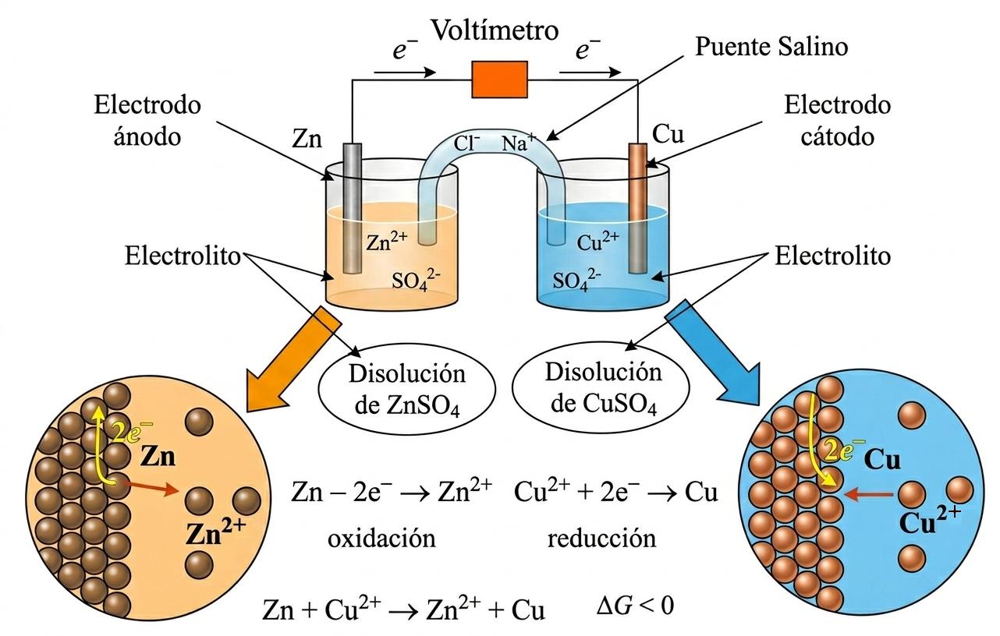
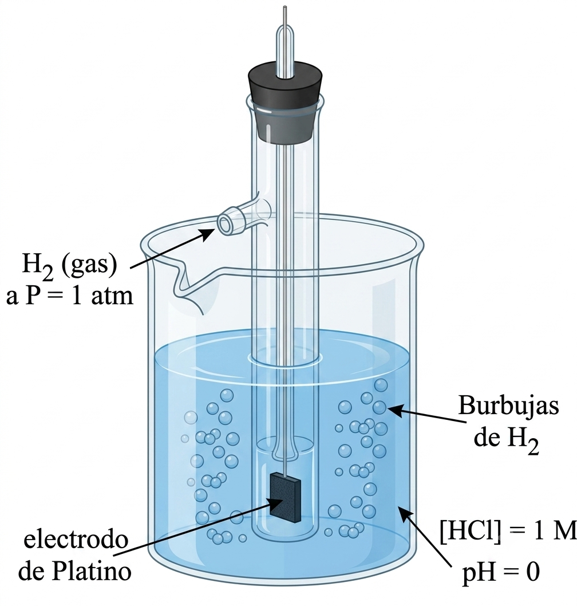
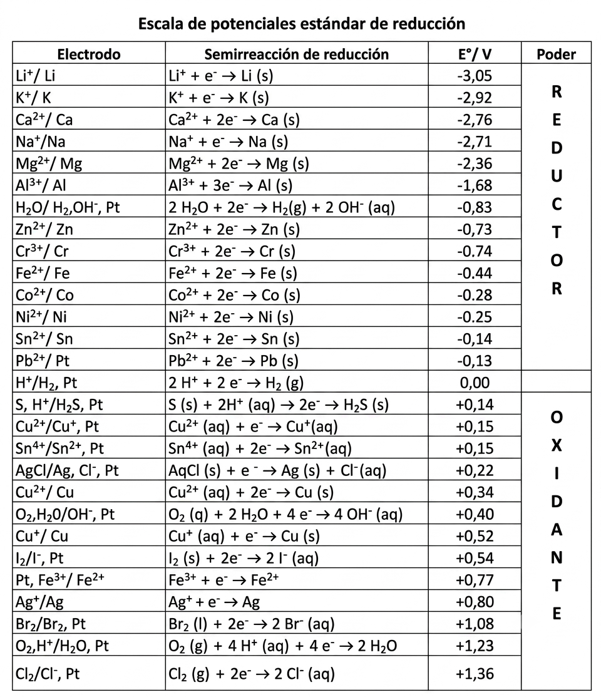
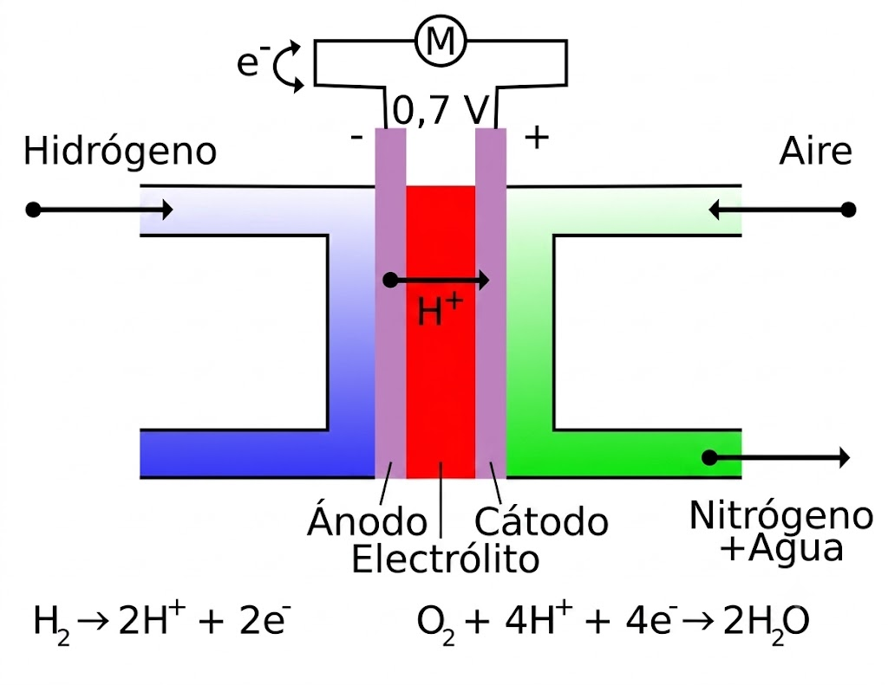
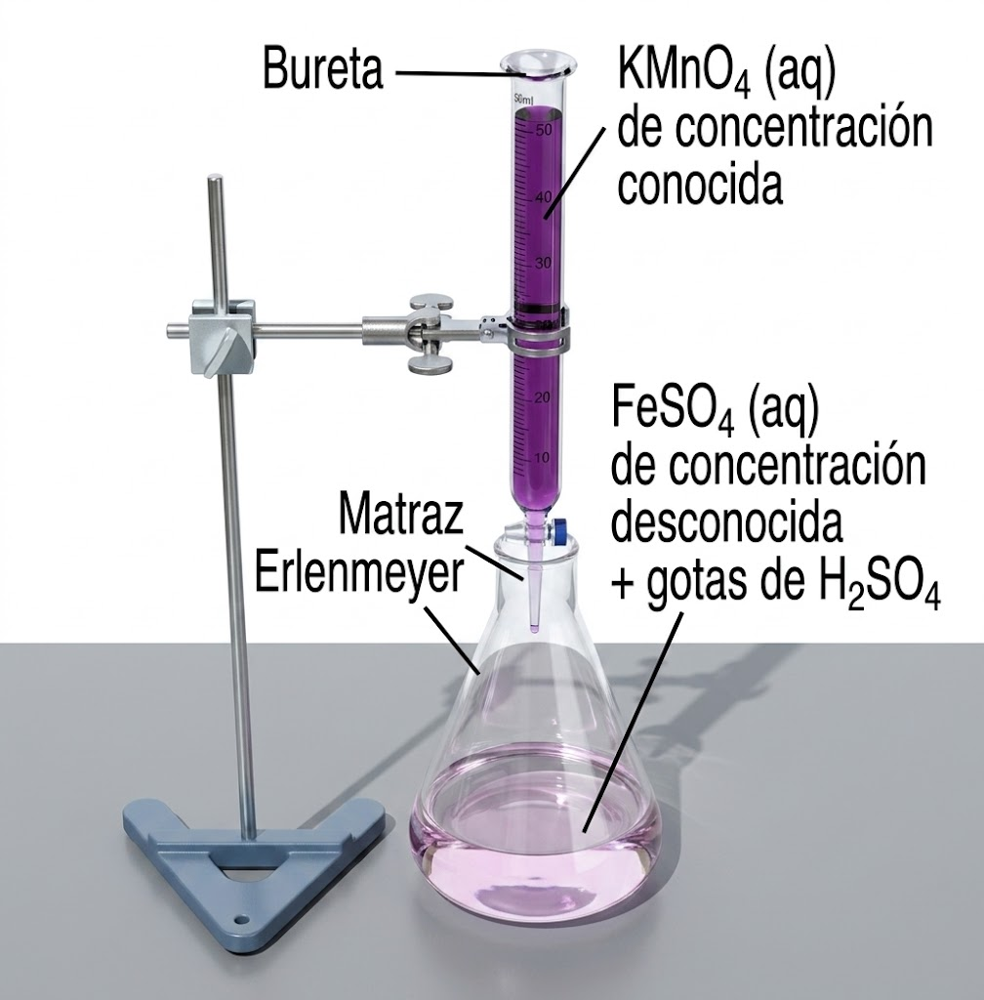
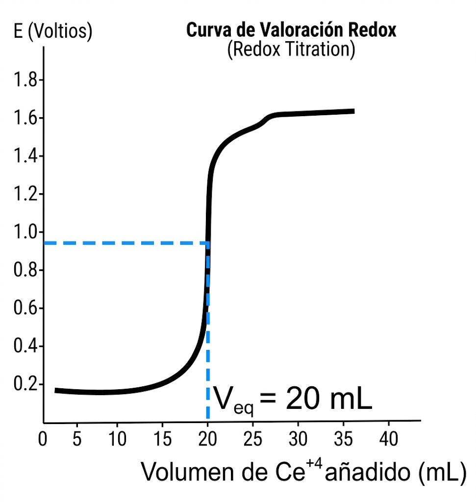
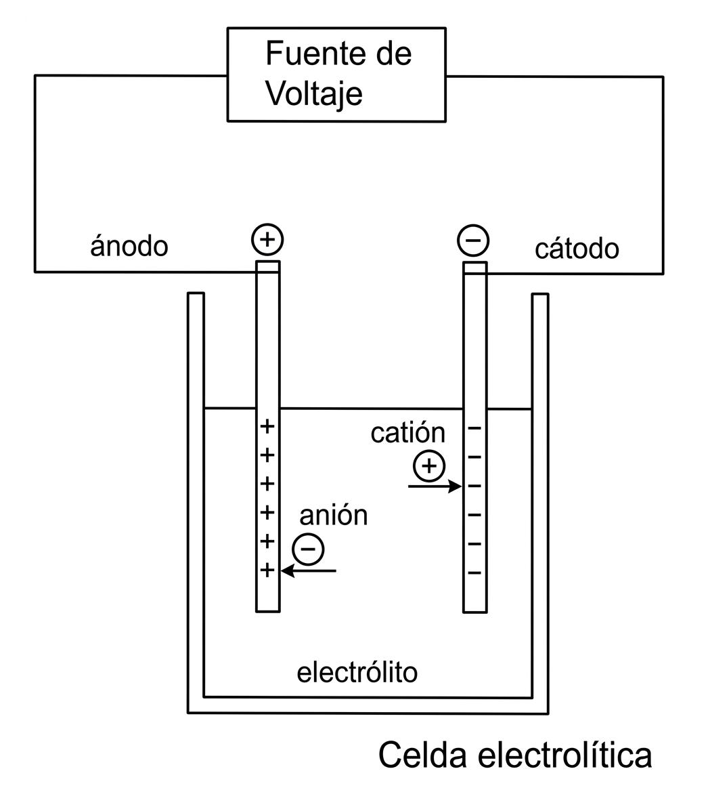
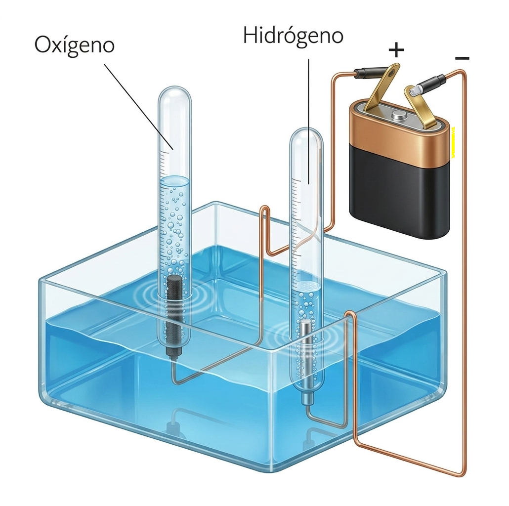
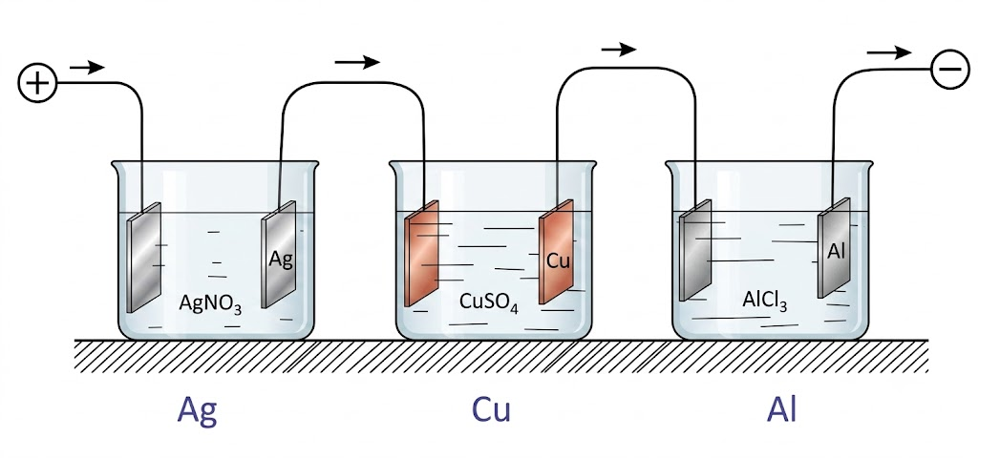

# Tema 7: Reacciones de tranferencia de electrones

## **1. Introducción**

### **Estado de oxidación (e.o.) (o número de oxidación)** {: .caja-subtitulo }

> **"Es la carga que tendría un átomo si todos sus enlaces fueran iónicos, es decir, considerando todos los enlaces covalentes polares como si en vez de tener fracciones de carga tuvieran cargas completas"**
> 

En el caso de enlaces covalentes polares habría que suponer que la pareja de electrones compartidos están totalmente desplazados hacia el elemento más electronegativo (Ej, $\ce{H2O}$).

El estado de oxidación no tiene porqué ser la carga real que tiene un átomo, aunque a veces coincide (Ej. NaCl).

### **Principales estados de oxidación** {: .caja-subtitulo }

* Todos los **elementos** cuando **no están combinados** con otros tienen **estado de oxidación (E.O.) = 0**.

* El **oxígeno** (O) en óxidos, ácidos y oxisales tiene **estado de oxidación = --2**. (Sólo tiene +2 en combinaciones con el flúor).

* El **hidrógeno** (H) tiene **estado de oxidación = --1** en los hidruros metálicos y **+1** en el resto de los casos que son la mayoría.

* Los **metales** formando parte de compuestos tienen **estados de oxidación positivos**.

### **Cálculo del estado de oxidación (e.o.)** {: .caja-subtitulo }

**La suma de los estados de oxidación de una molécula neutra es siempre 0.**

**Ejemplo**: Calcular el estado de oxidación del S en $\ce{ZnSO4}$

Dado que $\ce{E{.}O{.}(Zn) = + 2{;} \hspace{0.25cm} E{.}O{.}(O) = - 2}$, entonces:

$$\ce{+2 + x + 4 * (-2) = 0 \rightarrow  x (S) = +6}$$

**La suma de los estados de oxidación de un ion poliatómico es igual a su carga eléctrica.**

**Ejemplo**: Calcular el estado de oxidación del P en el ión fosfato: $\ce{PO4^{3-}}$

$$\ce{x + 4 * (-2) = -3 \rightarrow x (P) = +5}$$

**Si se trata de un ion monoatómico es igual a su carga.** 

**Ejemplo**: $\ce{Na^+}$ es 1, $\ce{\quad Mg^{+2}}$ es 2...

### **Definición de oxidación y reducción** {: .caja-subtitulo }

El término **oxidación** comenzó a usarse para indicar que un compuesto incrementaba la proporción de átomos de oxígeno.

Igualmente, se utilizó el término de **reducción** para indicar una disminución en la proporción de oxígeno.

Actualmente, ambos conceptos no van ligados a la mayor o menor presencia de oxígeno. Se utilizan las siguientes definiciones:

* **Oxidación**: **Pérdida de electrones (o aumento en el número de oxidación).**

* **Reducción**: **Ganancia de electrones (o disminución en el número de oxidación).**

Siempre que se produce una oxidación debe producirse simultáneamente una reducción. Cada una de estas reacciones se denomina **semirreacción**.

**Ejemplos**

1. Si introducimos un electrodo de cobre en una disolución de $\ce{AgNO3}$, de manera espontánea el cobre se oxidará pasando a la disolución como $\ce{Cu^{2+}}$, mientras que la $\ce{Ag^+}$ de la misma se reducirá pasando a ser plata metálica:

    $$\ce{2  AgNO3  (ac) + Cu  (s) \rightarrow Cu(NO3)2  (ac) + 2  Ag  (s)}$$

    $$\ce{a)  Cu \rightarrow Cu^{2+} + 2  e^-  (oxidaci\acute{o}n)}$$

    $$\ce{b)  Ag^+ + 1e^- \rightarrow Ag  (reducci\acute{o}n)}$$

2. Al añadir HCl (ac) sobre Zn (s) se produce $\ce{ZnCl2}$ y se desprende $\ce{H2  (g)}$:

    $$\ce{HCl  (ac) + Zn  (s) \rightarrow ZnCl2 + H2  (g)}$$

3. Todas las combustiones son oxidaciones:

    $$\ce{C6H12O6 + 6  O2 \rightarrow  6  CO2 + 6  H2O}$$

    ¿Qué elementos cambian su número de oxidación? (Paso de moléculas "grandes" a moléculas "pequeñas" en el catabolismo)

4. A veces el concepto antiguo de reducción tenía que ver con "ganar hidrógeno", p. ej.

    $$\ce{CH2=CH2 + H2 \rightarrow CH3-CH3}$$

    ¿Qué elementos cambian su número de oxidación?

Cuidado. No pensemos ahora que todas las reacciones químicas son redox. 

Muchas de ellas no lo son como las reacciones de neutralización ácido-base; reacciones de precipitación; reacciones de esterificación; reacciones de polimerización ; reacciones de descomposición ($\ce{CaCO3}$)...

### **Oxidantes y reductores** {: .caja-subtitulo }

**Oxidante**: Es la sustancia capaz de oxidar a otra (acepta electrones), con lo que ésta se reduce. En general, los **no metales son oxidantes**.

**Reductor**: Es la sustancia capaz de reducir a otra (da electrones), con lo que ésta se oxida. En general, los **metales son reductores**.

Ejemplo de reacción: $\ce{Zn + 2  Ag^+ \rightarrow  Zn^{2+} + 2  Ag}$

* Oxidación: $\ce{\quad Zn  (reductor) \rightarrow  Zn^{2+} + 2  e-}$

* Reducción: $\ce{\quad Ag+  (oxidante) + 1  e- \rightarrow  Ag}$

¿Y esto es importante?

* El catabolismo.
* El envejecimiento
* La obtención de metales (Na, Al, etc.)
* Las pilas y baterías.

## **2. Ajuste de reacciones redox (método del ion-electrón)**

Se basa en la conservación tanto de la masa como de la carga (los electrones que se pierden en la oxidación son los mismos que los que se ganan en la reducción).

Se trata de escribir las dos semirreacciones que tienen lugar y después igualar el número de $\ce{e-}$ de ambas, para que al sumarlas los electrones desaparezcan.

El método tiene una ligera **variación** según la reacción se dé en medio **ácido** o en medio **básico**.

### **Ejemplo de ajuste en medio ácido** {: .caja-subtitulo }

1. Formular correctamente las especies químicas:

    $$\ce{Cu + HNO3 \rightarrow Cu(NO3)2 + NO + H2O}$$

2. Se identifican los átomos que se oxidan y se reducen:

    $$\ce{\overset{0}{Cu} + \overset{+1}{H}\overset{+5}{N}\overset{-2}{O}_3 -> \overset{+2}{Cu}(\overset{+5}{N}\overset{-2}{O}_3)_2 + \overset{+2}{N}\overset{-2}{O} + \overset{+1}{H}_2\overset{-2}{O}}$$

    Es evidente que se ha oxidado el cobre: $\ce{0  \rightarrow  +2}$ y que se ha reducido el nitrógeno: $\ce{+5  \rightarrow  +2}$.

    El resto de elementos (oxígeno e hidrógeno) no cambian su número de oxidación.

3. Se escriben por separado las **semirreacciones iónicas** de oxidación y de reducción sin ajustar:
    
    * $\ce{Oxidaci\acute{\ce{o}}n{:}  Cu \rightarrow  Cu^{2+} + 2  e-}$
    * $\ce{Reducci\acute{\ce{o}}n{:}  NO3- \rightarrow  NO}$

4. La semirreacción de oxidación ya está ajustada en masa y en carga; para ajustar los oxígenos de la de reducción hay que sumar moléculas de agua donde faltan oxígenos y los hidrógenos que aparecen se ajustan con protones, $\ce{H+}$.

    Por último se ajusta la carga con electrones donde hagan falta:

    $$\ce{NO3- + 4  H+ + 3  e- \rightarrow  NO + 2  H2O}$$

5. El número de electrones puestos en juego en la oxidación y la reducción deben de ser el mismo:

    Para lograrlo se multiplica cada una por el número entero necesario y se suman:

    $$\begin{array}{l} \ce{(  Cu \rightarrow  Cu^{2+} + 2  e-  ) * 3  } \\ \ce{(  NO3- + 4  H+ + 3  e- \rightarrow  NO + 2  H2O  ) * 2 } \\ \hline \ce{3  Cu + 2  NO3- + 8  H+ + \cancel{\ce{6  e-}} \rightarrow  3  Cu^{2+} + \cancel{\ce{6  e-}} + 2  NO + 4  H2O } \end{array}$$

6. Por último se escribe la ecuación molecular haciendo algún último pequeño ajuste si es necesario:

    $$\ce{3  Cu + 8  HNO3 \rightarrow  3  Cu(NO3)2 + 2  NO + 4  H2O}$$

7. En el caso de que la reacción sea en medio básico los oxígenos se ajustan poniendo el doble de $\ce{OH-}$ en el lado en el que faltan oxígenos y entonces los hidrógenos se ajustan con moléculas de agua.

Es importante recordar que **se disocian todas las sales, los ácidos y los hidróxidos**. El resto de compuestos covalentes (óxidos, amoniaco,...) no se disocian.

## **3. Pilas galvánicas**

Cuando las reacciones redox son espontáneas, liberan energía que se puede emplear para realizar un trabajo eléctrico. Esta tarea se realiza a través de una **celda voltaica** (o **galvánica**).

Las **celdas galvánicas** son unos dispositivos en los cuales la transferencia de electrones (de la semirreacción de oxidación a la semirreacción de reducción) se produce a través de un circuito externo en vez de ocurrir directamente entre los reactivos; de esta manera el flujo de electrones (corriente eléctrica) puede ser utilizado.

### **Pila Daniell** {: .caja-subtitulo }

Es un buen ejemplo de pila. La reacción es:

$$\ce{Zn + CuSO4  (ac) \rightarrow  ZnSO4  (ac) + Cu}$$

Se trata de una reacción exotérmica en la que el cobre se reduce (de +2 a 0) y el cinc se oxida (de 0 a +2). Las semirreacciones son:

$$\ce{Zn  (s) \rightarrow  Zn^{2+}  (ac) + 2  e-  (oxidaci\acute{\ce{o}}n) }$$

$$\ce{Cu^{2+}  (ac) + 2  e-  \rightarrow  Cu  (s)  (reducci\acute{\ce{o}}n) }$$

De hecho, si metemos una barra de Zn en un vaso con disolución de $\ce{CuSO4}$ se podrá apreciar un ligero aumento de temperatura (reacción exotérmica) mientras el Zn se va disolviendo y va apareciendo cobre metálico.

La **pila Daniell** consta de una lámina de zinc metálico, Zn (electrodo anódico o **ánodo**), sumergida en una disolución de sulfato de zinc, $\ce{ZnSO4}$, 1 M (solución anódica) y una lámina de cobre metálico, Cu (electrodo catódico o **cátodo**), sumergido en una disolución de sulfato de cobre, $\ce{CuSO4}$, 1 M (solución catódica).

El funcionamiento de la celda se basa en el principio de que la oxidación de Zn a $\ce{Zn^{2+}}$ y la reducción de $\ce{Cu^{2+}}$ a Cu se puede llevar a cabo simultáneamente, pero en recipientes separados por un puente salino, con la transferencia de electrones, $\ce{e-}$, a través de un alambre conductor metálico externo.

{ style="display: block; margin: 0 auto; width: 60%; height: auto;" }

### **Los electrodos** {: .caja-subtitulo }

Las láminas de zinc y cobre son **electrodos**.

Los **electrodos** son la superficie de contacto entre el conductor metálico y la solución de semicelda (anódica o catódica).

Si el **electrodo no participa de la reacción redox** (ni se oxida ni se reduce), se le llama **electrodo inerte o pasivo**.

Cuando participa de la reacción redox, como es este caso, se denomina **electrodo activo**.

Recordemos que:

* El electrodo en el que se produce la **o**xidación es el **á**nodo.

* En el que se lleva a cabo la **r**educción es el **c**átodo.

**El signo de los electrodos**

Debemos tener cuidado de los signos que adjudicamos a los electrodos de una celda voltaica. Hemos visto que se liberan electrones en el ánodo conforme el zinc se oxida y fluyen al circuito externo.

Puesto que los electrones tienen carga negativa, adjudicamos un **signo negativo al ánodo**.

Por el contrario, los electrones fluyen hacia el cátodo, donde se consumen en la reducción del cobre. En consecuencia, se confiere un **signo positivo al cátodo** porque parece atraer a los electrones negativos.

### **El puente salino** {: .caja-subtitulo }

Con el funcionamiento de la celda, la oxidación del Zn introduce iones $\ce{Zn^{2+}}$ adicionales en el compartimento del ánodo. A menos que se proporcione un medio para neutralizar esta carga positiva, no podrá haber más oxidación. De manera similar, la reducción del $\ce{Cu^{2+}}$ en el cátodo deja un exceso de carga negativa en solución en ese compartimento.

La **neutralidad eléctrica se conserva** al haber una migración de iones a través un puente salino o a través de una barrera porosa que separa los dos compartimentos.

Un **puente salino** se compone de un tubo en forma de "U" que contiene una solución muy concentrada de un electrólito (por ejemplo: $\ce{NaNO3  (ac)}$, $\ce{NH4NO3  (ac)}$, $\ce{NaCl  (ac)}$, $\ce{KNO3  (ac)}$, entre otros) cuyos iones no reaccionan con los otros iones de la celda ni con el material de los electrodos.

El electrólito se suele incorporar en un gel para que la solución de electrólito no escurra cuando se invierte el tubo en U.

### **Fuerza electromotriz** {: .caja-subtitulo }

Los electrones fluyen desde el ánodo, de una celda voltaica, hacia el cátodo a causa de una diferencia de energía potencial.

La diferencia de energía potencial por carga eléctrica (la diferencia de potencial) entre dos electrodos se mide en voltios.

Un **voltio** (V) es la diferencia de potencial que hay entre dos puntos cuando para trasladar la carga de 1 coulombio (C) de uno a otro se requiere la energía de 1 Julio (J).

La diferencia de potencial entre dos electrodos de una celda voltaica proporciona la "fuerza motriz" que empuja los electrones a través del circuito externo. Por consiguiente, llamamos a esta diferencia de potencial, **fuerza electromotriz** (que causa movimiento de electrones), o **FEM**.

### **F.E.M. de una pila** {: .caja-subtitulo }

La FEM de una pila, que se denota como $\ce{E_{pila}}$, se conoce como potencial de celda. Puesto que la $\ce{E_{pila}}$ se mide en voltios, solemos referirnos a ella como el voltaje de la celda.

Para cualquier reacción de celda que se lleva a cabo **espontáneamente**, como en una celda voltaica, **el potencial de celda es positivo**.

La FEM de una celda voltaica en particular **depende de las reacciones específicas que se llevan a cabo en el cátodo y ánodo, la concentración de los reactivos y productos, y la temperatura**.

Enfocaremos nuestra atención en celdas que operan a **25 $^{\circ}$C en condiciones estándar**: 

- **concentración 1 M** de reactivos y productos en solución y **1 atm de presión para los gases**. 

En **condiciones estándar la fem** se llama FEM estándar o **potencial estándar de la pila**, y se denota como $\ce{E^0}$.

Por ejemplo, para la celda voltaica de Zn/Cu, el potencial estándar de celda a 25 $^{\circ}$C es 1,10 V:

$$\ce{Zn  (s) + Cu^{2+}  (ac{,}  1  M) \rightarrow  Zn^{2+}  (ac{,}  1  M) + Cu  (s) \quad \quad \quad E^0_{celda} = 1,10  V}$$

**Representación simbólica de una pila**

En esta notación una barra vertical "$\vert{}$" denota un cambio de fase y una doble barra vertical "$\vert{}\vert{}$" indica el puente salino. A la **izquierda** se pone siempre el **ánodo** de la pila (oxidación) y a la **derecha** el **cátodo** (reducción). Así:

$$\ce{Zn  (s)  \vert{}  ZnSO4  (ac)  \vert{}\vert{}  CuSO4  (ac)  \vert{}  Cu  (s)}$$

O directamente con las especies iónicas:

$$\ce{Zn  (s)  \vert{}  Zn^{2+}  (ac)  \vert{}\vert{}  Cu^{2+}  (ac)  \vert{}  Cu  (s)}$$

También se pueden indicar las concentraciones:

$$\ce{Zn  (s)  \vert{}  ZnSO4  (0,1  M)  \vert{}\vert{}  CuSO4  (0,2  M)  \vert{}  Cu  (s)}$$

### **Electrodos de gases** {: .caja-subtitulo }

También se pueden construir pilas con **electrodos gaseosos** ($\ce{Cl2}$, $\ce{F2}$, $\ce{H2}$...).

El electrodo está compuesto de un tubo de vidrio atravesado por un hilo de platino terminado en una placa del mismo metal. El tubo se sumerge parcialmente en una disolución, y por la parte superior se inyecta el elemento gaseoso que burbujea a través de la disolución.

El **Pt no interviene** en la reacción, solo transporta los electrones, por eso se llama **electrodo inerte**.

En la figura se muestra concretamente un **electrodo de hidrógeno**.

* $\ce{H2 \rightarrow  2  H+ + 2  e-}$ (oxidación, actúa como ánodo)

* $\ce{2  H+ + 2  e- \rightarrow H2}$ (reducción, como cátodo)

{ style="display: block; margin: 0 auto; width: 30%; height: auto;" }

### **Potencial de electrodo** {: .caja-subtitulo }

La FEM total de una pila será la suma de las variaciones de potencial que se producen en los dos electrodos.

Si pudiéramos medir la fem de cada una de las semirreacciones la FEM de la pila se podría determinar como la suma del potencial de oxidación del ánodo más el potencial del reducción del cátodo:

$$\ce{E^0_{celda} = E^0_{oxi-\acute{\ce{a}}nodo} + E^0_{red-c\acute{\ce{a}}todo}}$$

Pero es <u>imposible medir el potencial de un electrodo aislado</u> (no hay reducción sin oxidación, y viceversa).

Eso se soluciona estableciendo un **electrodo de referencia**, al que se asigna arbitrariamente **el potencial de 0,0 V**.

Ese electrodo de referencia es el **electrodo estándar de hidrógeno**.

**¿Oxidante o reductor?**

Igual que vimos que hay sustancias, el agua por ejemplo, que pueden comportarse como ácidos o como bases según se enfrenten a sustancias más básicas o ácidas que ella, una determinada especie química se puede comportar como oxidante o reductor según a quien se enfrente.

Por ello, un determinado electrodo en una pila puede actuar como cátodo (reduciéndose), y hablaremos de "**potencial de reducción**" y en otras como ánodo (oxidándose) y hablaremos de "**potencial de oxidación**".

**Potenciales de oxidación y reducción**

**La única diferencia entre el potencial de reducción y el de oxidación de un determinado electrodo es el signo.**

Por ejemplo veamos los electrodos de cobre:

* $\ce{C\acute{\ce{a}}todo  (reducci\acute{\ce{o}}n){:}  \quad Cu^{2+} + 2  e- \rightarrow Cu \hspace{1cm} E^0_{red} = 0,34  V}$

* $\ce{\acute{\ce{A}}nodo  (oxidaci\acute{\ce{o}}n){:}  \quad Cu \rightarrow Cu^{2+} + 2  e- \hspace{1cm} E^0_{oxi} = - 0,34  V}$

Los del cinc:

* $\ce{C\acute{\ce{a}}todo  (reducci\acute{\ce{o}}n){:}  \quad Zn^{2+} + 2  e- \rightarrow Zn \hspace{1cm} E^0_{red} = - 0,76  V}$

* $\ce{\acute{\ce{A}}nodo  (oxidaci\acute{\ce{o}}n){:} \quad Zn \rightarrow Zn^{2+} + 2  e- \hspace{1cm}  E^0_{oxi} = 0,76  V}$

**¿Qué significa el signo?**

Cuando el potencial de reducción de un electrodo es positivo, por ejemplo el del Cu, significa que si se construye una pila con ese electrodo y el de hidrógeno, la semirreacción que tiene lugar en dicho electrodo es una reducción:

$$\ce{Cu^{2+} + 2  e- \rightarrow Cu}$$

Por lo tanto el $\ce{Cu^{2+}}$ en presencia de hidrógeno se reduce.

Si el potencial de reducción es negativo, como le ocurre al Zn, significa que si se construye una pila con ese electrodo y el de hidrógeno, la semirreacción que tiene lugar en dicho electrodo es una oxidación:

$$\ce{Zn \rightarrow Zn^{2+} + 2  e-}$$

Por lo tanto, el Zn en presencia de protones se oxida.

**Tabla de potenciales de reducción**

A partir de estas tablas podemos saber:

* Qué metales son oxidados por los $\ce{H+}$

* El carácter oxidante o reductor de un electrodo.

* Determinar el cátodo y el ánodo de una pila, etc.

{ style="display: block; margin: 0 auto; width: 50%; height: auto;" }

### $\ce{\textbf{E}^0}$ **y Espontaneidad** {: .caja-subtitulo }

Existe una relación entre el potencial estándar de una reacción y la energía libre estándar de Gibbs que puede servirnos para predecir la espontaneidad, o no, de determinada reacción:

$$\ce{\Delta G = - n * F * E^0}$$

donde $\ce{n}$ es el número de electrones transferidos en el proceso redox, y $\ce{F}$ es la constante de Faraday ($\ce{1  mol  de  electrones = 96500  C}$).

Como tanto $n$ como $\ce{F}$ son constantes positivas, **una reacción será espontánea cuando $\ce{E^0}$ sea positivo**.

Como vimos antes, $\ce{E^0_{celda} = E^0_{oxi-\acute{\ce{a}}nodo} + E^0_{red-c\acute{\ce{a}}todo}}$, pero como de las tablas lo que tenemos son potenciales de reducción es más cómodo ponerlo así:

$$\ce{E^0_{celda} = E^0_{red-c\acute{\ce{a}}todo} - E^0_{red-\acute{\ce{a}}nodo}}$$

### **Pilas de combustible** {: .caja-subtitulo }

Las **pilas de combustible** son dispositivos electroquímicos en los cuales un flujo continuo de combustible y oxidante sufren una reacción química controlada que da lugar a los productos y suministra directamente corriente eléctrica a un circuito externo.

Se trata de un dispositivo electroquímico de conversión de energía similar a una batería.

Se diferencia en que está diseñada para permitir el abastecimiento continuo de los reactivos consumidos. Es decir, produce electricidad de una fuente externa de combustible y de oxígeno u otro agente oxidante, en contraposición a la capacidad limitada de almacenamiento de energía que posee una batería.

Además, en una batería los electrodos reaccionan y cambian según cómo esté de cargada o descargada; en cambio, en una celda de combustible los electrodos son catalíticos y relativamente estables.

Para explicar su funcionamiento básico, se toma como ejemplo una de las más comunes, la denominada **PEM** (de membrana de intercambio protónico: Proton Exchange Membrane).

El esquema básico de la celda unitaria de una pila PEM se muestra en la figura.

{ style="display: block; margin: 0 auto; width: 40%; height: auto;" }

Consta de dos electrodos: el ánodo (donde se oxida el combustible) y el cátodo (donde el oxidante o comburente se reduce).

El electrolito actúa simultáneamente como aislante eléctrico, conductor protónico y separador de las reacciones que tienen lugar en el cátodo respecto a las que tienen lugar en el ánodo. Debido a lo anterior, los electrones viajan desde el ánodo hasta el cátodo a través de un circuito externo, generando una corriente eléctrica, mientras que los protones lo hacen a través del electrolito.

## **4. Volumetrías redox**

De la misma manera que se podían hacer volumetrías ácido-base, las podemos hacer redox para calcular la concentración de un reactivo oxidante o reductor a partir de su valoración con otro reactivo de concentración conocida.

{style="display: block; margin: 0 auto; width: 30%; height: auto; border: 1px solid #333;"}

El momento en el que se ha completado la reacción entre oxidante y reductor se denomina **punto de equivalencia**, que puede determinarse a partir de la estequiometría de la reacción.

{style="display: block; margin: 0 auto; width: 40%; height: auto; border: 1px solid #333;"}

Se puede determinar de dos maneras:

A) Mediante **medidas potenciométricas**: se observa un salto en la medida del potencial del medio en torno al punto de equivalencia.

B) Usando **indicadores redox**: sustancias que presentan una coloración diferente en sus formas oxidada y reducida. No obstante, algunos agentes valorantes como el permanganato potásico no precisan de la utilización de indicadores, pues el propio reactivo presenta colores diferentes en su forma oxidada (color púrpura) y en la reducida (incoloro).

Las sustancias de concentraciones conocidas utilizadas como referencia en las valoraciones no son muchas. Suelen ser oxidantes y reductores fuertes, que son estables en disolución y cuyas reacciones redox son estequiométricamente sencillas.

Los **oxidantes más usados** son las disoluciones de: permanganato potásico ($\ce{KMnO4}$), dicromato potásico ($\ce{K2Cr2O7}$), yodo ($\ce{I2}$), bromato potásico ($\ce{KBrO3}$) y las de sales de cerio (IV).

Los **reductores más frecuentes** son las disoluciones de: sales de hierro (II), arsenito de sodio ($\ce{NaAsO2}$), tiosulfato sódico ($\ce{Na2S2O3}$) y oxalato sódico (ácido oxálico = etanodioico, $\ce{Na2C2O4  o  NaOOC-COONa}$).

**Ejemplo**

Se valoran 250 mL de una disolución de ácido oxálico (etanodioico) con disolución 0,1 M de permanganato potásico en medio ácido (sulfúrico). Hasta llegar al punto de equivalencia se han consumido 35 mL de la disolución de permanganato. ¿Cuál es la molaridad del ácido oxálico?

**Solución**: 

Tras ajustar la ecuación, nos queda:

$$\ce{5  C2O4^{2-} + 2  MnO4^- + 16  H+ \rightarrow  10  CO2 + 2  Mn^{2+} + 8  H2O}$$

Ecuación iónica global:

$$\ce{2\text{MnO}_4^- + 5\text{H}_2\text{C}_2\text{O}_4 + 6\text{H}^+ \rightarrow 2\text{Mn}^{2+} + 10\text{CO}_2 + 8\text{H}_2\text{O}}$$

Relación estequiométrica: $2\text{ moles de KMnO}_4$ reaccionan exactamente con $5\text{ moles de H}_2\text{C}_2\text{O}_4$.

Calculamos los moles consumidos de $\ce{KMnO4}$ y para ello utilizamos la fórmula $\ce{n = M \cdot V}$.

$$\ce{n_{\text{KMnO}_4} = 0,1\text{ mol/L} \cdot 0,035\text{ L} = 0,0035\text{ moles de} KMnO4}$$

Calculamos los moles de ácido oxálico mediante la estequiometría, usando la relación molar de la reacción ($5:2$).

$$\ce{n_{\text{H}_2\text{C}_2\text{O}_4} = 0,0035\text{ mol KMnO}_4 \cdot \frac{5\text{ mol H}_2\text{C}_2\text{O}_4}{2\text{ mol KMnO}_4} = 0,00875\text{ moles de H}_2\text{C}_2\text{O}_4}$$

Por último, calculamos la molaridad del ácido oxálico, dividiendo los moles de ácido entre el volumen total de su disolución expresado en litros:

$$\ce{M_A = \frac{n_{\text{H}_2\text{C}_2\text{O}_4}}{V_A} = \frac{0,00875\text{ mol}}{0,250\text{ L}} = 0,035\text{ M}}$$

## **5. Electrólisis**

Se trata del proceso inverso al que tiene lugar en una pila.

En la **electrólisis**, la **energía eléctrica se transforma en energía química**.

Justamente, **las reacciones no espontáneas** que no se pueden llevar a cabo en una pila, gracias a una ddp externa **sí se pueden producir**.

Se lleva a cabo en una **cuba o celda electrolítica**.

### **Cuba electrolítica** {: .caja-subtitulo }

Se trata de un recipiente que contiene un electrólito (fundido o en disolución) en el que se sumergen dos electrodos (ánodo y cátodo). Éstos se conectan a una fuente de corriente continua (batería), el ánodo al polo positivo y el cátodo al negativo.

{style="display: block; margin: 0 auto; width: 30%; height: auto; border: 1px solid #333;"}

Cuando se conecta la batería en los electrodos se producen las semirreacciones redox:

* $\ce{\acute{\ce{A}}nodo ( + ) {:}  oxidaci\acute{\ce{o}}n}$

* $\ce{C\acute{\ce{a}}todo ( - ) {:}  reducci\acute{\ce{o}}n}$

Para que se produzca la electrólisis la ddp (diferencial de potencial) tiene que ser igual o superior a la FEM (fuerz electromotriz) de la pila que funcionase con los mismos electrodos en sentido inverso.

**Aplicaciones**

* Producción de elementos (Na, $\ce{Cl2}$, etc.)

* Purificación de elementos (Cu, Pb, Sn, etc.)

* Recubrir objetos metálicos de un baño de otro metal (baño electrolítico), con fines decorativos (plateado, dorado,...) o de protección de objetos metálicos contra la corrosión (galvanizado).

### **Producción de** $\textbf{Na}$ y $\textbf{Cl_2}$ {: .caja-subtitulo }

Si en una cuba electrolítica tenemos NaCl fundido, cuando pase la corriente eléctrica los aniones $\ce{Cl-}$ irán hacia el ánodo (+), y los cationes $\ce{Na+}$ hacia el cátodo (--), y tendrán lugar las reacciones siguientes:

* $\ce{\text{á}nodo  ( + )  {:} \quad 2  Cl- \rightarrow Cl2 + 2  e-}$

* $\ce{c\text{á}todo  ( - )  {:} \quad Na+ + 1  e- \rightarrow Na}$

Obteniéndose cloro gas y sodio metálico. De hecho este es el procedimiento usado en la industria para la obtención de estos elementos.

Como el potencial de reducción del sodio es de $\ce{- 2,71  V}$ y del cloro de $\ce{+1,36  V}$, la ddp mínima que habrá que aplicar será de 4,07 V.

### **Electrólisis del agua** {: .caja-subtitulo }

Es posible realizar la electrólisis del agua. Aunque ésta está parcialmente ionizada, para que circule mejor la corriente eléctrica se añade una pequeña cantidad de ácido sulfúrico.

* $\ce{\text{á}nodo  ( + )  {:}  \quad H2O  \rightarrow  \dfrac {1}{2}  O2 + 2  H+ + 2  e-}$

* $\ce{c\text{á}todo  ( - )  {:} \quad 2  H+ + 2  e- \rightarrow H2}$

$$\ce{\textbf{Proceso  global:} \quad H2O \rightarrow \dfrac {1}{2}  O2 + H2}$$

{style="display: block; margin: 0 auto; width: 40%; height: auto; border: 1px solid #333;"}

### **Electrólisis de** $\textbf{NaCl  (ac)}$ {: .caja-subtitulo }

En este caso, como el potencial de reducción del hidrógeno ($\ce{0,0  V}$) es mayor que el del sodio ($\ce{-2,71  V}$), se reducirá el hidrógeno, y se obtendrá cloro e hidrógeno. Las reacciones serán:

* $\ce{\text{á}nodo  ( + )  {:}  \quad 2  Cl-  \rightarrow Cl2 + 2  e-}$

* $\ce{c\text{á}todo  ( - )  {:} \quad 2  H+ + 2  e- \rightarrow H2}$

Además queda en disolución hidróxido de sodio.

En general, ningún metal con potencial de reducción menor de $\ce{-0,8  V}$ puede obtenerse de sus disoluciones en agua por electrólisis.

Los de $\ce{E^0}$ mayor de 0 sí pueden obtenerse, y los de $\ce{-0,8 \leq E^0 \leq  0}$ solo a determinados valores de pH.

## **6. Leyes de Faraday**

La **cantidad de sustancia (moles) que se oxida o se reduce** en los electrodos de una cuba electrolítica **es proporcional a la cantidad de electricidad (culombios) que la atraviesa**.

La **cantidad de electricidad necesaria** para depositar **un mol de cualquier sustancia en una cuba electrolítica es de 96500 C (1 F) multiplicada por el número de electrones (a) captados o cedidos en el proceso**.

$$\ce{n = \dfrac {\ce{Q}}{\ce{a * F}} = \dfrac {\ce{I * t}}{\ce{a * F}}}$$

**Agrupación de cubas electrolíticas en serie**

A veces se pueden conectar varias cubas en serie:

{style="display: block; margin: 0 auto; width: 50%; height: auto; border: 1px solid #333;"}

### **Corrosión** {: .caja-subtitulo }

La **corrosión** se define como el deterioro de un material a consecuencia de un ataque electroquímico por su entorno.

La velocidad a la que tiene lugar la corrosión dependerá en alguna medida de la temperatura, de la salinidad del fluido en contacto con el metal y de las propiedades de los metales en cuestión.

El proceso de corrosión es **natural y espontáneo**.

Los ejemplos más conocidos son las alteraciones químicas de los metales a causa del aire, como la **herrumbre del hierro y el acero** o la **formación de pátina verde en el cobre y sus aleaciones** (**bronce, latón**).

### **Anodización** {: .caja-subtitulo }

El **anodizado** es un sistema que se usa para dar a algunos metales una mayor resistencia no solo ante la corrosión, sino también contra la abrasión (desgaste de un material por la acción del rozamiento).

Se le da ese nombre porque **el material a tratar actúa como ánodo** en el proceso electrolítico.

A diferencia de la galvanostegia y la galvanoplastia no se trata de recubrir un metal con otro más resistente, sino de cambiar las propiedades superficiales del mismo metal, aumentando intencionadamente el grosor de la capa de óxido que, de forma natural, se forma en su superficie.

### **Galvanostegia o galvanoplastia** {: .caja-subtitulo }

La **galvanostegia** es el recubrimiento de objetos con una delgada capa depositada electrolíticamente.

Generalmente se recubren metales menos nobles, como el hierro, con otros más nobles (estables).

Los metales así tratados se conocen como "galvanizados", aunque a veces este término se refiere a los recubrimientos de cinc.

Según con qué metal recubramos, se habla de "niquelado", "cadmiado", "cromado", "estañado", "cobreado", "plateado", "dorado", etc.

<!-- ---

[Descargar Tema 7 en PDF](../pdfs/tema7-redox/tema7-redox.pdf){ .md-button .md-button--primary } -->