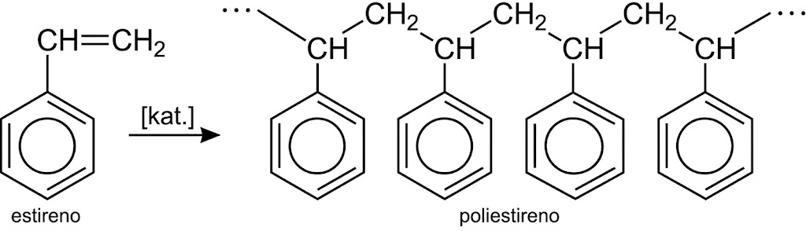
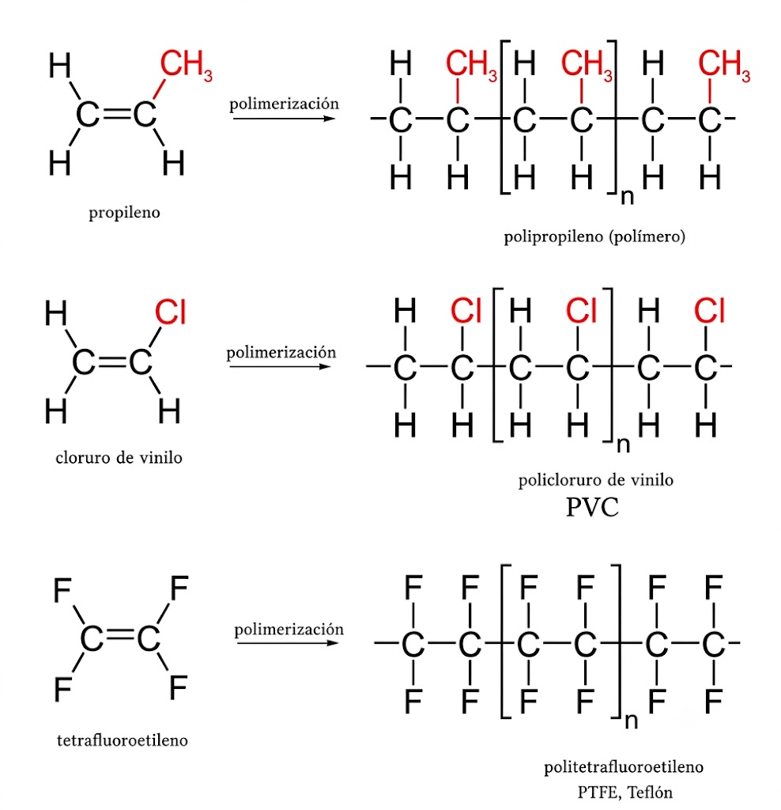
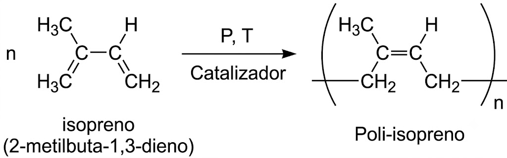

# Tema 9: Polímeros orgánicos

## **1. Introducción**

* **Polímeros**: del griego *Polys* (muchos) + *meros* (parte)
* Molécula muy grande (macromolécula) constituida por la unión repetida de muchas unidades moleculares pequeñas (**monómeros**), generalmente orgánicas, unidas entre sí por enlaces covalentes y que se forma por **reacciones de polimerización**.
* La unidad estructural que se repite a lo largo de la cadena polimérica se denomina **unidad repetitiva** o **monómero**. Por ejemplo, a partir del estireno (vinilbenceno) se obtiene el poliestireno:

{style="display: block; margin: 0 auto; width: 60%; height: auto;"}

## **2. Clasificación de los polímeros**

Los **polímeros** pueden clasificarse de muchas maneras:

* Según su **composición** (homopolímeros o heteropolímeros)
* Por su **origen** (naturales o sintéticos)
* Según su **estructura** (lineales, ramificados, entrecruzados, reticulados)
* Por su comportamiento frente al calor (**termoplásticos** o **termoestables**)
* Según la **reacción de polimerización** (adición o condensación). Esta última clasificación es la que más nos interesa.

## **3. Propiedades físicas generales**

Las propiedades físicas de estas moléculas difieren bastante de las propiedades de los monómeros que las constituyen. Las propiedades van a estar influenciadas por la estructura interna, presencia de fuerzas intermoleculares, etc.

* Al ser grandes moléculas, la estructura es generalmente amorfa.
* Notable plasticidad, elasticidad y resistencia mecánica.
* Alta resistividad eléctrica.
* Poco reactivos ante ácidos y bases.
* Unos son tan duros y resistentes que se utilizan en construcción: PVC, baquelita, etc.
* Otros pueden ser muy flexibles (polietileno), elásticos (caucho), resistentes a la tensión (nailon), muy inertes (teflón), etc.

## **4. Reacciones de adición**

* Siguen un mecanismo a través de radicales libres "en cadena". Las más típicas son las de formación de polímeros etilénicos, siendo el más sencillo el polietileno:

$$\ce{n \; (CH2 = CH2) \quad \rightarrow \quad -(CH2-CH2)-{}_\text{n}}$$

* Una vez iniciadas las reacciones que transcurren a través de radicales libres son muy rápidas, adicionándose más de 1000 monómeros por segundo, por lo que en pocos segundos se obtienen macromoléculas de más de un millón de unidades de masa atómica.

### **Algunos polímeros etilénicos** {: .caja-subtitulo }

{style="display: block; margin: 0 auto; width: 50%; height: auto;"}

### **El caucho**  {: .caja-subtitulo }

Un caso especial de esta clase de polímeros etilénicos es el **caucho** natural o sintético (el monómero es el "isopreno" o 2-metilbuta-1,3-dieno).

Es interesante saber que el caucho natural (cis-poliisopreno) es el único polímero que se encuentra en la naturaleza constituido por un hidrocarburo. Aunque el caucho natural es muy elástico, los productos fabricados con él tienen el inconveniente de ser quebradizos y ablandarse con el calor. Para mejorar sus propiedades se introdujo (1839, Ch. Goodyear) el proceso de **vulcanización**, consistente en añadir azufre (entre un 3 y un 8 % de la masa total), lo que mejoraba notablemente sus propiedades e hizo que se empezara a utilizar ampliamente. A partir de la primera guerra mundial ya se comenzó a fabricar caucho sintético en muchas variedades.

{style="display: block; margin: 0 auto; width: 50%; height: auto;"}

## **5. Reacciones de condensación**

Los monómeros pueden ser iguales o diferentes, pero tiene cada uno de ellos dos grupos funcionales en los extremos de la molécula, y la unión entre los monómeros supone la eliminación de una molécula pequeña, normalmente agua.

De la misma manera que los dos ejemplos principales vistos en las reacciones orgánicas de condensación son la **formación de ésteres** y **amidas**, en el caso de los polímeros los ejemplos más importantes son la formación de **poliésteres** y **poliamidas** (fibras textiles).

### **Poliésteres** {: .caja-subtitulo }

El poliéster termoplástico más conocido es el **PET**. El PET está formado sintéticamente con **etilenglicol** más el **ácido tereftálico**, produciendo el polímero dacrón o Terylene.

Como resultado del proceso de polimerización, se obtiene la **fibra**, que en sus inicios fue la base para la elaboración de los hilos para coser y que actualmente tiene múltiples aplicaciones.

**Obtención del poliéster**

* El ácido tereftálico es el 1,4-bencenodioico y el etilenglicol es el etano-1,2-diol:

<!--
##latex id=po4 sep=2em
\schemestart[0,1.2,1.5]
   \chemfig{ HOOC- *6(=-=(-COOH)-=-) }
   \+
   \ce{HO-CH2-CH2-OH}
   \arrow
   \chemfig{-[:0,0.75]O-CO-*6(=-=(-CO-O-CH_2-CH_2-O-CO-(*6(=-=(-CO-)-=-)))-=-)}
\schemestop
-->

{style="display: block; margin: 0 auto; width: 98%; height: auto;"}

**Unidad que se repite:**

<!--
##latex id=po5 sep=2em
\setchemfig{atom sep=2em, compound sub-boundary=false}
\chemfig{-O-CO-*6(=-=(-CO-O-CH_2-CH_2-O-)-=-)}
-->

{style="display: block; margin: 0 auto; width: 40%; height: auto;"}

### **Poliamidas** {: .caja-subtitulo }

* En las poliamidas se da la formación de enlaces similares a los peptídicos, donde el grupo amino de un aminoácido se une al grupo ácido del siguiente.

Se trata de una reacción de **condensación**, de moléculas iguales donde en cada enlace tipo amida formado se libera una molécula de agua mediante el OH del ácido y un H del grupo $\ce{NH2}$. El ejemplo más famoso es el **nailon-6,6**:

* **Monómero** (ácido 6-aminohexanoico):
  
$$\ce{NH2-CH2-(CH2)4-COOH}$$

* **Polímero**:

$$\ce{...-NH-CH2-(CH2)4-CO-NH-CH2-(CH2)4-CO - ...}$$

**Unidad que se repite:**

<!--
##latex id=po6 sep=2em
\setchemfig{atom sep=2em, compound sub-boundary=false}
\chemfig{\phantom{N}-C(=[2]O)-[@{op,.75}]{N}(-[2]H)-{(}CH_2{)_5}-[@{cl,0.25}]} 
%\polymerdelim[height = 30pt, depth = 5pt, indice = {}]{op}{cl}
-->

{style="display: block; margin: 0 auto; width: 20%; height: auto;"}

**Ejemplo de poliamidas**

* El ácido tereftálico (1,4-bencenodioico) junto con p-diaminobenceno dan lugar al **Kevlar**, fibra de elevada resistencia con múltiples usos (paracaídas, sistemas de aterrizaje, blindajes militares, raquetas de tenis, zapatillas deportivas).

<!--
##latex id=po7 sep=2em
\schemestart[0,1.2,1.5]
   \chemfig{[,0.75] HOOC- *6(=-=(-COOH)-=-) } 
   \+
   \chemfig{[,0.75] NH_2- *6(=-=(-NH_2)-=-)}
   \arrow
   \chemfig{[,0.75] -C(=[:90]O)-*6(=-=(-C(=[:90]O)-NH-*6(=-=(-NH-C(=[:90]O)-*6(=-=(-C(=[:90]O)-NH-)-=-))-=-))-=-)}
\schemestop
-->

{style="display: block; margin: 0 auto; width: 100%; height: auto;"}

**Unidad que se repite:**

<!--
##latex id=po8 sep=2em
\schemestart
   \chemfig{[,0.75] -C(=[:90]O)-*6(=-=(-C(=[:90]O)-NH-*6(=-=(-NH-)-=-))-=-)}
\schemestop
-->

{style="display: block; margin: 0 auto; width: 35%; height: auto;"}

<!-- ---

[Descargar Tema 9 en PDF](../pdfs/tema9-polimeros/tema9-polimeros.pdf){ .md-button .md-button--primary } -->